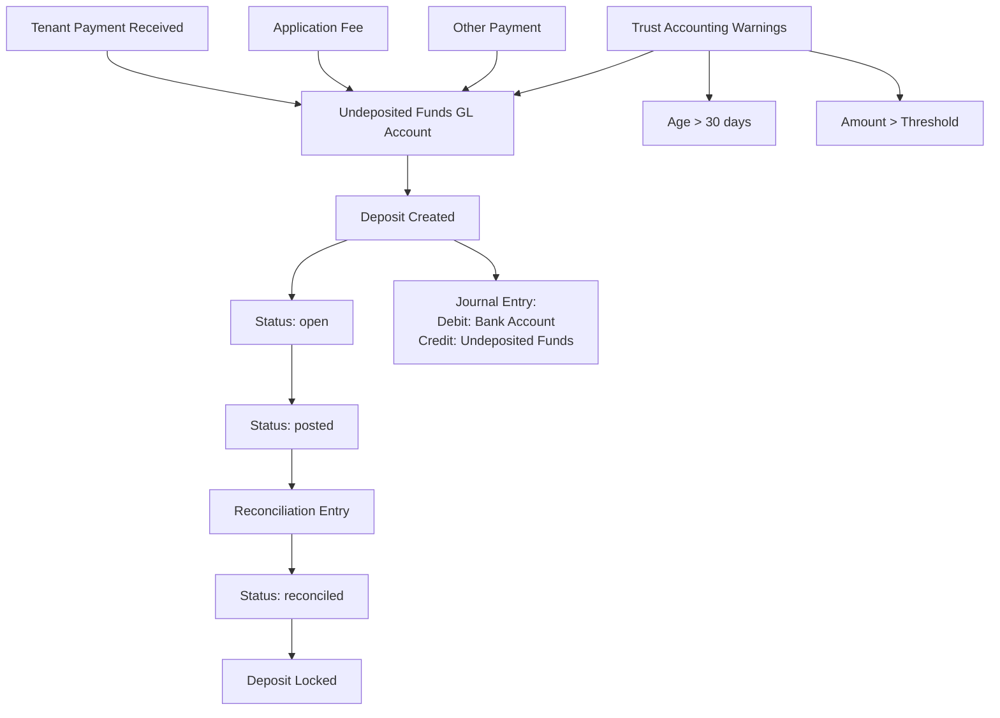

# Deposits and Undeposited Funds Alignment Plan

## Overview

Align the deposit workflow with Buildium's model by creating a first-class deposit object with explicit status tracking, implementing deposit locking when reconciled, ensuring all receipts automatically route to undeposited funds until included in a deposit, and adding trust accounting warnings.

## Current State Analysis

### What Exists

- Deposits are stored as `transactions` with `transaction_type = 'Deposit'`
- Deposit creation endpoint: `POST /api/bank-accounts/[id]/record-deposit`
- `transaction_payment_transactions` table links payments to deposits
- Undeposited Funds GL account resolution exists (`resolveUndepositedFundsGlAccountId`)
- Deposit transaction lines: Debit bank, Credit undeposited funds
- Buildium deposit API integration (syncs deposits to/from Buildium)
- Payment transactions can have `bank_gl_account_id` pointing to undeposited funds

### What's Missing

- No thin overlay tables (`deposit_meta`, `deposit_items`) to track deposit metadata and payment linkages
- No deposit locking mechanism based on bank-side line reconciliation
- No automatic routing of all inflows (including application fees) to undeposited funds
- No SQL views for trust accounting warnings (logic duplicated in app code)
- Deposit status not tracked separately from transaction status
- Using `transaction_payment_transactions` for undeposited detection instead of dedicated `deposit_items`
- Missing `bank_gl_account_buildium_id` to store intended bank separately from actual `bank_gl_account_id`
- No explicit `sync_status` tracking for Buildium sync operations

## Implementation Plan

### Phase 1: Create Deposit Overlay Tables and Status Model

**Files:**

- `supabase/migrations/YYYYMMDDHHMMSS_create_deposit_overlays.sql`
- `src/types/deposits.ts` (new)

**Changes:**

1. **Create deposit status enum (posted | reconciled | voided):**
   ```sql
                  CREATE TYPE deposit_status_enum AS ENUM ('posted', 'reconciled', 'voided');
                  -- Note: 'open' only introduced if drafts exist without transactions
   ```


2. **Create `deposit_meta` table (1:1 with transactions.id):**
   ```sql
                  -- Thin overlay: deposit metadata linked to transaction
                  CREATE TABLE public.deposit_meta (
                    id uuid PRIMARY KEY DEFAULT gen_random_uuid(),
                    transaction_id uuid NOT NULL REFERENCES public.transactions(id) ON DELETE CASCADE,
                    deposit_id text UNIQUE NOT NULL, -- Human-readable deposit ID (e.g., "DEP-2025-001")
                    status deposit_status_enum NOT NULL DEFAULT 'posted',
                    buildium_deposit_id integer, -- Buildium deposit ID
                    buildium_sync_status text DEFAULT 'pending', -- 'pending' | 'synced' | 'failed'
                    buildium_sync_error text,
                    buildium_last_synced_at timestamptz,
                    created_at timestamptz NOT NULL DEFAULT now(),
                    updated_at timestamptz NOT NULL DEFAULT now(),
                    created_by uuid REFERENCES auth.users(id),
                    updated_by uuid REFERENCES auth.users(id),
                    CONSTRAINT deposit_meta_transaction_unique UNIQUE (transaction_id)
                  );
                  
                  COMMENT ON TABLE public.deposit_meta IS 'Deposit metadata overlay on transactions. Source of truth remains transactions table.';
                  COMMENT ON COLUMN public.deposit_meta.buildium_sync_status IS 'Sync status for Buildium operations: pending (not synced), synced (successfully synced), failed (sync error)';
   ```

3. **Create `deposit_items` table (deposit ↔ payment link):**
   ```sql
                  -- Links deposit transactions to payment transactions
                  CREATE TABLE public.deposit_items (
                    id uuid PRIMARY KEY DEFAULT gen_random_uuid(),
                    deposit_transaction_id uuid NOT NULL REFERENCES public.transactions(id) ON DELETE CASCADE,
                    payment_transaction_id uuid NOT NULL REFERENCES public.transactions(id) ON DELETE RESTRICT,
                    buildium_payment_transaction_id integer, -- Optional Buildium payment ID
                    amount numeric(14,2) NOT NULL CHECK (amount > 0),
                    created_at timestamptz NOT NULL DEFAULT now(),
                    updated_at timestamptz NOT NULL DEFAULT now(),
                    -- Enforce uniqueness to prevent double-depositing
                    CONSTRAINT deposit_items_payment_unique UNIQUE (payment_transaction_id),
                    CONSTRAINT deposit_items_buildium_payment_unique UNIQUE (buildium_payment_transaction_id)
                      WHERE buildium_payment_transaction_id IS NOT NULL
                  );
                  
                  COMMENT ON TABLE public.deposit_items IS 'Links deposit transactions to payment transactions. Prevents double-depositing via unique constraints on payment_transaction_id and buildium_payment_transaction_id.';
   ```


4. **Add indexes:**
   ```sql
                  -- deposit_meta indexes
                  CREATE INDEX idx_deposit_meta_transaction ON public.deposit_meta(transaction_id);
                  CREATE INDEX idx_deposit_meta_status ON public.deposit_meta(status);
                  CREATE INDEX idx_deposit_meta_sync_status ON public.deposit_meta(buildium_sync_status);
                  CREATE INDEX idx_deposit_meta_buildium_deposit ON public.deposit_meta(buildium_deposit_id) 
                    WHERE buildium_deposit_id IS NOT NULL;
                  
                  -- deposit_items indexes
                  CREATE INDEX idx_deposit_items_deposit ON public.deposit_items(deposit_transaction_id);
                  CREATE INDEX idx_deposit_items_payment ON public.deposit_items(payment_transaction_id);
                  CREATE INDEX idx_deposit_items_buildium_payment ON public.deposit_items(buildium_payment_transaction_id)
                    WHERE buildium_payment_transaction_id IS NOT NULL;
   ```


5. **Add RLS policies (org-scoped using existing helper patterns):**
   ```sql
                  -- Enable RLS on deposit_meta
                  ALTER TABLE public.deposit_meta ENABLE ROW LEVEL SECURITY;
                  
                  -- Read policy: users can read deposits in their org (via transaction.org_id)
                  CREATE POLICY "deposit_meta_org_read" ON public.deposit_meta
                    FOR SELECT
                    USING (
                      EXISTS (
                        SELECT 1 FROM public.transactions t
                        WHERE t.id = deposit_meta.transaction_id
                        AND EXISTS (
                          SELECT 1 FROM public.organizations o
                          WHERE o.id = t.org_id
                          AND EXISTS (
                            SELECT 1 FROM public.user_organization_memberships uom
                            WHERE uom.organization_id = o.id
                            AND uom.user_id = auth.uid()
                          )
                        )
                      )
                    );
                  
                  -- Insert/Update/Delete policies: use service_role or transaction.org_id pattern
                  CREATE POLICY "deposit_meta_org_write" ON public.deposit_meta
                    FOR ALL
                    USING (
                      auth.role() = 'service_role' OR
                      EXISTS (
                        SELECT 1 FROM public.transactions t
                        WHERE t.id = deposit_meta.transaction_id
                        AND EXISTS (
                          SELECT 1 FROM public.organizations o
                          WHERE o.id = t.org_id
                          AND EXISTS (
                            SELECT 1 FROM public.user_organization_memberships uom
                            WHERE uom.organization_id = o.id
                            AND uom.user_id = auth.uid()
                          )
                        )
                      )
                    );
                  
                  -- Enable RLS on deposit_items
                  ALTER TABLE public.deposit_items ENABLE ROW LEVEL SECURITY;
                  
                  -- Read policy: users can read deposit items for deposits in their org
                  CREATE POLICY "deposit_items_org_read" ON public.deposit_items
                    FOR SELECT
                    USING (
                      EXISTS (
                        SELECT 1 FROM public.transactions t
                        WHERE t.id = deposit_items.deposit_transaction_id
                        AND EXISTS (
                          SELECT 1 FROM public.organizations o
                          WHERE o.id = t.org_id
                          AND EXISTS (
                            SELECT 1 FROM public.user_organization_memberships uom
                            WHERE uom.organization_id = o.id
                            AND uom.user_id = auth.uid()
                          )
                        )
                      )
                    );
                  
                  -- Insert/Update/Delete policies: use service_role or transaction.org_id pattern
                  CREATE POLICY "deposit_items_org_write" ON public.deposit_items
                    FOR ALL
                    USING (
                      auth.role() = 'service_role' OR
                      EXISTS (
                        SELECT 1 FROM public.transactions t
                        WHERE t.id = deposit_items.deposit_transaction_id
                        AND EXISTS (
                          SELECT 1 FROM public.organizations o
                          WHERE o.id = t.org_id
                          AND EXISTS (
                            SELECT 1 FROM public.user_organization_memberships uom
                            WHERE uom.organization_id = o.id
                            AND uom.user_id = auth.uid()
                          )
                        )
                      )
                    );
   ```

6. **Create deposit_id sequence generator function (with concurrency protection):**
   ```sql
                  CREATE OR REPLACE FUNCTION generate_deposit_id(transaction_id_param uuid)
                  RETURNS text AS $$
                  DECLARE
                    org_id_val uuid;
                    year_str text;
                    next_num integer;
                    lock_key bigint;
                  BEGIN
                    -- Get org_id from transaction to ensure naming consistency
                    SELECT org_id INTO org_id_val
                    FROM public.transactions
                    WHERE id = transaction_id_param;
                    
                    IF org_id_val IS NULL THEN
                      RAISE EXCEPTION 'Transaction not found: %', transaction_id_param;
                    END IF;
                    
                    -- Use advisory lock per org to prevent race conditions
                    lock_key := hashnumeric(org_id_val::text);
                    PERFORM pg_advisory_xact_lock(lock_key);
                    
                    year_str := to_char(now(), 'YYYY');
                    SELECT COALESCE(MAX(CAST(SUBSTRING(dm.deposit_id FROM '[0-9]+$') AS INTEGER)), 0) + 1
                    INTO next_num
                    FROM public.deposit_meta dm
                    JOIN public.transactions t ON t.id = dm.transaction_id
                    WHERE t.org_id = org_id_val 
                      AND dm.deposit_id LIKE 'DEP-' || year_str || '-%'
                    FOR UPDATE;
                    
                    RETURN 'DEP-' || year_str || '-' || LPAD(next_num::text, 3, '0');
                  END;
                  $$ LANGUAGE plpgsql;
                  
                  COMMENT ON FUNCTION generate_deposit_id(uuid) IS 'Generates deterministic deposit ID for a transaction. Protected against race conditions via advisory lock.';
   ```

**Migration Strategy:**

- Transactions remain source of truth (no change)
- Backfill existing deposit transactions into `deposit_meta` table
- Set status to 'posted' for existing deposits (they're already created)
- Link via `transaction_id` (1:1 relationship)
- Backfill `deposit_items` from `transaction_payment_transactions`

### Phase 2: Integrate Deposit Overlays with Deposit Workflow

**Files:**

- `src/app/api/bank-accounts/[id]/record-deposit/route.ts` (modify)
- `src/lib/deposit-service.ts` (new)
- `src/server/bank-accounts/record-deposit.ts` (modify)

**Changes:**

1. **Update deposit creation to also create overlay records (atomic transaction):**

- Wrap transaction + deposit_meta + deposit_items creation in a single database transaction
- Create deposit_meta record with status='posted' (transactions are created immediately)
- Generate deposit_id using sequence function (locked via advisory lock)
- Link deposit_meta.transaction_id to transaction.id (1:1)
- Create deposit_items records for each linked payment
- Rollback all if any part fails
- Use `BEGIN ... COMMIT` or Supabase transaction helper

2. **Create deposit service functions:**

- `createDepositWithMeta()` - Creates transaction + deposit_meta + deposit_items (atomic)
- `updateDepositStatus()` - Updates deposit_meta.status (with validation)
- `getDepositMetaByTransactionId()` - Retrieves deposit_meta by transaction_id
- `getDepositItemsByDepositTransactionId()` - Retrieves deposit_items for a deposit
- `listDepositsByBankAccount()` - Lists deposits (via transactions) for a bank account

3. **Update deposit endpoints to use overlay tables:**

- Modify GET `/api/bank-accounts/[id]/record-deposit` to return deposit_meta status
- Modify PATCH `/api/bank-accounts/[id]/deposits/[transactionId]` to update deposit_meta and transaction
- Modify DELETE to use deposit_items to find linked payments, re-route to UDF, then delete transaction (cascade handles deposit_meta and deposit_items)

### Phase 3: Implement Deposit Status Workflow

**Files:**

- `src/lib/deposit-service.ts` (extend)
- `src/app/api/deposits/[id]/post/route.ts` (new)
- `src/app/api/deposits/[id]/status/route.ts` (new)

**Changes:**

1. **Status transition logic and sources of truth:**

- Status model: `posted | reconciled | voided` (no `open` unless drafts exist without transactions)
- Transactions are created immediately (status starts as 'posted')
- `posted` → `reconciled`: 
  - Primary source: When bank-side transaction_line is marked as reconciled (trigger-based on bank_register_entries)
  - Secondary source: Buildium webhook indicates deposit is reconciled (idempotent check)
  - Guard: Prevent regression from reconciled → posted (only forward transitions)
- `posted` → `voided`: When deposit is voided
- `reconciled`: Immutable (locked, cannot edit amounts/bank/lines)

**Status Source Priority:**
1. Local reconciliation entry (highest priority, immediate trigger)
2. Buildium webhook (with idempotency check)
3. Buildium sync job (periodic reconciliation status check)

**Reverse Trigger Protection:**
- Add trigger to prevent status regression: `reconciled` → `posted` → `open`
- Only allow forward transitions (open → posted → reconciled)
- If webhook sends older state, log warning and skip update

2. **Create status update endpoints:**

- `POST /api/deposits/[id]/post` - Mark deposit as posted
- `GET /api/deposits/[id]` - Get deposit with status
- `PATCH /api/deposits/[id]/status` - Update status (with validation)

3. **Add status validation:**

- Only allow status transitions: open → posted → reconciled
- Prevent edits to reconciled deposits (except metadata like memo)

### Phase 4: Implement Deposit Locking (Bank-Side Line Reconciliation)

**Files:**

- `supabase/migrations/YYYYMMDDHHMMSS_deposit_reconciliation_locking.sql`
- `src/lib/deposit-service.ts` (extend)
- Integration with bank_register_entries (from banking alignment plan)

**Changes:**

1. **Create trigger to detect bank-side line reconciliation:**
   ```sql
                  -- Lock deposit when bank-side transaction_line is reconciled
                  -- Bank-side line = transaction_line where gl_account_id is a bank account AND posting_type = 'Debit'
                  -- Check bank_register_entries for reconciled status
                  
                  CREATE OR REPLACE FUNCTION update_deposit_status_on_bank_line_reconciliation()
                  RETURNS TRIGGER AS $$
                  DECLARE
                    deposit_transaction_id_val uuid;
                    current_status deposit_status_enum;
                    bank_line_reconciled boolean;
                  BEGIN
                    -- Find deposit transaction for this bank line
                    -- Bank lines in deposits: transaction_lines where gl_account_id is bank AND posting_type = 'Debit'
                    SELECT DISTINCT tl.transaction_id INTO deposit_transaction_id_val
                    FROM public.transaction_lines tl
                    JOIN public.gl_accounts ga ON ga.id = tl.gl_account_id
                    WHERE tl.id = NEW.transaction_line_id
                      AND ga.is_bank_account = true
                      AND tl.posting_type = 'Debit'
                      AND EXISTS (
                        SELECT 1 FROM public.transactions t
                        WHERE t.id = tl.transaction_id
                        AND t.transaction_type = 'Deposit'
                      )
                    LIMIT 1;
                    
                    IF deposit_transaction_id_val IS NULL THEN
                      RETURN NEW;
                    END IF;
                    
                    -- Check if bank line is reconciled
                    SELECT CASE WHEN NEW.status = 'reconciled' THEN true ELSE false END
                    INTO bank_line_reconciled
                    FROM public.bank_register_entries
                    WHERE transaction_line_id = NEW.transaction_line_id;
                    
                    IF bank_line_reconciled THEN
                      -- Get current status
                      SELECT status INTO current_status
                      FROM public.deposit_meta
                      WHERE transaction_id = deposit_transaction_id_val;
                      
                      -- Only allow forward transitions
                      IF current_status IS NULL OR current_status = 'reconciled' THEN
                        RETURN NEW;
                      END IF;
                      
                      -- Update deposit status to reconciled
                      UPDATE public.deposit_meta
                      SET status = 'reconciled', updated_at = now()
                      WHERE transaction_id = deposit_transaction_id_val;
                    END IF;
                    
                    RETURN NEW;
                  END;
                  $$ LANGUAGE plpgsql;
                  
                  -- Trigger fires when bank_register_entries status changes to reconciled
                  CREATE TRIGGER trg_deposit_reconciliation_lock
                    AFTER UPDATE OF status ON public.bank_register_entries
                    FOR EACH ROW
                    WHEN (NEW.status = 'reconciled' AND OLD.status != 'reconciled')
                    EXECUTE FUNCTION update_deposit_status_on_bank_line_reconciliation();
   ```

2. **Create DB guardrails to block edits to reconciled deposits:**
   ```sql
                  -- Prevent edits to bank amount/account/lines once reconciled
                  CREATE OR REPLACE FUNCTION prevent_reconciled_deposit_edits()
                  RETURNS TRIGGER AS $$
                  DECLARE
                    deposit_status_val deposit_status_enum;
                  BEGIN
                    -- Get deposit status
                    SELECT dm.status INTO deposit_status_val
                    FROM public.deposit_meta dm
                    WHERE dm.transaction_id = NEW.id;
                    
                    -- If reconciled, block changes to bank-related fields
                    IF deposit_status_val = 'reconciled' THEN
                      -- Block bank_gl_account_id changes
                      IF OLD.bank_gl_account_id IS DISTINCT FROM NEW.bank_gl_account_id THEN
                        RAISE EXCEPTION 'Cannot change bank_account_id of reconciled deposit';
                      END IF;
                      
                      -- Block total_amount changes (would affect bank line)
                      IF OLD.total_amount IS DISTINCT FROM NEW.total_amount THEN
                        RAISE EXCEPTION 'Cannot change total_amount of reconciled deposit';
                      END IF;
                      
                      -- Allow memo and date (with consistent line updates handled by API)
                    END IF;
                    
                    RETURN NEW;
                  END;
                  $$ LANGUAGE plpgsql;
                  
                  CREATE TRIGGER trg_prevent_reconciled_deposit_edits
                    BEFORE UPDATE ON public.transactions
                    FOR EACH ROW
                    WHEN (OLD.transaction_type = 'Deposit' AND NEW.transaction_type = 'Deposit')
                    EXECUTE FUNCTION prevent_reconciled_deposit_edits();
                  
                  -- Prevent transaction_line edits for reconciled deposits
                  CREATE OR REPLACE FUNCTION prevent_reconciled_deposit_line_edits()
                  RETURNS TRIGGER AS $$
                  DECLARE
                    deposit_status_val deposit_status_enum;
                    is_bank_line boolean;
                  BEGIN
                    -- Check if this is a bank line
                    SELECT ga.is_bank_account INTO is_bank_line
                    FROM public.gl_accounts ga
                    WHERE ga.id = COALESCE(NEW.gl_account_id, OLD.gl_account_id);
                    
                    IF is_bank_line THEN
                      -- Get deposit status
                      SELECT dm.status INTO deposit_status_val
                      FROM public.deposit_meta dm
                      JOIN public.transactions t ON t.id = dm.transaction_id
                      WHERE t.id = NEW.transaction_id
                        AND t.transaction_type = 'Deposit';
                      
                      -- If reconciled, block amount/account changes
                      IF deposit_status_val = 'reconciled' THEN
                        IF OLD.amount IS DISTINCT FROM NEW.amount THEN
                          RAISE EXCEPTION 'Cannot change bank line amount of reconciled deposit';
                        END IF;
                        IF OLD.gl_account_id IS DISTINCT FROM NEW.gl_account_id THEN
                          RAISE EXCEPTION 'Cannot change bank line account of reconciled deposit';
                        END IF;
                      END IF;
                    END IF;
                    
                    RETURN NEW;
                  END;
                  $$ LANGUAGE plpgsql;
                  
                  CREATE TRIGGER trg_prevent_reconciled_deposit_line_edits
                    BEFORE UPDATE ON public.transaction_lines
                    FOR EACH ROW
                    EXECUTE FUNCTION prevent_reconciled_deposit_line_edits();
   ```


3. **Add protection trigger to prevent status regression:**
   ```sql
                  -- Prevent status regression (reconciled → posted, posted → voided if reconciled)
                  CREATE OR REPLACE FUNCTION prevent_deposit_status_regression()
                  RETURNS TRIGGER AS $$
                  BEGIN
                    -- Only allow forward transitions: posted → reconciled, posted → voided
                    IF OLD.status = 'reconciled' AND NEW.status != 'reconciled' THEN
                      RAISE EXCEPTION 'Cannot change deposit status from reconciled to %', NEW.status;
                    END IF;
                    
                    -- Prevent webhook downgrades
                    IF OLD.status = 'reconciled' AND NEW.status = 'posted' THEN
                      RAISE EXCEPTION 'Cannot downgrade deposit status from reconciled to posted (webhook protection)';
                    END IF;
                    
                    RETURN NEW;
                  END;
                  $$ LANGUAGE plpgsql;
                  
                  CREATE TRIGGER trg_prevent_deposit_status_regression
                    BEFORE UPDATE ON public.deposit_meta
                    FOR EACH ROW
                    WHEN (OLD.status IS DISTINCT FROM NEW.status)
                    EXECUTE FUNCTION prevent_deposit_status_regression();
   ```


4. **Add API validation with explicit editing rules:**

**Editing Rules:**
- **Status = 'posted'**: 
  - Allowed: memo, date (with consistent line updates)
  - Blocked: amount changes (bank line), bank_account_id changes, add/remove payment links
- **Status = 'reconciled'**: 
  - Allowed: memo only (date changes blocked if bank line is reconciled)
  - Blocked: ALL amount/line/bank_account_id/payment link changes (enforced by DB triggers)

**Implementation:**
- In deposit PATCH endpoint, check deposit_meta.status before allowing edits
- Validate field-level permissions based on status
- For date changes on posted deposits: ensure transaction_lines.date is updated consistently
- Return clear error messages:
  - "Cannot edit amount of reconciled deposit"
  - "Cannot add/remove payments from posted deposit"
  - "Cannot change bank account of reconciled deposit"
- Log all attempted edits to reconciled deposits for audit

### Phase 5: Ensure All Inflows Route to Undeposited Funds

**Files:**

- `src/app/api/leases/[id]/payments/route.ts` (modify)
- `src/app/api/monthly-logs/[logId]/payments/route.ts` (modify)
- `src/lib/lease-transaction-service.ts` (modify)
- `supabase/functions/buildium-lease-transactions/index.ts` (modify)
- Application fee creation endpoints (modify)

**Changes:**

1. **Update payment creation to always post to Undeposited Funds initially:**

- Remove optional `BankAccountId` from payment payload when creating in Buildium
- Always create payment transaction lines with undeposited funds GL account
- Set `bank_gl_account_id` on transaction to undeposited funds account
- Store intended bank as `bank_gl_account_buildium_id` (separate from actual `bank_gl_account_id`)
- **Require or auto-create UDF per org**: 
  - Check if UDF account exists before creating payment
  - If missing, create it automatically OR return clear error
  - Log when UDF account is auto-created
  - Ensure UDF account exists for each org

2. **Add `bank_gl_account_buildium_id` to transactions table:**
   ```sql
                  ALTER TABLE public.transactions
                    ADD COLUMN IF NOT EXISTS bank_gl_account_buildium_id integer;
                  
                  COMMENT ON COLUMN public.transactions.bank_gl_account_buildium_id IS 'Intended bank account (Buildium ID) separate from actual bank_gl_account_id (which points to UDF for undeposited payments)';
   ```

2. **Create helper function:**
   ```typescript
                  async function ensurePaymentToUndepositedFunds(
                    transactionId: string,
                    orgId: string | null,
                    supabase: TypedSupabaseClient
                  ): Promise<void>
   ```


- Resolves undeposited funds GL account
- Updates transaction.bank_gl_account_id if not already set
- Updates/creates transaction_lines to credit undeposited funds

3. **Update application fee and Buildium sync handling:**

- Ensure application fees also route to undeposited funds
- Update any application fee creation endpoints
- **Buildium sync webhook handler**: 
  - When syncing payments from Buildium webhooks, check if they have BankAccountId
  - If BankAccountId points to operating bank, re-route to undeposited funds
  - Use `ensurePaymentToUndepositedFunds()` helper in webhook handler
  - Log when payments are re-routed during sync
- **Buildium import jobs**:
  - Apply same routing logic in batch import scripts
  - Handle case where Buildium deposit already exists but local payment needs UDF routing

4. **Migration script to backfill existing payments:**

- Find payments with `bank_gl_account_id` pointing directly to operating bank
- Move them to undeposited funds (create reversing JE if needed)

### Phase 6: Add Trust Accounting Warnings (SQL Views)

**Files:**

- `supabase/migrations/YYYYMMDDHHMMSS_create_udf_warning_views.sql`
- `src/app/api/deposits/undeposited-funds/warnings/route.ts` (new)
- `src/components/banking/UndepositedFundsWarning.tsx` (new)

**Changes:**

1. **Create SQL view for undeposited payments:**
   ```sql
                  CREATE OR REPLACE VIEW public.v_undeposited_payments AS
                  SELECT 
                    t.id AS transaction_id,
                    t.org_id,
                    t.date AS payment_date,
                    t.total_amount,
                    t.transaction_type,
                    t.memo,
                    t.tenant_id,
                    t.paid_to_tenant_id,
                    -- Exclude payments already linked to deposits via deposit_items
                    NOT EXISTS (
                      SELECT 1 FROM public.deposit_items di
                      WHERE di.payment_transaction_id = t.id
                    ) AS is_undeposited,
                    -- Calculate age in days
                    EXTRACT(DAY FROM (now() - t.date::timestamp)) AS age_days
                  FROM public.transactions t
                  JOIN public.gl_accounts udf ON udf.id = t.bank_gl_account_id
                  WHERE t.transaction_type IN (
                    'Payment', 
                    'ElectronicFundsTransfer', 
                    'ApplyDeposit',
                    'RentalApplicationFeePayment'  -- Include application fees
                  )
                  AND udf.name ILIKE '%undeposited funds%'
                  AND NOT EXISTS (
                    -- Exclude if already in a deposit
                    SELECT 1 FROM public.deposit_items di
                    WHERE di.payment_transaction_id = t.id
                  );
                  
                  COMMENT ON VIEW public.v_undeposited_payments IS 'All payments sitting in undeposited funds, excluding those already linked to deposits. Includes RentalApplicationFeePayment.';
   ```

2. **Create SQL view for trust accounting warnings:**
   ```sql
                  CREATE OR REPLACE VIEW public.v_udf_warnings AS
                  SELECT 
                    org_id,
                    COUNT(*) AS payment_count,
                    SUM(total_amount) AS total_amount,
                    MAX(age_days) AS max_age_days,
                    AVG(age_days) AS avg_age_days,
                    -- Warning levels
                    CASE 
                      WHEN MAX(age_days) >= 60 OR SUM(total_amount) >= 10000 THEN 'critical'
                      WHEN MAX(age_days) >= 30 OR SUM(total_amount) >= 5000 THEN 'warning'
                      ELSE 'info'
                    END AS warning_level
                  FROM public.v_undeposited_payments
                  WHERE is_undeposited = true
                  GROUP BY org_id;
                  
                  COMMENT ON VIEW public.v_udf_warnings IS 'Trust accounting warnings grouped by org: critical (>60 days or >$10k), warning (>30 days or >$5k), info otherwise';
   ```

3. **Create API endpoint (thin wrapper over SQL views):**

- `GET /api/deposits/undeposited-funds/warnings`
- Query `v_udf_warnings` view for org-scoped warnings
- Query `v_undeposited_payments` view for payment details
- Returns list of warnings with amounts, ages, payment details

4. **Create UI component:**

- Display warnings in banking dashboard (query SQL views)
- Show undeposited funds balance prominently
- Link to deposit creation page
- Use SQL views directly in components (no app logic duplication)

### Phase 7: Update Deposit UI Components

**Files:**

- `src/components/bank-accounts/RecordDepositForm.tsx` (modify)
- `src/app/(protected)/bank-accounts/[id]/record-deposit/page.tsx` (modify)
- `src/app/(protected)/bank-accounts/[id]/deposits/[transactionId]/page.tsx` (modify)

**Changes:**

1. **Display deposit status in UI:**

- Show status badge (Posted/Reconciled/Voided) - no "Open" unless drafts exist
- Disable edit buttons when status is 'reconciled'
- Show lock icon for reconciled deposits

2. **Display deposit_id (with legacy fallback):**

- Show human-readable deposit ID in deposit list
- Use deposit_id in URLs/navigation (e.g., `/deposits/DEP-2025-001`)
- **Legacy route support**: 
  - Keep `/bank-accounts/[id]/deposits/[transactionId]` route for backward compatibility
  - Redirect transaction_id URLs to deposit_id URLs when possible
  - Fallback to transaction_id lookup if deposit_id not found
  - Update router/navigation to prefer deposit_id
- Handle missing deposit_id gracefully (show transaction_id as fallback)

3. **Add deposit status filter:**

- Filter deposits by status in deposit list
- Show undeposited funds balance prominently

4. **Update deposit edit form (with status badge logic):**

- Prevent amount/line edits for reconciled deposits (align with API validations)
- Show read-only view with lock indicator for reconciled deposits
- Allow memo/notes edits even when reconciled (with save button)
- **Status badge component**:
  - Posted: Blue badge, metadata-only editable (transactions created immediately)
  - Reconciled: Gray badge with lock icon, memo-only editable
  - Voided: Red badge, read-only
- Disable form fields based on status (use same rules as API)
- Show validation errors inline when attempting invalid edits
- Display reconciliation link if deposit is reconciled

### Phase 8: Buildium Integration Enhancements (with Sync Status)

**Files:**

- `src/app/api/buildium/bank-accounts/deposits/route.ts` (modify)
- `src/lib/buildium-mappers.ts` (extend)
- `supabase/functions/buildium-webhook/index.ts` (extend)

**Changes:**

1. **Sync deposit status from Buildium (idempotent with explicit sync_status):**

- When fetching Buildium deposits, check if they're reconciled
- Update local deposit_meta.status based on Buildium reconciliation status
- **Idempotency**: Skip updates if deposit already reconciled locally
- **Source priority**: Local reconciliation entry > Buildium webhook > Buildium sync
- **Prevent regression**: Webhooks cannot downgrade status (reconciled → posted)
- Update `buildium_sync_status` to 'synced' on success, 'failed' on error
- Update `buildium_last_synced_at` timestamp
- Handle deposit status webhooks if Buildium supports them
- **Webhook idempotency**: Check if deposit already reconciled before updating
- Log when Buildium webhook is skipped due to idempotency

2. **Create deposit in Buildium (best-effort with retry):**

- **Deposit ID mapping**: 
  - Store Buildium deposit ID in `deposit_meta.buildium_deposit_id`
  - Use local `deposit_id` (DEP-YYYY-NNN) in memo/notes if Buildium doesn't support custom ID
- Ensure deposit_id is included in Buildium payload memo (if custom ID field not supported)
- Map local deposit_meta.status to Buildium deposit status
- **Best-effort create**: Handle Buildium API errors gracefully (log and continue with local-only deposit)
- **Sync status tracking**: Set `buildium_sync_status` to 'pending' initially, 'synced' on success, 'failed' on error
- **Retry logic**: Add retry mechanism for failed syncs (update sync_status and retry later)

3. **Handle Buildium deposit webhooks (idempotent with regression protection):**

- Update deposit_meta.status when Buildium deposit is reconciled
- **Idempotency check**: Verify deposit_meta exists and status allows transition before updating
- **Regression protection**: Cannot downgrade from reconciled → posted (trigger enforced)
- Link to reconciliation if reconciliation webhook is received
- **Import path**: Handle deposits created in Buildium but not local
  - Create local transaction and deposit_meta when Buildium deposit webhook received
  - Link to transaction via `buildium_transaction_id` lookup
  - Generate local `deposit_id` using `generate_deposit_id()`
  - Set status based on Buildium reconciliation status
  - Set `buildium_sync_status` to 'synced' (already in Buildium)
- Log all webhook handling events (created, updated, skipped)

4. **Handle missing deposits gracefully:**

- If Buildium deposit exists but local doesn't, create during sync
- If local deposit exists but Buildium doesn't, sync to Buildium on next reconciliation attempt
- Track sync status in `deposit_meta.buildium_sync_status` ('pending' | 'synced' | 'failed')
- Add retry mechanism for failed syncs (update sync_status and retry later)

### Phase 9: Database Schema Updates

**Files:**

- Update `docs/database/database-schema.md`
- Update `src/types/database.ts` (regenerate types)

**Changes:**

1. **Document deposits table in schema docs**
2. **Document deposit status workflow**
3. **Document deposit locking behavior**
4. **Update transaction model docs to reference deposits**

### Phase 10: Migration and Backfill

**Files:**

- `supabase/migrations/YYYYMMDDHHMMSS_backfill_deposits_from_transactions.sql`
- `scripts/backfill-deposits.ts` (new, if needed)

**Changes:**

1. **Separate schema and data migrations:**

**Schema Migration** (Phase 1):
- Create deposits table structure
- Create deposit_reconciliation_entries table
- Add indexes, triggers, RLS policies
- Create helper functions

**Data Migration** (Phase 10, idempotent):
```sql
-- Add migration marker to prevent reruns
CREATE TABLE IF NOT EXISTS public.deposit_migration_marker (
  id uuid PRIMARY KEY DEFAULT gen_random_uuid(),
  migration_name text UNIQUE NOT NULL,
  completed_at timestamptz NOT NULL DEFAULT now(),
  rows_processed integer NOT NULL
);

-- Idempotent backfill function for deposit_meta
CREATE OR REPLACE FUNCTION backfill_deposit_meta_from_transactions()
RETURNS integer AS $$
DECLARE
  marker_exists boolean;
  processed_count integer := 0;
  tx_record RECORD;
  deposit_id_val text;
  deposit_status_val deposit_status_enum;
BEGIN
  -- Check if already run
  SELECT EXISTS(SELECT 1 FROM public.deposit_migration_marker 
                WHERE migration_name = 'backfill_deposit_meta_v1') INTO marker_exists;
  
  IF marker_exists THEN
    RAISE NOTICE 'Backfill already completed, skipping';
    RETURN 0;
  END IF;
  
  -- Process deposits
  FOR tx_record IN 
    SELECT t.id, t.org_id, t.date, t.total_amount, t.memo, t.buildium_transaction_id
    FROM public.transactions t
    WHERE t.transaction_type = 'Deposit'
    AND NOT EXISTS (
      SELECT 1 FROM public.deposit_meta dm WHERE dm.transaction_id = t.id
    )
  LOOP
    -- Skip if missing required fields (handle gracefully)
    IF tx_record.org_id IS NULL THEN
      RAISE NOTICE 'Skipping transaction % due to missing org_id', tx_record.id;
      CONTINUE;
    END IF;
    
    -- Determine status: posted by default, reconciled if bank line is reconciled
    SELECT CASE 
      WHEN EXISTS (
        SELECT 1 FROM public.transaction_lines tl
        JOIN public.gl_accounts ga ON ga.id = tl.gl_account_id
        JOIN public.bank_register_entries bre ON bre.transaction_line_id = tl.id
        WHERE tl.transaction_id = tx_record.id
          AND ga.is_bank_account = true
          AND tl.posting_type = 'Debit'
          AND bre.status = 'reconciled'
      ) THEN 'reconciled'::deposit_status_enum
      ELSE 'posted'::deposit_status_enum
    END INTO deposit_status_val;
    
    -- Generate deposit_id (deterministic, uses advisory lock)
    SELECT generate_deposit_id(tx_record.id) INTO deposit_id_val;
    
    -- Upsert deposit_meta (idempotent)
    INSERT INTO public.deposit_meta (
      transaction_id, deposit_id, status, buildium_deposit_id
    ) VALUES (
      tx_record.id, deposit_id_val, deposit_status_val, tx_record.buildium_transaction_id
    )
    ON CONFLICT (transaction_id) DO UPDATE SET
      deposit_id = EXCLUDED.deposit_id,
      status = EXCLUDED.status,
      buildium_deposit_id = COALESCE(EXCLUDED.buildium_deposit_id, deposit_meta.buildium_deposit_id),
      updated_at = now();
    
    processed_count := processed_count + 1;
  END LOOP;
  
  -- Mark as complete
  INSERT INTO public.deposit_migration_marker (migration_name, rows_processed)
  VALUES ('backfill_deposit_meta_v1', processed_count)
  ON CONFLICT (migration_name) DO UPDATE SET 
    completed_at = now(), rows_processed = EXCLUDED.rows_processed;
  
  RETURN processed_count;
END;
$$ LANGUAGE plpgsql;

-- Idempotent backfill function for deposit_items
CREATE OR REPLACE FUNCTION backfill_deposit_items_from_transaction_payment_transactions()
RETURNS integer AS $$
DECLARE
  marker_exists boolean;
  processed_count integer := 0;
  link_record RECORD;
BEGIN
  -- Check if already run
  SELECT EXISTS(SELECT 1 FROM public.deposit_migration_marker 
                WHERE migration_name = 'backfill_deposit_items_v1') INTO marker_exists;
  
  IF marker_exists THEN
    RAISE NOTICE 'Backfill already completed, skipping';
    RETURN 0;
  END IF;
  
  -- Process links from transaction_payment_transactions
  FOR link_record IN 
    SELECT 
      tpt.transaction_id AS deposit_transaction_id,
      tpt.buildium_payment_transaction_id,
      tpt.amount,
      -- Find payment transaction by buildium_transaction_id
      (SELECT id FROM public.transactions 
       WHERE buildium_transaction_id = tpt.buildium_payment_transaction_id
       LIMIT 1) AS payment_transaction_id
    FROM public.transaction_payment_transactions tpt
    JOIN public.transactions t ON t.id = tpt.transaction_id
    WHERE t.transaction_type = 'Deposit'
    AND NOT EXISTS (
      SELECT 1 FROM public.deposit_items di 
      WHERE di.deposit_transaction_id = tpt.transaction_id
        AND (di.payment_transaction_id = (SELECT id FROM public.transactions WHERE buildium_transaction_id = tpt.buildium_payment_transaction_id LIMIT 1)
             OR di.buildium_payment_transaction_id = tpt.buildium_payment_transaction_id)
    )
    AND tpt.buildium_payment_transaction_id IS NOT NULL
  LOOP
    -- Skip if payment transaction not found
    IF link_record.payment_transaction_id IS NULL THEN
      RAISE NOTICE 'Skipping link for deposit % due to missing payment transaction', link_record.deposit_transaction_id;
      CONTINUE;
    END IF;
    
    -- Upsert deposit_item (idempotent, enforced uniqueness prevents double-depositing)
    INSERT INTO public.deposit_items (
      deposit_transaction_id, payment_transaction_id, buildium_payment_transaction_id, amount
    ) VALUES (
      link_record.deposit_transaction_id,
      link_record.payment_transaction_id,
      link_record.buildium_payment_transaction_id,
      link_record.amount
    )
    ON CONFLICT (payment_transaction_id) DO NOTHING
    ON CONFLICT (buildium_payment_transaction_id) DO NOTHING;
    
    processed_count := processed_count + 1;
  END LOOP;
  
  -- Mark as complete
  INSERT INTO public.deposit_migration_marker (migration_name, rows_processed)
  VALUES ('backfill_deposit_items_v1', processed_count)
  ON CONFLICT (migration_name) DO UPDATE SET 
    completed_at = now(), rows_processed = EXCLUDED.rows_processed;
  
  RETURN processed_count;
END;
$$ LANGUAGE plpgsql;
```

3. **Fix "undeposited payments" detection (use deposit_items instead of transaction_payment_transactions):**

- Update queries to use `deposit_items` for exclusion logic
- Exclude payments where `payment_transaction_id` exists in `deposit_items`
- Include `RentalApplicationFeePayment` and all fee variants in undeposited candidates
- Update `loadRecordDepositPrefill()` and related functions to use `deposit_items`

4. **Handle edge cases gracefully:**

- Transactions missing org_id: Skip (log warning, handle gracefully)
- Payment transactions missing: Skip deposit_item creation (log warning)
- Duplicate payment_transaction_ids: Use ON CONFLICT (enforced uniqueness prevents double-depositing)
- Invalid status transitions: Set to 'posted' as safe default
- Missing bank_account_id: Skip deposit_meta creation (log warning)

## Data Flow Diagram




## Key Decisions

1. **Transactions as Source of Truth**: Keep transactions table as source of truth, use thin overlays (`deposit_meta`, `deposit_items`)
2. **Deposit ID Format**: Use `DEP-YYYY-NNN` format for human-readable IDs, generated deterministically per org
3. **Status Model**: Use `posted | reconciled | voided` (no `open` unless drafts exist without transactions)
4. **Status Transitions**: Only allow forward transitions (posted → reconciled), prevent regression
5. **Locking Behavior**: Lock when bank-side line is reconciled, allow memo edits only
6. **Payment Routing**: All inflows (including application fees) route to undeposited funds initially
7. **Undeposited Detection**: Use `deposit_items` instead of `transaction_payment_transactions` for exclusion logic
8. **Intended Bank Storage**: Store intended bank as `bank_gl_account_buildium_id`, separate from actual `bank_gl_account_id` (which points to UDF)
9. **Safe Delete**: Use `deposit_items` to deterministically find linked payments, not heuristic searches
10. **SQL Views for Warnings**: Implement trust accounting warnings via SQL views (`v_undeposited_payments`, `v_udf_warnings`) instead of app code
11. **Sync Status Tracking**: Add explicit `buildium_sync_status` field for retry logic and best-effort sync
12. **Backward Compatibility**: Existing deposits will be backfilled into overlay tables with status='posted'

## Testing Strategy

1. **Unit Tests:**

- Deposit status transitions (all valid and invalid paths)
- Deposit locking validation (reconciled deposits cannot be edited)
- Undeposited funds balance calculation (with edge cases)
- Payment routing to undeposited funds
- `generate_deposit_id()` concurrency (test advisory lock behavior)
- Reverse status regression prevention (trigger tests)

2. **Integration Tests:**

- Deposit creation workflow (atomic transaction + deposit creation)
- Deposit status updates on reconciliation (trigger-based)
- Payment → Undeposited Funds → Deposit flow (end-to-end)
- Buildium deposit sync (idempotency checks)
- Backfill idempotency (run multiple times, verify no duplicates)

3. **Regression Tests:**

- **Status transition fixture**: 
  - Create deposit in 'open', transition to 'posted', then 'reconciled'
  - Verify each transition works and previous states are locked
- **Reconciliation trigger fixture**:
  - Create deposit, add reconciliation entry, verify status updates
  - Verify trigger fires correctly and prevents regression
- **UDF routing fixture**:
  - Create payment, verify routes to UDF
  - Create deposit with payment, verify UDF credit, verify deposit debit
- **Buildium webhook → reconciliation flow fixture**:
  - Simulate Buildium deposit webhook
  - Create reconciliation entry
  - Verify deposit status updates correctly
  - Test idempotency (send webhook twice, verify no duplicate updates)

4. **Manual Testing:**

- Create deposit with multiple payments
- Reconcile deposit and verify locking
- Test trust accounting warnings
- Verify UI shows deposit status correctly
- Test legacy transaction_id URLs redirect to deposit_id URLs
- Verify memo edits work for reconciled deposits

## Observability and Logging

1. **Deposit State Transitions:**

- Log all status changes with timestamps, user, trigger source
- Use structured logging: `{ deposit_id, old_status, new_status, trigger, user_id, timestamp }`
- Track reconciliation links: `{ deposit_id, reconciliation_id, entry_amount, created_at }`
- Alert on unexpected status transitions (e.g., regression attempts)

2. **Undeposited Funds Balance Calculation:**

- Log balance calculation runs (start time, org_id, result, duration)
- Alert on calculation failures (errors, timeouts)
- Alert on stale balance data (last calculation > 1 hour ago)
- Track payment routing to UDF (payment_id, org_id, amount, timestamp)

3. **Buildium Sync Events:**

- Log all Buildium deposit sync operations (create, update, skip)
- Track idempotency skips (reason: already reconciled, already exists)
- Log webhook processing (received, processed, skipped, error)
- Monitor sync failures and retry logic

4. **Deposit Creation Failures:**

- Log transaction + deposit creation failures (rollback events)
- Alert on advisory lock contention (high wait times)
- Track deposit_id generation failures

5. **Reconciliation Link Events:**

- Log when deposits are linked to reconciliations
- Track multi-line deposit reconciliation (which lines reconciled)
- Alert on reconciliation linkage failures

## Rollout Plan

1. **Phase 1-2**: Create deposits table and integrate with workflow (non-breaking)
   - Deploy schema migration
   - Deploy deposit creation service (creates both transaction and deposit)
   - Existing deposits continue working (backfill in Phase 10)

2. **Phase 3-4**: Add status tracking and locking (existing deposits default to 'posted')
   - Deploy status workflow endpoints
   - Deploy reconciliation linking
   - Existing deposits become 'posted' on backfill

3. **Phase 5**: Update payment routing (may require backfill migration)
   - Deploy payment routing changes
   - Run backfill migration for existing payments if needed

4. **Phase 6-7**: Add warnings and update UI
   - Deploy trust accounting warnings
   - Update UI components with status badges
   - Add legacy route support

5. **Phase 8**: Enhance Buildium integration
   - Deploy Buildium sync enhancements
   - Deploy webhook handlers (idempotent)

6. **Phase 9-10**: Documentation and migration
   - Run backfill migration (idempotent, can be rerun safely)
   - Update documentation
   - Monitor observability metrics