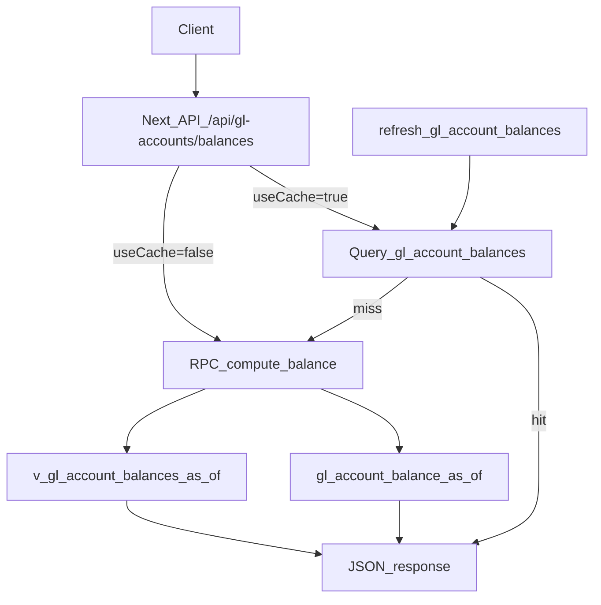

# GL account balances (as-of)

## Goals

- Provide a **Buildium-like as-of balance** surface: **debits minus credits up to date**.
- Support **optional property scoping** using your chosen semantics: mirror `get_property_financials` scoping _plus_ `transaction_lines.buildium_property_id` matching.
- Add an optional **snapshot/cache layer** for speed/audit.
- Expose an internal API: `GET /api/gl-accounts/balances` with Zod validation, org-authorization, filtering, and pagination.

## Key repo anchors we’ll mirror

- Property scoping logic and “bank lines may be unscoped” precedent in [`supabase/migrations/20260404100000_align_get_property_financials_with_rollup.sql`](/Users/brandonbabel/property-manager/supabase/migrations/20260404100000_align_get_property_financials_with_rollup.sql).
- Existing trial balance surfaces in [`supabase/migrations/20250829013000_031_gl_reporting_views.sql`](/Users/brandonbabel/property-manager/supabase/migrations/20250829013000_031_gl_reporting_views.sql) (`v_gl_trial_balance`, `gl_trial_balance_as_of`).
- Existing GL accounts API style in [`src/app/api/gl-accounts/route.ts`](/Users/brandonbabel/property-manager/src/app/api/gl-accounts/route.ts) (org authorization, query params).

## DB changes (Supabase migrations)

### 1) Function: `public.gl_account_balance_as_of(p_gl_account_id uuid, p_as_of date, p_property_id uuid default null)`

Create a **stable SQL function** returning a single numeric balance.

- **Balance definition**:
- `debits_sum - credits_sum` up to `p_as_of` (inclusive)
- treat `posting_type` case-insensitively (avoid assuming exact `'Debit'/'Credit'` casing)
- **Property scoping** (only when `p_property_id is not null`): include `transaction_lines` where any of the following holds:
- `transaction_lines.property_id = p_property_id`
- `transaction_lines.unit_id` is a unit in that property
- `transaction_lines.lease_id` is a lease in that property
- `transaction_lines.buildium_lease_id` matches a lease’s `buildium_lease_id` for that property
- `transaction_lines.buildium_property_id` matches the property’s Buildium id

### 2) Listable “view” function: `public.v_gl_account_balances_as_of(p_as_of date)`

Since you confirmed a parameterized view should be a set-returning function, we’ll implement:

- **Return shape**: one row per `(gl_account_id, property_id)` balance computed for `p_as_of`, including:
- `gl_account_id`, `property_id` (nullable), `as_of_date`, `debits`, `credits`, `balance`
- GL metadata from `gl_accounts` (`name`, `type`, `sub_type`, `account_number`, `is_active`, bank flags, Buildium ids)
- **Rows returned**:
- **Global** rows (`property_id is null`) for every GL account
- **Property-scoped** rows (`property_id = properties.id`) for every GL account × property
  - Note: this can be large. We’ll keep it correct first; if it becomes too slow, we can introduce an alternate function that accepts `p_property_id` to compute just one property.

### 3) Snapshots table: `public.gl_account_balances`

Create the table as you specified:

- Columns:
- `gl_account_id uuid not null`
- `property_id uuid null`
- `as_of_date date not null`
- `balance numeric(15,2) not null`
- `source text not null default 'local'`
- `computed_at timestamptz not null default now()`
- `payload jsonb null`
- Constraints / indexes:
- Unique index on `(gl_account_id, property_id, as_of_date)`
- Supporting index for API lookups (e.g. `(as_of_date, property_id)` and/or `(gl_account_id, as_of_date)`)
- RLS:
- Add a policy that allows a row if the user can access the associated `gl_accounts` row (join by `gl_account_id` → `gl_accounts.org_id`).

### 4) Procedure: `public.refresh_gl_account_balances(p_as_of date default current_date)`

- Upsert snapshots from `v_gl_account_balances_as_of(p_as_of)` into `gl_account_balances`.
- Set `payload` to include at least `{ debits, credits, computedBy: 'v_gl_account_balances_as_of' }` to aid audit/debug.

### 5) Optional scheduling hook

- If you want automation, add a small Node cron script under [`scripts/cron/`](/Users/brandonbabel/property-manager/scripts/cron/) that calls the procedure daily. Your existing pattern is “run a TS script via external cron” (see [`scripts/cron/recurring.ts`](/Users/brandonbabel/property-manager/scripts/cron/recurring.ts)).

## API changes (Next.js)

### 6) New route: `GET /api/gl-accounts/balances`

Add [`src/app/api/gl-accounts/balances/route.ts`](/Users/brandonbabel/property-manager/src/app/api/gl-accounts/balances/route.ts).

- **Query params (Zod-validated)**:
- `asOfDate` (required, `YYYY-MM-DD`)
- `propertyId` (optional uuid)
- `glAccountId` (optional uuid)
- `useCache` (optional boolean; default `true`)
- `type` (optional; filter on `gl_accounts.type`)
- Pagination: `page` + `limit` (cap `limit` similar to your other endpoints)
- **Org authorization**:
- Mirror [`src/app/api/gl-accounts/route.ts`](/Users/brandonbabel/property-manager/src/app/api/gl-accounts/route.ts) behavior (`requireAuth`, `resolveUserOrgIds`, `orgId` from query/header/cookie, forbid if not in user orgs).
- **Data source selection**:
- If `useCache=true`, first try `gl_account_balances` for the requested key(s).
- If cache miss (or `useCache=false`): compute live via DB functions:
  - single account: call `gl_account_balance_as_of(glAccountId, asOfDate, propertyId)`
  - list: call `v_gl_account_balances_as_of(asOfDate)` and filter to `propertyId` if provided
- Return a consistent JSON shape: `{ success: true, data, pageInfo }`.

## Data-flow diagram

## Files we expect to add/change

- DB migrations (new):
- [`supabase/migrations/2025XXXXXX_create_gl_account_balances_surface.sql`](/Users/brandonbabel/property-manager/supabase/migrations/2025XXXXXX_create_gl_account_balances_surface.sql)
- API route (new):
- [`src/app/api/gl-accounts/balances/route.ts`](/Users/brandonbabel/property-manager/src/app/api/gl-accounts/balances/route.ts)
- Optional cron script (new, only if you want scheduling now):
- [`scripts/cron/refresh-gl-account-balances.ts`](/Users/brandonbabel/property-manager/scripts/cron/refresh-gl-account-balances.ts)

## Validation / safety checks
