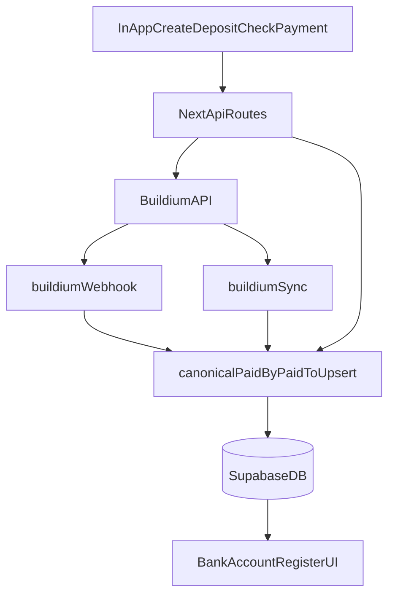

# PaidBy/PaidTo: Transaction-level Single Source of Truth

## Context / current behavior

- The Bank Account register UI currently **hardcodes `Paid by` to `—`** and only uses `vendor_id` for `Paid to`.
```278:288:src/app/(protected)/bank-accounts/[id]/page.tsx
    return {
      id: row.id ? String(row.id) : `${row.date ?? 'tx'}-${Math.random().toString(36).slice(2)}`,
      dateLabel: formatDate(row.date),
      numberLabel: row.reference_number || '—',
      paidByLabel: '—',
      paidToLabel: vendorLabel,
      memoLabel: row.memo || '—',
      paymentAmount,
      depositAmount,
      balanceAfter: runningBalance,
    };
```


- `v_recent_transactions_ranked` is currently just `transactions` plus a row-number and **does not compute party fields**.
```43:50:supabase/migrations/20241012153000_add_transaction_status_enum.sql
create or replace view public.v_recent_transactions_ranked as
select t.*,
  row_number() over (
    partition by t.org_id
    order by t.date desc,
      t.created_at desc
  ) as rn
from public.transactions t;
```


- We already persist some Buildium “detail” fields that can power PaidBy/PaidTo:
- `transactions.payee_*` (from Buildium `PaymentDetail.Payee`)
- `transaction_payment_transactions` (from Buildium `DepositDetails.PaymentTransactions`, includes `AccountingEntity` + `Amount`)
```5:67:supabase/migrations/20260402090000_buildium_transaction_schema_extension.sql
ALTER TABLE public.transactions
  ADD COLUMN IF NOT EXISTS buildium_last_updated_at timestamptz,
  ADD COLUMN IF NOT EXISTS payment_method_raw text,
  ADD COLUMN IF NOT EXISTS payee_buildium_id integer,
  ADD COLUMN IF NOT EXISTS payee_buildium_type text,
  ADD COLUMN IF NOT EXISTS payee_name text,
  ADD COLUMN IF NOT EXISTS payee_href text,
  -- ...
  ADD COLUMN IF NOT EXISTS bank_gl_account_buildium_id integer;

CREATE TABLE IF NOT EXISTS public.transaction_payment_transactions (
  id uuid DEFAULT gen_random_uuid() PRIMARY KEY,
  transaction_id uuid REFERENCES public.transactions(id) ON DELETE CASCADE,
  buildium_payment_transaction_id integer,
  accounting_entity_id integer,
  accounting_entity_type text,
  accounting_entity_href text,
  accounting_unit_id integer,
  accounting_unit_href text,
  amount numeric,
  created_at timestamptz DEFAULT now() NOT NULL,
  updated_at timestamptz DEFAULT now() NOT NULL
);
```


## Goal state

- **Single source of truth**: `transactions` holds exactly one canonical **PaidBy** and one canonical **PaidTo** (nullable when truly unknown).
- **PaidBy meaning (bank register)**: PaidBy is the **AccountingEntity context** (Property + optional Unit).
- **PaidTo meaning**: PaidTo is the **counterparty** (Vendor/Tenant/Owner/etc.).
- Buildium webhook/sync and in-app create flows populate canonical columns.
- Bank register reads canonical columns (no hardcoding).

## Proposed approach (transaction-level canonical columns)

### 1) Add canonical PaidBy/PaidTo columns to `transactions`

**PaidBy (AccountingEntity)**

- `paid_by_accounting_entity_id` (integer, Buildium ID)
- `paid_by_accounting_entity_type` (text)
- `paid_by_accounting_entity_href` (text)
- `paid_by_accounting_unit_id` (integer)
- `paid_by_accounting_unit_href` (text)
- `paid_by_label` (text, derived display label for register)

**PaidTo (counterparty)**

- `paid_to_buildium_id` (integer)
- `paid_to_type` (text)
- `paid_to_name` (text)
- `paid_to_href` (text)
- `paid_to_vendor_id` (uuid, nullable FK)
- `paid_to_tenant_id` (uuid, nullable FK)

Constraints/indexes:

- **Type constraint note**: `paid_to_type` is stored as **free text initially** (aligned to Buildium response values). Once the OpenAPI doc confirms the allowed set, we can optionally migrate to a Postgres enum (or CHECK constraint) in a follow-up migration without changing the write-path API.
- CHECK: `paid_to_vendor_id` and `paid_to_tenant_id` are mutually exclusive.
- **Authority rule (canonical vs mirror)**:
- Canonical for PaidTo is `paid_to_*` + (when available) local FK (`paid_to_vendor_id` or `paid_to_tenant_id`) and must be consistent with `paid_to_type`.
- If local FK/type and Buildium mirror fields ever disagree, **local FK + `paid_to_type` wins** and Buildium fields are overwritten on the next central upsert/backfill.
- **RLS note**: these new columns live on `transactions` and must not weaken existing `transactions` RLS. They are only readable/writable via existing transactions policies/views/APIs.
- **Indexes for register performance** (expected):
- `CREATE INDEX ... ON public.transactions (bank_gl_account_id, date);`
- Optional if we add filters later: `CREATE INDEX ... ON public.transactions (bank_gl_account_id, paid_by_accounting_entity_id);`

### 2) Centralize the write-path (single upsert helper)

Create one helper used everywhere (webhook, sync, create flows) to set canonical columns deterministically:

- **PaidBy**
- Prefer Buildium `DepositDetails.PaymentTransactions[].AccountingEntity` when present.
- **Multi-party rule** (single PaidBy selection when multiple exist): pick the **largest Amount**; if tied, pick the **lowest stable ID**; if still tied, pick the first stable-sort by (AccountingEntityType, AccountingEntityId, UnitId).
- Else derive from best available local context (`transaction_lines.buildium_property_id/unit_id`, `transactions.buildium_unit_id`, lease→property/unit).
- **Label format (defined once)**:
    - If unit is present: `${PropertyName} | ${UnitLabel}`
    - Else: `${PropertyName}`
- **Canonical vs derived**: `paid_by_*` and `paid_to_*` columns are canonical; `paid_by_label` (and any future `paid_to_label`) are derived. Labels are recomputed **only** in the central upsert/backfill paths (never ad-hoc in the UI).
- **PaidTo**
- Prefer local vendor/tenant links when known.
- Fallback to Buildium `PaymentDetail.Payee` into `paid_to_*`.
- **Multi-party rule** (single PaidTo selection when multiple exist): if Buildium provides multiple PaidTo candidates, use the same deterministic selection rule as PaidBy (largest Amount if available; otherwise lowest ID).

### 3) Fetch Buildium bank transactions + detail (to populate new fields)

From the indexed doc **“Open API, powered by Buildium (v1)”**, capture the exact endpoint path + HTTP method for:

- listing bank transactions for a bank account/date range
- fetching a single transaction detail containing PaidBy/PaidTo-equivalent fields

Then update ingestion and create flows to call the detail endpoint **only when local inputs + webhook/list payload are insufficient to set canonical fields directly** (avoid unnecessary Buildium round-trips and tight coupling).

### 4) Update bank register query + UI

- Update the query surface to include `paid_by_label` and `paid_to_name`.
- Update `[src/app/(protected)/bank-accounts/[id]/page.tsx](src/app/(protected)/bank-accounts/[id]/page.tsx)` to render:
- `Paid by` = `paid_by_label ?? '—'`
- `Paid to` = `paid_to_name ?? '—'`

### 5) Backfill + verification

- Backfill canonical columns for historical rows only where deterministic; otherwise leave null and generate a review report.
- Backfill determinism examples:
- Deterministic: deposit/check/payment that maps to exactly one (property, optional unit) context and one clear counterparty (vendor/tenant/payee).
- Ambiguous: deposits with multiple `DepositDetails.PaymentTransactions` across multiple properties/units; payments with conflicting local FK vs Buildium payee data.
- Validate using [`docs/runbooks/transaction-ingestion-validation.md`](docs/runbooks/transaction-ingestion-validation.md).

## Architecture / flow

