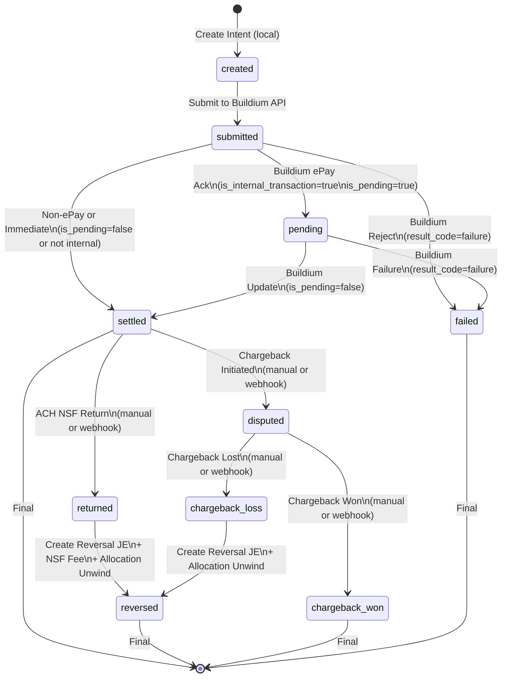

# Payment Lifecycle State Machine Plan

## Overview

This plan implements a payment state machine aligned with Buildium's payment operations, leveraging existing Buildium transaction fields (`is_internal_transaction`, `internal_transaction_is_pending`, etc.) for lifecycle tracking. The system reuses `buildium_webhook_events` as the immutable event log and adds idempotency BEFORE Buildium API calls to prevent duplicate payments. It supports manual return/chargeback recording with hooks for future automation.

## Key Design Decisions

1. **Don't use `transaction_status` for payment lifecycle**: Keep `transaction_status_enum` for ledger/receivable semantics ('', 'Overdue', 'Due', 'Partially paid', 'Paid', 'Cancelled'). Payment lifecycle uses Buildium internal transaction fields.

2. **Reuse `buildium_webhook_events`**: This table already has compound idempotency key `(buildium_webhook_id, event_name, event_created_at)` and stores raw payloads. Use it as the immutable event log for Buildium events.

3. **Derive lifecycle from Buildium fields**: 
   - `pending` = `is_internal_transaction=true` AND `internal_transaction_is_pending=true`
   - `settled` = `is_internal_transaction=true` AND `internal_transaction_is_pending=false` OR `is_internal_transaction=false` (non-internal = immediately settled unless failure)
   - `settled_at` = `internal_transaction_result_date` when available, otherwise `transaction.created_at` for non-internal
   - `failed` = `internal_transaction_result_code` in failure set (precedence: failure code overrides non-internal settled status)
   - **Concrete failure codes**: Define mapping for Buildium `internal_transaction_result_code` values (e.g., 'NSF', 'AccountClosed', 'InsufficientFunds', etc.)

4. **Idempotency BEFORE Buildium API calls**: Check/store idempotency key before calling Buildium to prevent duplicate payment creation.

5. **Model A (current behavior)**: Transactions row exists immediately after submission. If ePay/internal payment, lifecycle tracks pending until Buildium updates internal status.

6. **Store raw + normalized**: Store `raw_event_type`, `raw_result_code`, `raw_reason_code` as text; add normalized columns via application code or views. No enums for event types initially.

7. **Manual returns/chargebacks first**: Start with manual recording endpoints; add automation hooks when Buildium reflects these in webhooks.

8. **Payer restrictions on actual methods**: Model restrictions using `payment_method_enum` values, support method groups (e.g., ACH-like methods).

9. **UDF defaults for online methods**: Default to Undeposited Funds for ElectronicPayment, DirectDeposit, CreditCard unless explicitly bypassing deposit workflow. Add explicit `bypass_udf` flag for override.

10. **Allocation plan integration**: Reserve `allocation_plan` field in payment_intent for tenant ledger allocation engine integration.

11. **Thin payment projection**: Payment is a thin projection/view over transactions, not duplicating lifecycle data. Derive state via computed columns/views.

12. **One event source**: Reuse `buildium_webhook_events` for Buildium events. Create separate `manual_payment_events` table for manual entries. Expose unified `payment_events` view joining both with normalized fields.

13. **Unique constraints**: `payment_intent(org_id, idempotency_key)` unique; `payment(org_id, gateway_transaction_id)` unique to block duplicates.

14. **Junction table for restrictions**: Use `payer_restriction_methods` junction table instead of text[] array for deterministic lookups/indexing.

## Current State Analysis

### What Exists

- **Transactions table**: Core financial artifact storage with `transaction_status_enum` for ledger semantics ('', 'Overdue', 'Due', 'Partially paid', 'Paid', 'Cancelled') - NOT for payment lifecycle
- **Buildium PaymentDetail fields**: `is_internal_transaction`, `internal_transaction_is_pending`, `internal_transaction_result_code`, `internal_transaction_result_date` tracked on transactions (used for lifecycle)
- **Idempotency support**: `idempotency_key` column on transactions table with unique index
- **Webhook event storage**: `buildium_webhook_events` table with compound unique key `(buildium_webhook_id, event_name, event_created_at)` for idempotency
- **Basic reversal**: Reversal support via `src/lib/accounting/reversals.ts` and `reversal_of_transaction_id` field
- **Webhook handlers**: Buildium webhook processing for `LeaseTransaction.Created/Updated/Deleted` events
- **Payment methods**: Defined set `payment_method_enum` (Check, Cash, MoneyOrder, CashierCheck, DirectDeposit, CreditCard, ElectronicPayment)

### What's Missing

1. **Payment intent tracking**: No separation between payment request and financial artifact
2. **Idempotency before Buildium calls**: Currently calls Buildium then upserts locally; double-submit creates duplicates
3. **Explicit state machine**: No state transitions derived from Buildium internal transaction fields
4. **Payment projection**: No separate view/table projecting lifecycle state from transactions
5. **Return/NSF tracking**: No explicit tracking of ACH NSF returns or bounced checks (no workflow yet)
6. **Chargeback tracking**: No dispute/chargeback lifecycle support
7. **Payer restrictions**: No mechanism to temporarily disable payment methods after returns
8. **Deposit/UDF interaction**: Payment creation may bypass UDF workflow for some methods
9. **Allocation plan**: No field to store intended allocation strategy for tenant ledger integration

## Architecture

### Core Objects

```mermaid
erDiagram
    payment_intent ||--o| payment : creates
    payment_intent ||--o{ buildium_webhook_events : referenced_by
    payment ||--|| transactions : projects_from
    buildium_webhook_events ||--o{ payment_event : source_of
    payment_event }o--|| payment_intent : belongs_to
    payment_event }o--|| payment : tracked_by
    payer_restrictions ||--o{ payment_intent : restricts
    
    payment_intent {
        uuid id PK
        uuid org_id FK
        string idempotency_key UK
        uuid payer_id FK
        string payer_type
        decimal amount
        text payment_method "references payment_method_enum"
        text state "created|submitted|pending|settled|failed"
        text gateway_provider "buildium|stripe|..."
        text gateway_intent_id
        jsonb allocation_plan "reserved for tenant ledger"
        jsonb metadata
        timestamptz created_at
        timestamptz submitted_at
        timestamptz updated_at
    }
    
    buildium_webhook_events {
        uuid id PK
        text buildium_webhook_id
        text event_name
        timestamptz event_created_at
        jsonb event_data "raw payload"
        boolean processed
        timestamptz processed_at
    }
    
    payment_event {
        uuid id PK
        uuid payment_intent_id FK
        uuid payment_id FK "nullable"
        uuid source_event_id FK "nullable, references buildium_webhook_events.id"
        text provider "buildium|stripe|..."
        text raw_event_type "text, not enum"
        text normalized_event_type
        text raw_result_code "nullable"
        text normalized_result_code "nullable"
        text gateway_event_id "nullable, unique per provider"
        jsonb event_data "immutable"
        timestamptz occurred_at "from source event"
        timestamptz created_at
    }
    
    payment {
        uuid id PK
        uuid payment_intent_id FK
        uuid transaction_id FK "unique, references transactions.id"
        uuid org_id FK "part of unique constraint with gateway_transaction_id"
        text state "authorized|settled|returned|disputed|chargeback_loss|chargeback_won|reversed"
        text normalized_state "computed column/view from transaction fields"
        decimal amount "computed from transaction.total_amount"
        text payment_method "computed from transaction.payment_method"
        uuid payer_id FK "computed from transaction.payee_tenant_id"
        string payer_type
        text gateway_transaction_id "nullable, unique with org_id"
        timestamptz returned_at "nullable"
        text raw_return_reason_code "nullable"
        text normalized_return_reason_code "nullable"
        timestamptz disputed_at "nullable"
        text chargeback_id "nullable"
        timestamptz settled_at "computed from internal_transaction_result_date or created_at"
        timestamptz created_at
        timestamptz updated_at
    }
    
    transactions {
        uuid id PK
        boolean is_internal_transaction
        boolean internal_transaction_is_pending
        date internal_transaction_result_date
        text internal_transaction_result_code
        text transaction_status "ledger status, NOT lifecycle"
    }
    
    payer_restrictions {
        uuid id PK
        uuid org_id FK
        uuid payer_id FK
        string payer_type
        text restriction_type "eft_disabled|payment_method_disabled"
        timestamptz restricted_until "nullable"
        text reason "references event or manual"
        uuid source_event_id FK "nullable, references buildium_webhook_events.id or manual_payment_events.id"
        jsonb metadata
        timestamptz created_at
        timestamptz updated_at
    }
    
    payer_restriction_methods {
        uuid id PK
        uuid payer_restriction_id FK
        text payment_method "references payment_method_enum"
        unique(payer_restriction_id, payment_method)
    }
    
    manual_payment_events {
        uuid id PK
        uuid org_id FK
        uuid payment_intent_id FK "nullable"
        uuid payment_id FK "nullable"
        text raw_event_type "return.nsf|chargeback.initiated|chargeback.won|chargeback.lost|reversal.created"
        text normalized_event_type
        jsonb event_data
        timestamptz occurred_at
        timestamptz created_at
        uuid created_by_user_id FK "nullable"
    }
    
    payment_events {
        view "UNION of buildium_webhook_events + manual_payment_events with normalized fields"
    }
```

### State Machine Flow

**State derivation from Buildium fields:**
- `created`: Intent created locally, not yet submitted to Buildium
- `submitted`: Submitted to Buildium API (transaction row exists)
- `pending`: `is_internal_transaction=true` AND `internal_transaction_is_pending=true` (ePay pending settlement)
- `settled`: `is_internal_transaction=true` AND `internal_transaction_is_pending=false` (settlement complete)
- `failed`: `internal_transaction_result_code` indicates failure (store raw code, normalize)



## Implementation Plan

### Phase 1: Database Schema

**File**: `supabase/migrations/YYYYMMDDHHMMSS_create_payment_lifecycle_schema.sql`

**Changes**:

1. **Create `payment_intent` table**:

- `id` (uuid, PK)
- `org_id` (uuid, FK to organizations)
- `idempotency_key` (text, unique, indexed) - **CRITICAL: checked before Buildium API call**
- `payer_id` (uuid, FK to tenants/contacts)
- `payer_type` (text: 'tenant', 'contact', etc.)
- `amount` (numeric)
- `payment_method` (text: references `payment_method_enum` - Check, Cash, MoneyOrder, CashierCheck, DirectDeposit, CreditCard, ElectronicPayment)
- `state` (text: 'created', 'submitted', 'pending', 'authorized', 'settled', 'failed') - **Include 'authorized' if card flows planned; NO ENUM initially, store as text**
- `gateway_provider` (text, nullable: 'buildium', 'stripe', etc.)
- `gateway_intent_id` (text, nullable)
- `allocation_plan` (jsonb, nullable) - **Reserved for tenant ledger allocation integration**
- `bypass_udf` (boolean, default false) - **Explicit override flag for UDF workflow**
- `metadata` (jsonb)
- Audit fields: `created_at`, `submitted_at`, `updated_at`
- **Unique constraint**: `(org_id, idempotency_key)` - **CRITICAL for duplicate prevention**

2. **Create `manual_payment_events` table** (separate from `buildium_webhook_events` to keep provenance clear):

- `id` (uuid, PK)
- `org_id` (uuid, FK to organizations) - **Required for RLS**
- `payment_intent_id` (uuid, FK, nullable)
- `payment_id` (uuid, FK to payments, nullable)
- `raw_event_type` (text: 'return.nsf', 'chargeback.initiated', 'chargeback.won', 'chargeback.lost', 'reversal.created')
- `normalized_event_type` (text) - **Normalized via application code**
- `event_data` (jsonb, immutable)
- `occurred_at` (timestamptz) - **When event occurred (may be historical)**
- `created_at` (timestamptz)
- `created_by_user_id` (uuid, FK to auth.users, nullable) - **Who manually recorded this**

3. **Create `payment_events` view** (unified view of all payment events):

- UNION of `buildium_webhook_events` (provider='buildium') and `manual_payment_events` (provider='manual')
- Normalize event types across both sources
- Include `provider`, `source_event_id`, `normalized_event_type`, `normalized_result_code`
- Enable querying payment event history from single source

4. **Create `payment` table** (thin projection/lifecycle tracking over transactions):

- `id` (uuid, PK)
- `payment_intent_id` (uuid, FK)
- `transaction_id` (uuid, FK to transactions, unique) - **One payment per transaction**
- `org_id` (uuid, FK) - **Part of unique constraint with gateway_transaction_id**
- `gateway_transaction_id` (text, nullable) - **Buildium transaction ID, unique with org_id**
- `state` (text: 'authorized', 'settled', 'returned', 'disputed', 'chargeback_loss', 'chargeback_won', 'reversed') - **NO ENUM initially, computed via view/function**
- `normalized_state` (text) - **Computed column deriving from transaction fields (see derivation logic below)**
- `amount` (numeric) - **Computed from transaction.total_amount, immutable after settled via application logic**
- `payment_method` (text) - **Computed from transaction.payment_method**
- `payer_id` (uuid) - **Computed from transaction.payee_tenant_id or related fields**
- `payer_type` (text)
- `returned_at` (timestamptz, nullable)
- `raw_return_reason_code` (text, nullable) - **Raw reason code (NSF, ACCOUNT_CLOSED, etc.)**
- `normalized_return_reason_code` (text, nullable) - **Normalized**
- `disputed_at` (timestamptz, nullable)
- `chargeback_id` (text, nullable)
- `settled_at` (timestamptz, nullable) - **Computed from transaction.internal_transaction_result_date OR transaction.created_at for non-internal**
- Audit fields: `created_at`, `updated_at`
- **Unique constraint**: `(org_id, gateway_transaction_id)` - **Block duplicate webhook replays**

**State derivation logic (computed column/view)**:
```sql
-- Pseudocode for normalized_state computation
CASE
  WHEN transaction.internal_transaction_result_code IN (failure_codes...) THEN 'failed'
  WHEN transaction.is_internal_transaction = true AND transaction.internal_transaction_is_pending = true THEN 'pending'
  WHEN transaction.is_internal_transaction = true AND transaction.internal_transaction_is_pending = false THEN 'settled'
  WHEN transaction.is_internal_transaction = false OR transaction.is_internal_transaction IS NULL THEN 'settled' -- Non-internal = immediately settled
  ELSE 'submitted'
END
```

**settled_at derivation**:
- `internal_transaction_result_date` when available (internal transactions)
- `transaction.created_at` for non-internal payments (immediately settled)

**Failure code mapping table**:
- Create `buildium_failure_codes` lookup table or mapping function
- Map Buildium `internal_transaction_result_code` values to normalized failure reasons
- Examples: 'NSF', 'AccountClosed', 'InsufficientFunds', 'InvalidAccount', etc.

5. **Create `payer_restrictions` table** (with junction table for methods):

- `id` (uuid, PK)
- `org_id` (uuid, FK) - **Required for RLS**
- `payer_id` (uuid, FK)
- `payer_type` (text)
- `restriction_type` (text: 'eft_disabled', 'payment_method_disabled') - **NO ENUM initially**
- `restricted_until` (timestamptz, nullable)
- `reason` (text: references event or manual description)
- `source_event_id` (uuid, nullable) - **FK to buildium_webhook_events.id OR manual_payment_events.id**
- `metadata` (jsonb)
- Audit fields: `created_at`, `updated_at`

6. **Create `payer_restriction_methods` junction table** (instead of text[] array):

- `id` (uuid, PK)
- `payer_restriction_id` (uuid, FK to payer_restrictions)
- `payment_method` (text, references `payment_method_enum`)
- **Unique constraint**: `(payer_restriction_id, payment_method)`
- **Indexes**: `(payer_restriction_id)`, `(payment_method)` for efficient lookups

**Rationale**: Junction table enables deterministic indexing and efficient queries for method group restrictions (e.g., ACH-like methods: DirectDeposit + ElectronicPayment)

7. **State enum for payment_intent only** (optional, but recommended for validation):
   ```sql
   CREATE TYPE payment_intent_state_enum AS ENUM ('created', 'submitted', 'pending', 'authorized', 'settled', 'failed');
   ```
   Include 'authorized' if card flows are planned. Use this for `payment_intent.state` column type. Keep other fields as text.

8. **Create `buildium_failure_codes` lookup table** (for failure code normalization):

- `raw_code` (text, PK) - **Buildium internal_transaction_result_code**
- `normalized_code` (text) - **Normalized failure reason**
- `failure_category` (text: 'nsf', 'account_issue', 'system_error', etc.)
- `description` (text, nullable)

**Initial mapping** (examples):
- 'NSF' → normalized_code: 'insufficient_funds', category: 'nsf'
- 'AccountClosed' → normalized_code: 'account_closed', category: 'account_issue'
- 'InsufficientFunds' → normalized_code: 'insufficient_funds', category: 'nsf'
- 'InvalidAccount' → normalized_code: 'invalid_account', category: 'account_issue'

9. **Indexes**:

- `payment_intent(org_id, idempotency_key)` unique - **CRITICAL for duplicate prevention (composite key)**
- `payment_intent(org_id, state)` for org queries
- `payment(transaction_id)` unique - **One payment per transaction**
- `payment(org_id, gateway_transaction_id)` unique - **Block duplicate webhook replays**
- `payer_restrictions(org_id, payer_id, restricted_until)` filtered index for active restrictions
- `payer_restriction_methods(payer_restriction_id)` for restriction → methods lookup
- `payer_restriction_methods(payment_method)` for method → restrictions lookup
- `manual_payment_events(org_id, payment_intent_id)` for intent event history
- `manual_payment_events(org_id, payment_id)` for payment event history

10. **RLS policies**: All tables scoped by `org_id` with standard RLS patterns
   - `payment_intent`: RLS by `org_id`
   - `payment`: RLS by `org_id`
   - `payer_restrictions`: RLS by `org_id`
   - `payer_restriction_methods`: RLS via join through `payer_restrictions`
   - `manual_payment_events`: RLS by `org_id`
   - **Verify**: `buildium_webhook_events` has `org_id` or can be safely joined via transactions

11. **Computed columns/views for payment state**:
   - Create computed column or view for `payment.normalized_state` deriving from `transactions.is_internal_transaction` fields
   - Create computed column for `payment.settled_at` deriving from `internal_transaction_result_date` or `created_at`

### Phase 2: Idempotency Fix (CRITICAL)

**File**: Update `src/lib/lease-transaction-service.ts`

**Changes**:

1. **Add idempotency check BEFORE Buildium API call**:
   - Accept `idempotencyKey` parameter in `createInBuildiumAndDB()`
   - Check if `payment_intent` with this key exists
   - If exists, return existing transaction (do NOT call Buildium)
   - If not exists, create payment_intent with key, THEN call Buildium
   - Store Buildium response transaction ID in payment_intent
   - Prevent duplicate Buildium payment creation

2. **Idempotency flow**:
   ```typescript
   async createInBuildiumAndDB(leaseId, payload, idempotencyKey?): Promise<{localId?, buildiumId?, intentId?}> {
     // 1. Generate or use provided idempotency key
     const key = idempotencyKey || generateIdempotencyKey();
     
     // 2. Check for existing intent with this key
     const existing = await findPaymentIntentByIdempotencyKey(key);
     if (existing) {
       // Return existing transaction, do NOT call Buildium
       return { localId: existing.transaction_id, buildiumId: existing.gateway_transaction_id, intentId: existing.id };
     }
     
     // 3. Create payment_intent in 'created' state
     const intent = await createPaymentIntent({ idempotency_key: key, ... });
     
     // 4. NOW call Buildium (only if intent is new)
     const buildiumResponse = await client.makeRequest('POST', ...);
     
     // 5. Update intent to 'submitted', store gateway_transaction_id
     // 6. Create/update transaction
     // 7. Create payment projection
   }
   ```

3. **Update all payment creation endpoints**:
   - `/api/leases/[id]/payments` - Accept idempotency key, pass to service
   - `/api/monthly-logs/[logId]/payments` - Same

### Phase 3: Payment Intent Service

**Files**:

- `src/lib/payments/payment-intent-service.ts` (new)
- `src/types/payments.ts` (new)

**Changes**:

1. **Create `PaymentIntentService` class**:

- `createIntent(params, idempotencyKey?)` - Creates payment intent with idempotency check
- `findByIdempotencyKey(key)` - Idempotency lookup (used by Phase 2)
- `submitIntent(intentId, buildiumResponse)` - Updates to 'submitted' after Buildium call
- `transitionStateFromBuildiumFields(intentId, transaction)` - Derives state from transaction.is_internal_transaction fields
- `findByIntentId(id)` - Retrieval with relations

2. **State derivation from Buildium fields with failure code precedence**:
   ```typescript
   function derivePaymentState(transaction: TransactionRow): PaymentIntentState {
     const failureCode = transaction.internal_transaction_result_code;
     
     // Precedence: failure code overrides everything
     if (failureCode && isFailureCode(failureCode)) {
       return 'failed';
     }
     
     // Internal transaction pending
     if (transaction.is_internal_transaction && transaction.internal_transaction_is_pending) {
       return 'pending';
     }
     
     // Internal transaction settled
     if (transaction.is_internal_transaction && !transaction.internal_transaction_is_pending) {
       return 'settled';
     }
     
     // Non-internal = immediately settled (unless failure handled above)
     if (!transaction.is_internal_transaction || transaction.is_internal_transaction === null) {
       return 'settled';
     }
     
     return 'submitted'; // Fallback
   }
   
   function deriveSettledAt(transaction: TransactionRow): Date | null {
     // Use internal_transaction_result_date when available
     if (transaction.internal_transaction_result_date) {
       return new Date(transaction.internal_transaction_result_date);
     }
     
     // For non-internal payments, use transaction creation date
     if (!transaction.is_internal_transaction || transaction.is_internal_transaction === null) {
       return new Date(transaction.created_at);
     }
     
     return null; // Pending internal transaction
   }
   
   function isFailureCode(code: string | null): boolean {
     if (!code) return false;
     // Query buildium_failure_codes table or use mapping
     const normalized = normalizeFailureCode(code);
     return normalized !== null;
   }
   ```

3. **Gateway integration hooks** (stubbed for future, Buildium-first):
   ```typescript
   interface GatewayAdapter {
     submitPayment(intent: PaymentIntent): Promise<GatewayResponse>;
     handleWebhook(event: GatewayWebhookEvent): Promise<void>;
   }
   
   class BuildiumAdapter implements GatewayAdapter {
     // Current implementation - calls LeaseTransactionService
   }
   ```

### Phase 4: Payment Projection

**File**: `src/lib/payments/payment-service.ts` (new)

**Changes**:

1. **Create `PaymentService` class** that derives lifecycle from transactions**:

- `createFromTransaction(intentId, transactionId)` - Creates payment projection linking to transaction
- `deriveStateFromTransaction(transaction)` - Derives state from `is_internal_transaction` fields (same logic as Phase 3)
- `updateFromBuildiumWebhook(transactionId, buildiumData)` - Updates lifecycle state when Buildium webhook arrives
- `recordReturn(paymentId, returnData)` - Manual return entry, transitions to 'returned', creates reversal
- `recordChargeback(paymentId, disputeData)` - Manual chargeback entry, transitions to 'disputed'
- `resolveChargeback(paymentId, won)` - Manual resolution, transitions to 'chargeback_won' or 'chargeback_loss'
- `getByTransactionId(transactionId)` - Lookup by transaction

2. **State derivation logic** (same as Phase 3):
   - `pending` = `is_internal_transaction=true` AND `internal_transaction_is_pending=true`
   - `settled` = `is_internal_transaction=true` AND `internal_transaction_is_pending=false`
   - `failed` = `internal_transaction_result_code` indicates failure

3. **Model A (current behavior)**:
   - Transaction row exists immediately after submission
   - Payment projection created when transaction is created
   - Lifecycle state tracks settlement via Buildium internal transaction fields
   - No separate "authorized" vs "settled" distinction for non-ePay methods

### Phase 5: Webhook Integration

**Files**:

- Update `src/app/api/webhooks/buildium/route.ts`
- Update `supabase/functions/buildium-webhook/index.ts` (if applicable)

**Changes**:

1. **Reuse `buildium_webhook_events` as event log**:
   - No need for separate `payment_event` table for Buildium events
   - Query `buildium_webhook_events` for payment-related events (`LeaseTransaction.Created/Updated`)
   - Link payment_intent to webhook event via `source_event_id` (if using thin projection)

2. **Update Buildium webhook handler**:
   - When processing `LeaseTransaction.Created/Updated` with `PaymentDetail`
   - Extract `InternalTransactionStatus` from `PaymentDetail`
   - Find or create `payment_intent` by Buildium transaction ID
   - Update `payment` projection state from `is_internal_transaction` fields
   - Create/update payment lifecycle state

3. **Event projection** (optional thin layer):
   - If `payment_event` table exists, create records linking to `buildium_webhook_events.id`
   - Use `source_event_id` FK to reference original webhook event
   - Store normalized event types/codes for querying

4. **Idempotency**:
   - `buildium_webhook_events` already has compound unique key preventing duplicates
   - No additional idempotency needed for webhook processing

### Phase 6: Deposit/Undeposited Funds Fix

**Files**:

- Update `src/app/api/leases/[id]/payments/route.ts`
- Update `src/app/api/monthly-logs/[logId]/payments/route.ts`

**Changes**:

1. **Fix deposit/UDF interaction**:
   - For online payment methods (`ElectronicPayment`, `DirectDeposit`, `CreditCard`), default to UDF
   - Only set `BankAccountId` in Buildium payload if explicitly bypassing deposit workflow
   - Make method-dependent and explicit in payment creation logic

2. **Update payment creation with explicit override flag**:
   ```typescript
   // Explicit bypass_udf flag in payment_intent
   const shouldUseUDF = !bypass_udf && ['ElectronicPayment', 'DirectDeposit', 'CreditCard'].includes(payment_method);
   const bankAccountId = shouldUseUDF ? undefined : resolvedBankAccountId;
   
   // Create payment_intent with bypass_udf flag
   const intent = await createPaymentIntent({
     ...params,
     bypass_udf: bypass_udf || false, // Explicit override flag
   });
   ```

3. **UDF resolution order** (for non-online methods or when bypass_udf=true):
   - Use existing bank account resolution logic
   - Buildium-provided bank GL → org UDF → property operating/deposit-trust fallback

3. **Align with existing UDF precedence**:
   - Follow existing pattern in webhook ingestion: Buildium-provided bank GL → org UDF → property fallback
   - Ensure payment creation respects UDF workflow for online methods

### Phase 7: Payer Restrictions Service

**File**: `src/lib/payments/payer-restrictions-service.ts` (new)

**Changes**:

1. **Create `PayerRestrictionsService` class**:

- `applyRestriction(payerId, restrictionType, paymentMethods[], duration, reason)` - Creates restriction record with junction table entries
- `checkRestriction(payerId, paymentMethod)` - Validates if payer can use payment method (queries junction table)
- `clearRestriction(restrictionId)` - Removes active restriction and junction table entries
- `getActiveRestrictions(payerId)` - Returns current restrictions with method lists from junction table

2. **Restriction logic with junction table**:
   - Query `payer_restriction_methods` join for method matches (deterministic indexing)
   - Check `restricted_until` timestamp (null = permanent until cleared)
   - Support method groups by inserting multiple rows in junction table: e.g., ACH-like restriction creates two rows (DirectDeposit, ElectronicPayment)
   - Efficient lookups via indexes on `payer_restriction_id` and `payment_method`

3. **Integration points**:
   - Payment intent creation: Check restrictions BEFORE calling Buildium API
   - Payment form UI: Filter/disable restricted methods
   - Server-side validation in payment creation endpoints

4. **Auto-apply restrictions** (future hook):
   - On NSF return: Apply 'eft_disabled' restriction for ACH-like methods (configurable duration, e.g., 30 days)
   - On chargeback: Apply 'payment_method_disabled' for specific method
   - Store `source_event_id` linking to webhook event if auto-applied

### Phase 8: Manual Returns and Chargebacks

**Files**:

- `src/lib/payments/reversal-service.ts` (new)
- Update `src/lib/accounting/reversals.ts`

**Changes**:

1. **Manual return/chargeback endpoints** (start here, automate later):
   - `POST /api/payments/[paymentId]/return` - Manual NSF return entry
   - `POST /api/payments/[paymentId]/chargeback` - Manual chargeback entry
   - `POST /api/payments/[paymentId]/chargeback/resolve` - Resolve chargeback (won/lost)

2. **Create immutable events in `manual_payment_events` table**:
   - **DO NOT** write manual events into `buildium_webhook_events` (keep provenance clear)
   - Create records in `manual_payment_events` table
   - Store `raw_event_type` as 'return.nsf', 'chargeback.initiated', 'chargeback.won', 'chargeback.lost', 'reversal.created'
   - Link to payment via `payment_id`
   - Link to intent via `payment_intent_id`
   - Store `created_by_user_id` for audit trail
   - `occurred_at` may be historical (when return/chargeback actually occurred)

3. **Extend reversal service**:
   - `createNSFReversal(paymentId, returnData)` - Creates reversal JE + NSF fee charge + unwinds allocations (single transaction)
   - `createChargebackReversal(paymentId, disputeData)` - Creates reversal JE + unwinds allocations
   - Integration with allocation engine (from tenant_ledger plan) for allocation unwinding

4. **NSF fee creation**:
   - Query org policy for NSF fee amount (future: `org_control_accounts.nsf_fee_amount`)
   - Create charge transaction with fee category
   - Allocate to original lease

5. **Single transaction execution**:
   - All operations (reversal JE, NSF fee, allocation unwind) in single DB transaction
   - Update `payment.state` to 'returned' or 'disputed'

6. **Future automation hooks**:
   - Reserve place to detect Buildium webhooks for returns/chargebacks
   - When Buildium reflects these (via transaction updates or separate transaction types), add automation

### Phase 9: API Endpoints

**Files**:

- Update `src/app/api/leases/[id]/payments/route.ts`
- Update `src/app/api/monthly-logs/[logId]/payments/route.ts`
- `src/app/api/payments/intents/[intentId]/route.ts` (new)
- `src/app/api/payments/intents/[intentId]/events/route.ts` (new)
- `src/app/api/payments/[paymentId]/return/route.ts` (new)
- `src/app/api/payments/[paymentId]/chargeback/route.ts` (new)

**Changes**:

1. **Update payment creation endpoints**:
   - Accept `idempotency_key` in request body (optional, generate if not provided)
   - Check payer restrictions BEFORE Buildium API call
   - Create payment intent with idempotency check
   - Call Buildium API (only if intent is new - handled by Phase 2)
   - Apply UDF defaults for online methods (Phase 6)
   - Return intent ID and current state

2. **New endpoints**:
   - `GET /api/payments/intents/[intentId]` - Get intent with state and payment projection
   - `GET /api/payments/intents/[intentId]/events` - Get event history (from `buildium_webhook_events` or `payment_event` projection)
   - `POST /api/payments/[paymentId]/return` - Manual return entry (Phase 8)
   - `POST /api/payments/[paymentId]/chargeback` - Manual chargeback entry (Phase 8)
   - `POST /api/payments/[paymentId]/chargeback/resolve` - Resolve chargeback (Phase 8)

3. **Event history endpoint**:
   - Query `buildium_webhook_events` for payment-related events
   - Or query `payment_event` projection if using thin layer
   - Return chronological event log with raw + normalized types/codes

### Phase 10: UI Integration

**Files**:

- Update `src/components/leases/ReceivePaymentForm.tsx`
- `src/components/payments/PaymentIntentStatus.tsx` (new)
- `src/components/payments/PayerRestrictionsAlert.tsx` (new)

**Changes**:

1. **Payment form updates**:
   - Fetch active restrictions for payer on form load
   - Filter out or disable restricted payment methods in dropdown
   - Show restriction warnings when restricted methods are selected
   - Display payment intent status after creation
   - Show event timeline for in-flight payments

2. **New components**:
   - `PaymentIntentStatus`: Shows lifecycle state (created → submitted → pending → settled)
   - `PayerRestrictionsAlert`: Displays active restrictions with reason and expiry
   - Event timeline: Shows event history from `buildium_webhook_events` or `payment_event`

3. **Restriction display**:
   - Show which methods are restricted and why
   - Display restriction expiry if not permanent
   - Allow clearing restrictions (admin only)

4. **Allocation plan integration** (reserved):
   - `payment_intent.allocation_plan` field reserved for tenant ledger allocation engine
   - UI can display intended allocations, actual allocations when tenant ledger is integrated

### Phase 11: Migration and Backfill

**File**: `supabase/migrations/YYYYMMDDHHMMSS_backfill_payment_intents.sql`

**Changes**:

1. **Backfill strategy**:
   - Correlate transactions to intents by `gateway_transaction_id` (Buildium transaction ID) or local transaction PK
   - **DO NOT use `transaction_status` for lifecycle state** - use Buildium fields
   - Infer state from `is_internal_transaction`, `internal_transaction_is_pending`, and `internal_transaction_result_code`
   - Set `settled_at` from `internal_transaction_result_date` or `transaction.created_at` for non-internal
   - Create payment projections linking to transactions
   - Link to existing `buildium_webhook_events` if available

2. **Data mapping with failure code precedence** (CORRECT - uses Buildium fields, not transaction_status):
   ```sql
   -- Correct mapping with failure code precedence
   -- Precedence 1: Failure codes override everything
   internal_transaction_result_code IN (SELECT raw_code FROM buildium_failure_codes)
   → payment_intent.state = 'failed', payment.state = 'failed', settled_at = NULL
   
   -- Precedence 2: Internal transaction pending
   is_internal_transaction = true AND internal_transaction_is_pending = true
   → payment_intent.state = 'pending', payment.state = 'pending', settled_at = NULL
   
   -- Precedence 3: Internal transaction settled
   is_internal_transaction = true AND internal_transaction_is_pending = false
   → payment_intent.state = 'settled', payment.state = 'settled', 
     settled_at = internal_transaction_result_date OR transaction.created_at
   
   -- Precedence 4: Non-internal = immediately settled (unless failure)
   is_internal_transaction = false OR is_internal_transaction IS NULL
   → payment_intent.state = 'settled', payment.state = 'settled', 
     settled_at = transaction.created_at
   
   -- Correlate by gateway_transaction_id or transaction.id
   payment.gateway_transaction_id = transaction.buildium_transaction_id
   OR payment.transaction_id = transaction.id
   ```

3. **Link payments to transactions and intents**:
   - One payment projection per payment transaction
   - Link via `payment.transaction_id` unique constraint
   - Correlate payment_intent to transaction by `gateway_transaction_id` (Buildium transaction ID)
   - For historical data without Buildium ID, use transaction ID or other correlation logic

4. **Set settled_at during backfill**:
   - Use `internal_transaction_result_date` when available
   - Use `transaction.created_at` for non-internal payments (immediately settled)
   - Leave NULL for pending internal transactions

## Files to Create/Modify

### New Files

- `supabase/migrations/YYYYMMDDHHMMSS_create_payment_lifecycle_schema.sql` (includes payment_events view, buildium_failure_codes table, junction tables)
- `supabase/migrations/YYYYMMDDHHMMSS_backfill_payment_intents.sql` (with settled_at population, failure code mapping)
- `src/lib/payments/payment-intent-service.ts`
- `src/lib/payments/payment-service.ts` (or view: `v_payment_lifecycle` as thin projection)
- `src/lib/payments/payer-restrictions-service.ts`
- `src/lib/payments/reversal-service.ts`
- `src/types/payments.ts`
- `src/app/api/payments/intents/[intentId]/route.ts`
- `src/app/api/payments/intents/[intentId]/events/route.ts`
- `src/app/api/payments/[paymentId]/return/route.ts`
- `src/app/api/payments/[paymentId]/chargeback/route.ts`
- `src/components/payments/PaymentIntentStatus.tsx`
- `src/components/payments/PayerRestrictionsAlert.tsx`

### Modified Files

- `src/lib/lease-transaction-service.ts` - **CRITICAL: Add idempotency check before Buildium API call**
- `src/app/api/leases/[id]/payments/route.ts` - Use payment intent service, restriction checks, UDF defaults
- `src/app/api/monthly-logs/[logId]/payments/route.ts` - Same as above
- `src/app/api/webhooks/buildium/route.ts` - Project payment events from webhook events, update lifecycle state
- `src/lib/accounting/reversals.ts` - Integrate with payment reversal service
- `src/components/leases/ReceivePaymentForm.tsx` - Check restrictions, filter methods, show intent status
- `src/types/database.ts` - Add new table types (generated)
- `docs/database/database-schema.md` - Document new schema

## Testing Strategy

1. **Unit tests**: State machine transitions, idempotency guards, state derivation from Buildium fields
2. **Integration tests**: End-to-end payment flow from intent creation → Buildium API call → webhook update → settlement
3. **Idempotency tests**: Verify duplicate idempotency keys return existing transaction without calling Buildium
4. **Webhook tests**: Buildium webhook processing, state updates from InternalTransactionStatus
5. **Restriction tests**: Method filtering, group restrictions, expiry checks
6. **Migration tests**: Backfill script verification with sample data, state inference correctness

## Rollout Plan

1. **Phase 1**: Schema and core services (non-breaking)
2. **Phase 2**: **CRITICAL**: Idempotency fix (prevents duplicate Buildium payments)
3. **Phase 3-4**: Payment intent and projection services
4. **Phase 5**: Webhook integration (reuse existing infrastructure)
5. **Phase 6**: Deposit/UDF fix
6. **Phase 7**: Payer restrictions
7. **Phase 8**: Manual returns/chargebacks
8. **Phase 9**: API endpoints
9. **Phase 10**: UI updates
10. **Phase 11**: Backfill existing data

## Future Considerations

- Gateway adapter implementations (Stripe, PayPal, etc.) - stubbed with Buildium-first approach
- Automated restriction management policies - hooks reserved for future
- Payment retry logic for failed payments
- Reporting and analytics on payment states
- Integration with tenant ledger allocation engine (`allocation_plan` field reserved)
- Automated return/chargeback detection from Buildium webhooks (manual first, automate later)