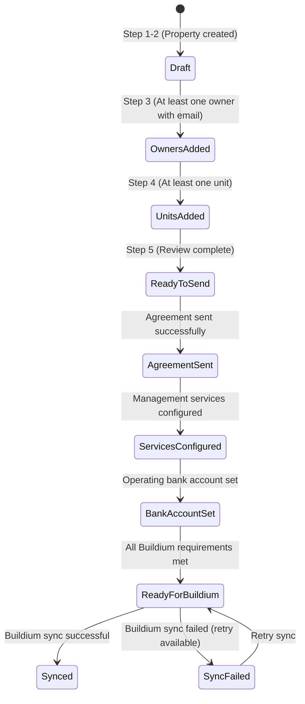

# Revised Property Onboarding Plan (Reuse-First, Schema-Aligned)

## A) Reuse Inventory

### A.1 Existing UI Components

| Component | Path | Used For | Notes ||-----------|------|----------|-------|| `AddPropertyModal` | `src/components/AddPropertyModal.tsx` | 7-step property creation wizard | **PRIMARY REUSE TARGET** - Extend for onboarding mode || `Step1PropertyType` | `src/components/AddPropertyModal.tsx:700-850` | Property type selection | Reuse with minor extension for management scope || `Step2PropertyDetails` | `src/components/AddPropertyModal.tsx:984-1173` | Address and property details | Reuse with early persistence trigger || `Step3Ownership` | `src/components/AddPropertyModal.tsx:1176-1679` | Owner selection and percentages | **EXTEND** to add signer email collection || `Step4UnitDetails` | `src/components/AddPropertyModal.tsx:1682-1850` | Unit creation (single form) | **REPLACE** with bulk creator for multi-unit || `AddUnitModal` | `src/components/AddUnitModal.tsx` | Single unit creation form | Reuse form fields/validation for bulk rows || `UnitsTable` | `src/components/property/UnitsTable.tsx` | Unit list with inline add/edit | Reuse table pattern for bulk creation grid || `HybridAddressAutocomplete` | `src/components/HybridAddressAutocomplete.tsx` | Address input with autocomplete | **REUSE AS-IS** || `DraftAssignmentServicesEditor` | `src/components/services/DraftAssignmentServicesEditor.tsx` | Service plan/assignment configuration | Reuse for post-onboarding services || `StatementRecipientsManager` | `src/components/monthly-logs/StatementRecipientsManager.tsx` | Email recipient list management | **REUSE PATTERN** for signer email collection || `CreateBankAccountModal` | `src/components/CreateBankAccountModal.tsx` | Bank account creation | Reuse for post-onboarding bank setup |

### A.2 Existing Schemas & Validators

| Schema | Path | Fields | Notes ||--------|------|--------|-------|| `PropertyCreateSchema` | `src/schemas/property.ts` | propertyType, name, addressLine1, city, state, postalCode, country, yearBuilt, structureDescription, management_scope, service_assignment, service_plan, owners, operatingBankAccountId, reserve, propertyManagerId | **REUSE AS-IS** - Already validates all onboarding fields || `UnitCreateSchema` | `src/schemas/unit.ts` | propertyId, unitNumber, unitSize, marketRent, addressLine1-3, city, state, postalCode, country, unitBedrooms, unitBathrooms, description, status | **REUSE AS-IS** - Validates unit fields || `OwnerCreateSchema` | `src/schemas/owner.ts` | firstName, lastName, isCompany, companyName, primaryEmail, primaryPhone, address fields, tax fields | **REUSE AS-IS** - Validates owner creation || `validateBuildiumPropertyPayload` | `src/app/api/properties/route.ts:807` | Validates property data for Buildium sync | **REUSE** for readiness checklist |

### A.3 Existing API Endpoints & Services

| Endpoint/Service | Path | Purpose | Reuse Strategy ||------------------|------|---------|----------------|| `POST /api/properties` | `src/app/api/properties/route.ts:94` | Create property with units/owners | **REUSE PATTERN** - Auth, org resolution, normalization helpers || `POST /api/units` | `src/app/api/units/route.ts:38` | Create single unit | **REUSE** for individual unit creation || Bulk unit insert | `src/app/api/properties/route.ts:471-500` | Batch unit creation in property POST | **REUSE PATTERN** for bulk unit endpoint || `POST /api/owners` | `src/app/api/owners/route.ts:43` | Create owner | **REUSE AS-IS** || `sendMonthlyStatement` | `src/lib/monthly-statement-email-service.ts:149` | Send email with audit logging | **REUSE PATTERN** for agreement sending || `POST /api/properties/[id]/sync` | `src/app/api/properties/[id]/sync/route.ts:68 `| Buildium sync with validation | **REUSE** for sync readiness check || `requireAuth` | `src/lib/auth/guards.ts` | Authentication guard | **REUSE AS-IS** - All routes || `resolveOrgIdFromRequest` | `src/lib/org/resolve-org-id.ts` | Org context resolution | **REUSE AS-IS** - All routes || `requireOrgMember` | `src/lib/auth/org-guards.ts` | Org membership check | **REUSE AS-IS** - All routes || `idempotency_keys` table | `supabase/migrations/20260315100000_create_idempotency_keys.sql` | Idempotency storage | **REUSE AS-IS** - 24h TTL |

### A.4 Existing Database Tables & Columns

| Table | Columns Used | Notes ||-------|--------------|-------|| `properties` | All standard columns (name, address_line1-3, city, state, postal_code, country, property_type, service_assignment, etc.) | **REUSE AS-IS** - No schema changes needed || `units` | property_id, unit_number, unit_bedrooms, unit_bathrooms, unit_size, description, country, status | **REUSE AS-IS** || `ownerships` | property_id, owner_id, ownership_percentage, disbursement_percentage, primary, org_id | **REUSE AS-IS** || `owners` | id, contact_id, org_id | **REUSE AS-IS** || `contacts` | id, primary_email, first_name, last_name, company_name, is_company | **REUSE AS-IS** for signer emails || `property_onboarding` | **RECREATE** - Table was dropped in cleanup; recreate with current_stage JSONB, status enum, progress SMALLINT, FK to properties | **RECREATE** - Full table recreation with proper schema |

| `idempotency_keys` | key, org_id, response, created_at, expires_at (24h TTL) | **REUSE AS-IS** - For agreement sending and sync idempotency || `statement_emails` | id, monthly_log_id, sent_at, sent_by_user_id, recipients (JSONB), pdf_url, status, error_message | **REUSE PATTERN** - Create similar `agreement_send_log` table || `onboarding_status_enum` | 'IN_PROGRESS', 'PENDING_APPROVAL', 'OVERDUE', 'COMPLETED' | **EXTEND** with new values (migration) |

### A.5 Existing Patterns to Reuse

| Pattern | Location | Reuse For ||---------|----------|-----------|| Stepper navigation | `AddPropertyModal.tsx:123-131` | Step navigation UI || Form state management | `AddPropertyModal.tsx:272` (useState) | Onboarding form state || Autosave (debounced) | Not found - **NEW PATTERN NEEDED** | Draft persistence || Owner dropdown + inline create | `AddPropertyModal.tsx:1270-1369` | Owner selection in Step 3 || Bulk insert transaction | `src/app/api/properties/route.ts:509-512` | Bulk unit creation || Email recipient management | `StatementRecipientsManager.tsx` | Signer email collection || Status badge rendering | `src/app/(protected)/maintenance/page.tsx:54-59` | Onboarding status display || Stage navigation | `MonthlyLogStageNavigation.tsx` | Onboarding step navigation (if needed) || Auth pattern | `requireAuth()` + `resolveOrgIdFromRequest()` + `requireOrgMember()` | **REUSE AS-IS** - All onboarding routes || Normalization helpers | `normalizePropertyType()`, `normalizeAssignmentLevel()`, `normalizeAssignmentLevelEnum()`, `normalizeCountryWithDefault()` | **REUSE AS-IS** - Property creation || Address normalization | `buildNormalizedAddressKey()` from `src/lib/normalized-address.ts` | **REUSE AS-IS** - Deduplication || Idempotency pattern | `idempotency_keys` table with org_id scoping, 24h TTL | **REUSE AS-IS** - Agreement sending, sync || camelCase → snake_case | Server maps camelCase payloads to snake_case DB columns | **REUSE PATTERN** - All endpoints || Error codes | 400 (validation), 409 (conflict), 422 (semantic errors) | **REUSE PATTERN** - All endpoints || Supabase client | Use `supabase` (client) unless RLS bypass needed, then `supabaseAdmin` | **REUSE PATTERN** - All DB operations |---

## B) Canonical Decisions & State Machine

### B.1 Data Model: Immediate Writes (Not Staged)

**Decision:** Property, owners, and units exist as real database rows as soon as they're valid. `current_stage` JSONB stores only transient wizard state (form field values, UI state, temporary selections) that doesn't map cleanly to normalized schema.

**Rationale:**

- Avoids data duplication (canonical data in one place)
- Easier debugging (single source of truth)
- Prevents drift between staged and real data
- Simpler mental model: "if it's valid, it's saved"

**What goes in `current_stage` JSONB:**

- Transient form state (unsaved field values during editing)
- UI state (which step user is on, which fields are dirty)
- Temporary selections (e.g., "user selected owner but hasn't saved yet")
- Wizard-specific metadata (e.g., "user changed property type mid-flow")

**What does NOT go in `current_stage`:**

- Owners → Written to `ownerships` table immediately via `POST /api/onboarding/:id/owners`
- Units → Written to `units` table immediately via `POST /api/onboarding/:id/units`
- Property → Written to `properties` table immediately via `POST /api/onboarding`

---

### B.2 Entry Point: POST /api/onboarding (Single Entry Point)

**Decision:** Use `POST /api/onboarding` as the single entry point for creating property + onboarding stub. Do NOT extend `POST /api/properties?isDraft=true`.

**Rationale:**

- Clear separation of concerns (onboarding vs property creation)
- Easier to add onboarding-specific logic (dedup, staging, etc.)
- Doesn't pollute existing property creation endpoint
- Cleaner API contract

---

### B.3 Units Endpoint: POST /api/onboarding/:id/units (Onboarding-Scoped)

**Decision:** Use `POST /api/onboarding/:id/units` for unit upserts. Do NOT create `POST /api/units/bulk`.

**Rationale:**

- Units are scoped to onboarding context
- Cleaner than global bulk endpoint
- Consistent with owners endpoint pattern
- Finalize endpoint handles any remaining validation

---

### B.4 Idempotency: idempotency_keys Table (Not Unique Constraints)

**Decision:** Use `idempotency_keys` table for agreement sending and sync idempotency. Do NOT use unique constraints on `agreement_send_log`.

**Rationale:**

- Reuses existing infrastructure
- Consistent with other idempotent endpoints (e.g., `POST /api/leases`)
- More flexible (can store response, handle retries)
- TTL-based cleanup is cleaner than partial indexes

**Implementation:**

- Key format: `hash(propertyId + templateId/name + sorted recipients)` for agreements
- Key format: `propertyId + upstreamRequestHash` for sync
- Scoped by `org_id`, TTL 24h (via `expires_at` column)
- Check before creating records, return 409 with cached response if match found

---

### B.5 Status Enum & State Machine (Centralized)

**Enum Values:**

```typescript
enum OnboardingStatus {
  DRAFT = 'DRAFT', // Property created, incomplete data
  OWNERS_ADDED = 'OWNERS_ADDED', // ≥1 owner + ≥1 signer email
  UNITS_ADDED = 'UNITS_ADDED', // ≥1 unit (unique unit_number per property)
  READY_TO_SEND = 'READY_TO_SEND', // Property basics + owners + units + signer(s)
  AGREEMENT_SENT = 'AGREEMENT_SENT', // Agreement sent successfully
  READY_FOR_BUILDIUM = 'READY_FOR_BUILDIUM', // All Buildium requirements met (P1)
  BUILDIUM_SYNCED = 'BUILDIUM_SYNCED', // Sync successful (P1)
  BUILDIUM_SYNC_FAILED = 'BUILDIUM_SYNC_FAILED', // Sync failed, retry available (P1)
}
```

**State Machine (Allowed Transitions):**

```
[*] → DRAFT (Step 1-2: Property created)
DRAFT → OWNERS_ADDED (Step 3: ≥1 owner + signer email)
OWNERS_ADDED → UNITS_ADDED (Step 4: ≥1 unit)
UNITS_ADDED → READY_TO_SEND (Step 5: Review complete, finalize called)
READY_TO_SEND → AGREEMENT_SENT (Agreement sent successfully)

// Fast path (edge cases)
DRAFT → AGREEMENT_SENT (Skip owners/units if not needed)

// Buildium transitions (P1 - only via sync endpoint)
AGREEMENT_SENT → READY_FOR_BUILDIUM (Readiness checklist passes)
READY_FOR_BUILDIUM → BUILDIUM_SYNCED (Sync successful)
READY_FOR_BUILDIUM → BUILDIUM_SYNC_FAILED (Sync failed)
BUILDIUM_SYNC_FAILED → READY_FOR_BUILDIUM (Retry sync)
```

**Guards (Server-Enforced):**

- `OWNERS_ADDED`: Requires ≥1 owner + ≥1 signer email
- `UNITS_ADDED`: Requires ≥1 unit (unique `unit_number` per property)
- `READY_TO_SEND`: Requires property basics + owners + units + signer(s)
- `BUILDIUM_SYNCED/FAILED`: Only via sync endpoint, requires readiness

**Backward Transitions:**

- Allowed: Users can edit and re-save (status updates forward when valid)
- Not allowed: Cannot jump forward without meeting guards

---

## C) Updated Step-by-Step Plan (5 Steps with Reuse Mappings)

### Step 1: Property Type & Scope

**Purpose:** Determine property classification and management approach**Fields Collected:**

- `property_type` (enum: 'Condo', 'Co-op', 'Condop', 'Rental Building', 'Townhouse', 'Mult-Family')
- `service_assignment` (conditional: 'Property Level' | 'Unit Level')

**Reuse Mapping:**

- **Component:** `Step1PropertyType` from `AddPropertyModal.tsx:700-850` - **REUSE WITH EXTENSION**
- **Schema:** `PropertyCreateSchema.propertyType` and `PropertyCreateSchema.service_assignment` - **REUSE AS-IS**
- **UI Pattern:** Radio button group from existing step - **REUSE AS-IS**
- **Extension:** Add conditional "How are units managed?" section when "Rental Building" or "Mult-Family" selected

**Minimal Changes:**

- Add conditional UI section in `Step1PropertyType` component
- No schema changes needed (fields already exist)

---

### Step 2: Property Details (CREATE PROPERTY RECORD HERE)

**Purpose:** Collect address and basic property information; **CREATE PROPERTY RECORD IMMEDIATELYFields Collected:**

- `name`, `address_line1`, `address_line2`, `address_line3`, `city`, `state`, `postal_code`, `country`, `year_built`, `structure_description`

**Reuse Mapping:**

- **Component:** `Step2PropertyDetails` from `AddPropertyModal.tsx:984-1173` - **REUSE WITH EXTENSION**
- **Address Input:** `HybridAddressAutocomplete` - **REUSE AS-IS**
- **Schema:** `PropertyCreateSchema` - **REUSE AS-IS**
- **API:** `POST /api/onboarding` - **NEW** entry point (do NOT extend `POST /api/properties`)

**Minimal Changes:**

- **NEW:** `POST /api/onboarding` - Create property + onboarding stub
  - Body (camelCase): `{ propertyType, name?, addressLine1, city?, state?, postalCode, country, borough?, neighborhood?, latitude?, longitude?, service_assignment, management_scope }`
  - Uses `buildNormalizedAddressKey()` to build `normalized_address_key`
  - Checks for open onboarding with same `normalized_address_key` + `org_id` → returns `409 { existingOnboardingId }` if found
  - Creates property stub (status=Active, required normalized enums) + onboarding row (status=DRAFT, progress=0, current_stage={})
  - Uses `requireAuth()`, `resolveOrgIdFromRequest()`, `requireOrgMember()`
  - Uses normalization helpers: `normalizePropertyType()`, `normalizeAssignmentLevel()`, `normalizeCountryWithDefault()`
  - Maps camelCase payload to snake_case DB columns
  - Returns `{ property, onboarding }`

- **NEW:** `PATCH /api/onboarding/:id` - Autosave draft state
  - Body: `{ currentStage, progress?, status? }`
  - Server enforces legal status transitions only
  - Returns `{ onboarding }`
  - Uses auth pattern + org guards

- **NEW:** `POST /api/onboarding/:id/owners` - Upsert/delete owners
  - Body: `{ owners: [{ clientRowId, ownerId? | ownerPayload, ownershipPercentage, disbursementPercentage?, primary?, signerEmail?, signerName? }] }`
  - Upsert/delete by `clientRowId`
  - Backfill `owners.org_id` from onboarding
  - Validates sum=100 and ≥1 signer email (422 if invalid)
  - Writes `ownerships` rows immediately (not staged)
  - Sets status `OWNERS_ADDED` when valid
  - Returns `{ onboarding, ownerships }`

- **NEW:** `POST /api/onboarding/:id/units` - Upsert/delete units
  - Body: `{ units: [{ clientRowId, unitNumber, unitBedrooms?, unitBathrooms?, unitSize?, description? }] }`
  - Upsert/delete by `clientRowId`
  - Enforces unique `unit_number` per property (422 if duplicate)
  - Writes `units` rows immediately (not staged)
  - Sets status `UNITS_ADDED` when ≥1 unit
  - Returns `{ onboarding, units }`

- **NEW:** `POST /api/onboarding/:id/finalize` - Revalidate and set READY_TO_SEND
  - No body
  - Revalidates property basics + owners/signers + units
  - Sets status `READY_TO_SEND`
  - Returns `{ onboarding, property }`

- **NEW:** `DELETE /api/onboarding/:id` - Cancel draft (optional)
  - Only for DRAFT status
  - Cleans stub property + children if no downstream references
  - Returns `204 No Content`

- Trigger onboarding creation on `postal_code` blur (instead of final submit)
- **UX:** If duplicate draft exists (409 response), prompt "Resume draft?" before creating new one

**Schema Changes:**

- Migration: **RECREATE** `property_onboarding` table (was dropped in cleanup)
  - Columns: `id` (uuid PK), `property_id` (uuid FK to properties), `org_id` (uuid FK to organizations), `status` (onboarding_status_enum), `progress` (SMALLINT 0-100), `current_stage` (JSONB), `created_at`, `updated_at`
  - Indexes: `org_id`, `property_id`, `(org_id, status)`
  - RLS: Mirrors `properties.org_id` scoping (org-scoped read/write)

- Migration: Extend `onboarding_status_enum` with: 'DRAFT', 'OWNERS_ADDED', 'UNITS_ADDED', 'READY_TO_SEND', 'AGREEMENT_SENT', 'READY_FOR_BUILDIUM', 'BUILDIUM_SYNCED', 'BUILDIUM_SYNC_FAILED' (reversible)

---

### Step 3: Owners & Signers

**Purpose:** Collect owner information with focus on signer emails for agreement sending**Fields Collected:**

- Owner: `owner_id`, `ownership_percentage`, `disbursement_percentage`, `primary`
- Signer: `email` (from `contacts.primary_email` or manual entry), `name`, `role` (optional)

**Reuse Mapping:**

- **Component:** `Step3Ownership` from `AddPropertyModal.tsx:1176-1679` - **EXTEND**
- **Owner Selection:** Existing owner dropdown + inline create - **REUSE AS-IS**
- **Recipient Pattern:** `StatementRecipientsManager.tsx` - **REUSE PATTERN** for signer email collection UI
- **Schema:** `PropertyCreateSchema.owners` - **REUSE AS-IS** (ownership percentages)
- **API:** `POST /api/owners` - **REUSE AS-IS**
- **API:** `POST /api/properties` ownership handling - **REUSE PATTERN**

**Minimal Changes:**

- **EXTEND** `Step3Ownership` to add signer email section below owner selection
- Reuse `StatementRecipientsManager` pattern (email + name inputs, add/remove buttons)
- **IMMEDIATE WRITES:** `POST /api/onboarding/:id/owners` writes `ownerships` rows immediately when valid
- **IDEMPOTENT UPSERTS:** Use `clientRowId` (client-generated UUID) for upsert pattern
- **VALIDATION:** Server validates ownership sums to 100% (422 if invalid), requires ≥1 signer email (422 if missing)
- **STATUS UPDATE:** Server sets `status = 'OWNERS_ADDED'` when valid
- **BACKFILL:** Server backfills `owners.org_id` from onboarding

**New Component (Justified):**

- `OwnerSignerSection.tsx` - Small component reusing `StatementRecipientsManager` pattern but simplified for signers only (email + name, no role dropdown initially). **Why new:** `StatementRecipientsManager` is tightly coupled to `propertyId` and statement recipients API. We need a simpler, reusable pattern.

---

### Step 4: Units (Bulk Creation)

**Purpose:** Create unit records; support bulk creation for multi-unit properties**Fields Collected (Minimal):**

- `unit_number` (REQUIRED), `unit_bedrooms`, `unit_bathrooms`, `unit_size`, `description` (all optional)

**Reuse Mapping:**

- **Single Unit Form:** `AddUnitModal.tsx` form fields - **REUSE** for row editing in bulk grid
- **Schema:** `UnitCreateSchema` - **REUSE AS-IS** (all fields optional except unitNumber)
- **Bulk Insert Pattern:** `src/app/api/properties/route.ts:471-500` - **REUSE PATTERN** for bulk endpoint
- **Table Pattern:** `UnitsTable.tsx` - **REUSE PATTERN** for editable grid

**Minimal Changes:**

- **NEW:** `BulkUnitCreator.tsx` component - Reuses `AddUnitModal` form fields in table rows
- **IMMEDIATE WRITES:** `POST /api/onboarding/:id/units` writes `units` rows immediately when valid
- **IDEMPOTENT UPSERTS:** Use `clientRowId` (client-generated UUID) for upsert pattern
- **VALIDATION:** Server enforces unique `unit_number` per property (422 if duplicate)
- **STATUS UPDATE:** Server sets `status = 'UNITS_ADDED'` when ≥1 unit
- **SIMPLIFIED FOR P0:** Inline row editing, simple duplicate checks, no pattern generation or bulk apply (defer to P1)

**New Component (Justified):**

- `BulkUnitCreator.tsx` - Editable table with unit rows. **Why new:** `AddUnitModal` is a modal for single unit; `UnitsTable` is read-only display. We need an editable grid for bulk creation. **Reuses:** Form field components and validation from `AddUnitModal`.

---

### Step 5: Review & Send Agreement

**Purpose:** Review all collected data, validate dependencies, send agreement**Reuse Mapping:**

- **Email Sending Pattern:** `sendMonthlyStatement` from `src/lib/monthly-statement-email-service.ts:149` - **REUSE PATTERN**
- **Audit Logging Pattern:** `statement_emails` table - **REUSE PATTERN** (create `agreement_send_log` table)
- **Recipient Management:** `StatementRecipientsManager` - **REUSE** for recipient list display/editing
- **Webhook Pattern:** Existing webhook calls in codebase - **REUSE PATTERN**

**Minimal Changes:**

- **NEW:** `AgreementReviewPanel.tsx` - Summary component with edit links (read-only display, no form)
- **NEW:** `POST /api/agreements/send` endpoint - Reuses email sending + audit logging pattern
- **IDEMPOTENT SENDING:** Use `idempotency_keys` table (not unique constraint)
  - Key: `hash(propertyId + templateId/name + sorted recipients)`
  - Scoped by `org_id`, TTL 24h
  - Check before creating `agreement_send_log`
  - Returns `409 { existingLogId, sentAt, recipients }` if idempotent match found

- **RETRY UX:** Surface retry button if send fails, show status in UI
- **NEW:** `agreement_send_log` table - Mirrors `statement_emails` structure
  - Store recipients as `{email, name}` objects (not just emails)
  - No unique constraint (idempotency handled by `idempotency_keys` table)
  - Partial index on `(property_id, template_id, recipient_hash, DATE(sent_at))` for idempotency window queries (non-unique, idempotency handled by `idempotency_keys` table)

- **EXTEND:** `property_onboarding.status` enum (already covered in Step 2 migration)

**New Components (Justified):**

- `AgreementReviewPanel.tsx` - Read-only summary with edit links. **Why new:** No existing review/summary component found. **Reuses:** Typography components, button styles, card layouts.
- `AgreementTemplateSelector.tsx` - Dropdown for template selection. **Why new:** No existing template selector. **Reuses:** Select component from UI library.

**Schema Changes:**

- Migration: Create `agreement_send_log` table (mirrors `statement_emails` structure):
  ```sql
      CREATE TABLE public.agreement_send_log (
        id uuid PRIMARY KEY DEFAULT gen_random_uuid(),
        property_id uuid NOT NULL REFERENCES public.properties(id) ON DELETE CASCADE,
        onboarding_id uuid REFERENCES public.property_onboarding(id) ON DELETE SET NULL,
        template_id uuid REFERENCES public.email_templates(id) ON DELETE SET NULL,
        template_name text,
        recipients jsonb NOT NULL, -- Array of {email, name, role?}
        recipient_hash text NOT NULL, -- Deterministic hash for idempotency: SHA256(property_id + template_id + sorted_emails)
        sent_at timestamptz NOT NULL DEFAULT now(),
        status text NOT NULL CHECK (status IN ('sent', 'failed')),
        webhook_payload jsonb,
        webhook_response jsonb,
        error_message text,
        org_id uuid NOT NULL REFERENCES public.organizations(id) ON DELETE RESTRICT,
        created_at timestamptz NOT NULL DEFAULT now(),
        updated_at timestamptz NOT NULL DEFAULT now(),
        UNIQUE(property_id, recipient_hash) -- Idempotency constraint
      );
  
      -- RLS policies
      ALTER TABLE public.agreement_send_log ENABLE ROW LEVEL SECURITY;
      CREATE POLICY "agreement_send_log_org_read" ON public.agreement_send_log
        FOR SELECT USING (is_org_member(auth.uid(), org_id));
      CREATE POLICY "agreement_send_log_org_write" ON public.agreement_send_log
        FOR INSERT WITH CHECK (is_org_admin_or_manager(auth.uid(), org_id));
  
      -- Indexes
      CREATE INDEX idx_agreement_send_log_property ON public.agreement_send_log(property_id);
      CREATE INDEX idx_agreement_send_log_sent_at ON public.agreement_send_log(sent_at DESC);
      CREATE INDEX idx_agreement_send_log_status ON public.agreement_send_log(status);
      CREATE INDEX idx_agreement_send_log_recipient_hash ON public.agreement_send_log(recipient_hash);
      CREATE INDEX idx_agreement_send_log_org ON public.agreement_send_log(org_id);
  ```


---

## C) Reuse Matrix (Mandatory Table)

| Step | Field | DB Table.Column | Existing UI Component | Existing Validator/Schema | Existing API/Service | Notes/Dependencies ||------|------|----------------|----------------------|---------------------------|----------------------|-------------------|| 1 | `property_type` | `properties.property_type` | `Step1PropertyType` (AddPropertyModal) | `PropertyCreateSchema.propertyType` | N/A (stored in form state) | Reuse component, extend for management scope || 1 | `service_assignment` | `properties.service_assignment` | `Step1PropertyType` (conditional section) | `PropertyCreateSchema.service_assignment` | N/A | New conditional UI, existing field || 2 | `name` | `properties.name` | `Step2PropertyDetails` | `PropertyCreateSchema.name` | `POST /api/properties` | Reuse component, trigger early creation || 2 | `address_line1` | `properties.address_line1` | `HybridAddressAutocomplete` | `PropertyCreateSchema.addressLine1` | `POST /api/properties` | Reuse as-is || 2 | `postal_code` | `properties.postal_code` | `HybridAddressAutocomplete` | `PropertyCreateSchema.postalCode` | `POST /api/properties` | Reuse as-is, trigger property creation on blur || 2 | `country` | `properties.country` | `HybridAddressAutocomplete` | `PropertyCreateSchema.country` | `POST /api/properties` | Reuse as-is || 2 | `current_stage` | `property_onboarding.current_stage` (JSONB) | N/A (autosave) | N/A | `PATCH /api/onboarding/:id` (NEW) | Store draft form state (JSONB), enum is source of truth || 3 | `owner_id` | `ownerships.owner_id` | `Step3Ownership` owner dropdown | `PropertyCreateSchema.owners[].id` | `POST /api/owners` | Reuse as-is || 3 | `ownership_percentage` | `ownerships.ownership_percentage` | `Step3Ownership` percentage input | `PropertyCreateSchema.owners[].ownershipPercentage` | `POST /api/properties` (ownership handling) | Reuse as-is || 3 | Signer emails | `property_onboarding.current_stage.signers` (JSONB array) | `OwnerSignerSection` (NEW, reuses StatementRecipientsManager pattern) | Email validation (reuse from StatementRecipientsManager) | `PATCH /api/onboarding/:id` (staged in draft) | New component, reuses recipient pattern, staged until finalize |

| 3 | Owners (staged) | `property_onboarding.current_stage.owners` (JSONB array) | `Step3Ownership` | `PropertyCreateSchema.owners` | `PATCH /api/onboarding/:id` (staged in draft) | Staged in draft, created on finalize || 3 | `contact.primary_email` | `contacts.primary_email` | Owner selection (via owner.contact_id) | `OwnerCreateSchema.primaryEmail` | `POST /api/owners` | Reuse existing owner-contact relationship || 4 | `unit_number` | `units.unit_number` | `BulkUnitCreator` (NEW, reuses AddUnitModal fields) | `UnitCreateSchema.unitNumber` | `POST /api/units/bulk` (NEW) | New component, reuses form fields || 4 | `unit_bedrooms` | `units.unit_bedrooms` | `BulkUnitCreator` (reuses AddUnitModal) | `UnitCreateSchema.unitBedrooms` | `POST /api/units/bulk` | Reuse form field component || 4 | `unit_bathrooms` | `units.unit_bathrooms` | `BulkUnitCreator` (reuses AddUnitModal) | `UnitCreateSchema.unitBathrooms` | `POST /api/units/bulk` | Reuse form field component || 5 | `recipients` | `agreement_send_log.recipients` (JSONB) | `StatementRecipientsManager` (reuse pattern) | Email array validation | `POST /api/agreements/send` (NEW) | Reuse recipient management pattern || 5 | `template_id` | `agreement_send_log.template_id` | `AgreementTemplateSelector` (NEW) | UUID validation | `GET /api/email-templates` (if exists) | New component, reuses Select UI || 5 | `sent_at` | `agreement_send_log.sent_at` | N/A (auto-set) | Timestamp validation | `POST /api/agreements/send` | Auto-set on send || 5 | `webhook_payload` | `agreement_send_log.webhook_payload` (JSONB) | N/A (stored) | JSON validation | `POST /api/agreements/send` | Store for idempotency |---

## D) Minimal Change Set

### D.1 Schema Changes (Migrations)

**File:** `supabase/migrations/YYYYMMDDHHMMSS_extend_onboarding_for_property_flow.sql`

**Migration Strategy:** Reversible, backfill-safe, with rollback support

1. **Extend `onboarding_status_enum` (reversible):**
   ```sql
   BEGIN;
   
   -- Add new enum values (PostgreSQL doesn't support IF NOT EXISTS for enum values)
   -- Use DO block to check first
   DO $$
   BEGIN
     IF NOT EXISTS (
       SELECT 1 FROM pg_enum
       WHERE enumlabel = 'DRAFT'
       AND enumtypid = 'public.onboarding_status_enum'::regtype
     ) THEN
       ALTER TYPE public.onboarding_status_enum ADD VALUE 'DRAFT';
     END IF;
   
     -- Repeat for each new value
     IF NOT EXISTS (SELECT 1 FROM pg_enum WHERE enumlabel = 'OWNERS_ADDED' AND enumtypid = 'public.onboarding_status_enum'::regtype) THEN
       ALTER TYPE public.onboarding_status_enum ADD VALUE 'OWNERS_ADDED';
     END IF;
     -- ... (repeat for all new values)
   END $$;
   
   -- Note: Enum value removal requires recreating the enum (not reversible without data migration)
   -- Rollback: Document that enum values cannot be removed without recreating type
   
   COMMIT;
   ```

2. **RECREATE `property_onboarding` table (was dropped in cleanup):**
   ```sql
   BEGIN;
   
   -- Drop existing table if it exists (cleanup from previous attempts)
   DROP TABLE IF EXISTS public.property_onboarding CASCADE;
   
   -- Recreate with proper schema
   CREATE TABLE public.property_onboarding (
     id uuid PRIMARY KEY DEFAULT gen_random_uuid(),
     property_id uuid NOT NULL REFERENCES public.properties(id) ON DELETE CASCADE,
     org_id uuid NOT NULL REFERENCES public.organizations(id) ON DELETE RESTRICT,
     status public.onboarding_status_enum NOT NULL DEFAULT 'DRAFT',
     progress smallint NOT NULL DEFAULT 0 CHECK (progress >= 0 AND progress <= 100),
     current_stage jsonb NOT NULL DEFAULT '{}'::jsonb,
     created_at timestamptz NOT NULL DEFAULT now(),
     updated_at timestamptz NOT NULL DEFAULT now()
   );
   
   -- Indexes
   CREATE INDEX idx_property_onboarding_org ON public.property_onboarding(org_id);
   CREATE INDEX idx_property_onboarding_property_id ON public.property_onboarding(property_id);
   CREATE INDEX idx_property_onboarding_org_status ON public.property_onboarding(org_id, status);
   CREATE INDEX idx_property_onboarding_created_at ON public.property_onboarding(created_at DESC);
   
   -- RLS policies (mirror properties.org_id scoping)
   ALTER TABLE public.property_onboarding ENABLE ROW LEVEL SECURITY;
   CREATE POLICY "property_onboarding_org_read" ON public.property_onboarding
     FOR SELECT USING (is_org_member(auth.uid(), org_id));
   CREATE POLICY "property_onboarding_org_insert" ON public.property_onboarding
     FOR INSERT WITH CHECK (is_org_admin_or_manager(auth.uid(), org_id));
   CREATE POLICY "property_onboarding_org_update" ON public.property_onboarding
     FOR UPDATE USING (is_org_admin_or_manager(auth.uid(), org_id))
     WITH CHECK (is_org_admin_or_manager(auth.uid(), org_id));
   CREATE POLICY "property_onboarding_org_delete" ON public.property_onboarding
     FOR DELETE USING (is_org_admin_or_manager(auth.uid(), org_id));
   
   -- updated_at trigger
   CREATE TRIGGER trg_property_onboarding_updated_at
     BEFORE UPDATE ON public.property_onboarding
     FOR EACH ROW EXECUTE FUNCTION public.set_updated_at();
   
   COMMIT;
   ```

3. **Create `agreement_send_log` table (see schema changes section above)**

4. **Create `agreement_send_log` table:**
   ```sql
         CREATE TABLE IF NOT EXISTS public.agreement_send_log (
           id uuid PRIMARY KEY DEFAULT gen_random_uuid(),
           property_id uuid NOT NULL REFERENCES public.properties(id) ON DELETE CASCADE,
           onboarding_id uuid REFERENCES public.property_onboarding(id) ON DELETE SET NULL,
           template_id uuid REFERENCES public.email_templates(id) ON DELETE SET NULL,
           template_name text,
           recipients jsonb NOT NULL,
           sent_at timestamptz NOT NULL DEFAULT now(),
           status text NOT NULL CHECK (status IN ('sent', 'failed')),
           webhook_payload jsonb,
           webhook_response jsonb,
           error_message text,
           org_id uuid NOT NULL REFERENCES public.organizations(id) ON DELETE RESTRICT,
           created_at timestamptz NOT NULL DEFAULT now(),
           updated_at timestamptz NOT NULL DEFAULT now()
         );
   
         CREATE INDEX IF NOT EXISTS idx_agreement_send_log_property ON public.agreement_send_log(property_id);
         CREATE INDEX IF NOT EXISTS idx_agreement_send_log_sent_at ON public.agreement_send_log(sent_at DESC);
         CREATE INDEX IF NOT EXISTS idx_agreement_send_log_status ON public.agreement_send_log(status);
   ```


### D.2 Code Changes (By File)

#### Existing Files to Modify

1. **`src/components/AddPropertyModal.tsx`**

- **Change:** Add `onboardingMode` prop (boolean)
- **Change:** Extend `Step1PropertyType` to show management scope question conditionally
- **Change:** Modify `Step2PropertyDetails` to trigger property creation on `postal_code` blur (if `onboardingMode`)
- **Change:** Extend `Step3Ownership` to add signer email section (reuse `StatementRecipientsManager` pattern)
- **Change:** Replace `Step4UnitDetails` with `BulkUnitCreator` component (if `onboardingMode`)
- **Change:** Add `Step5ReviewAndSend` (new step, only in onboarding mode)
- **Change:** Add autosave logic (debounced, saves to `property_onboarding.current_stage`)
- **Change:** Add draft recovery on modal open (load from `property_onboarding` if exists)

2. **`src/app/api/properties/route.ts`**

- **Change:** None - Do NOT extend this endpoint. Use `POST /api/onboarding` instead.

3. **`src/schemas/property.ts`**

- **Change:** None - `PropertyCreateSchema` already validates all fields

#### New Files to Create

1. **`src/components/onboarding/OwnerSignerSection.tsx`** (NEW)

- **Why:** Simplified recipient collection for signers (reuses `StatementRecipientsManager` pattern but decoupled)
- **Reuses:** Email validation, input components, add/remove button patterns

2. **`src/components/onboarding/BulkUnitCreator.tsx`** (NEW)

- **Why:** Editable grid for bulk unit creation (no existing bulk editor)
- **Reuses:** Form field components from `AddUnitModal`, table layout from `UnitsTable`

3. **`src/components/onboarding/AgreementReviewPanel.tsx`** (NEW)

- **Why:** Read-only summary with edit links (no existing review component)
- **Reuses:** Typography, card, button components

4. **`src/components/onboarding/AgreementTemplateSelector.tsx`** (NEW)

- **Why:** Template selection dropdown (no existing selector)
- **Reuses:** Select component from UI library

5. **`src/app/api/onboarding/[id]/units/route.ts`** (NEW)

- **Why:** Onboarding-scoped unit upsert endpoint (not global bulk endpoint)
- **Reuses:** Bulk insert pattern from `POST /api/properties` (lines 471-500), `UnitCreateSchema` validation

6. **`src/app/api/agreements/send/route.ts`** (NEW)

- **Why:** Agreement sending with idempotency and audit logging
- **Reuses:** Email sending pattern from `sendMonthlyStatement`, audit logging pattern from `statement_emails`

7. **`src/app/api/onboarding/[id]/route.ts`** (NEW)

- **Why:** Draft persistence endpoint (PATCH for `current_stage`)
- **Reuses:** Standard Supabase update pattern

8. **`src/lib/agreement-send-service.ts`** (NEW)

- **Why:** Centralized agreement sending logic
- **Reuses:** Email sending utilities, webhook call patterns

---

## E) Risks & Safeguards

### E.1 Duplication Prevention

**Risk:** Duplicating form definitions between `AddPropertyModal` and onboarding flow.**Safeguard:**

- **REUSE `PropertyCreateSchema`** - Single source of truth for validation
- **EXTEND `AddPropertyModal`** with `onboardingMode` prop instead of creating parallel component
- **SHARED TYPES** - Use `PropertyCreateInput` type from schema

**Risk:** Duplicating unit form fields in bulk creator.**Safeguard:**

- **EXTRACT** unit form fields into shared component (`UnitFormFields.tsx`) if needed
- **REUSE** `UnitCreateSchema` for validation
- **REUSE** form field components from `AddUnitModal`

**Risk:** Duplicating email recipient management logic.**Safeguard:**

- **REUSE PATTERN** from `StatementRecipientsManager` but create simplified version
- **SHARED** email validation utility (extract from `StatementRecipientsManager` if not already shared)

### E.2 Schema Drift Prevention

**Risk:** Onboarding flow uses fields that don't exist in schema.**Safeguard:**

- **VALIDATED** all fields in Reuse Matrix against actual schema
- **NO NEW FIELDS** proposed - only using existing columns
- **MIGRATIONS** only for: enum extension, `current_stage` JSONB conversion, `agreement_send_log` table

### E.3 Service Pattern Consistency

**Risk:** Agreement sending doesn't follow existing email sending patterns.**Safeguard:**

- **REUSE** `sendMonthlyStatement` pattern (audit logging, error handling, idempotency)
- **MIRROR** `statement_emails` table structure for `agreement_send_log`
- **REUSE** webhook call patterns from existing codebase

---

## F) Prioritized Implementation Backlog

### P0: Core Onboarding Flow (Reuse-First)

#### P0.1: Database Schema Updates

**Files:**

- `supabase/migrations/YYYYMMDDHHMMSS_extend_onboarding_for_property_flow.sql`

**Changes:**

1. **RECREATE** `property_onboarding` table (was dropped in cleanup)

   - Full table with `current_stage` JSONB from the start (not TEXT conversion)
   - See migration details in D.1 section

2. Extend `onboarding_status_enum` with new values:

   - `DRAFT`, `OWNERS_ADDED`, `UNITS_ADDED`, `READY_TO_SEND`, `AGREEMENT_SENT` (P0)
   - `READY_FOR_BUILDIUM`, `BUILDIUM_SYNCED`, `BUILDIUM_SYNC_FAILED` (P1)

3. Create `agreement_send_log` table (no unique constraint, idempotency via `idempotency_keys`)

**Reuses:** `statement_emails` pattern for audit logging

**Acceptance Criteria:**

- Migration runs successfully
- RLS policies added for `agreement_send_log`
- Indexes created

---

#### P0.2: Early Property Creation (Step 2)

**Files:**

- `src/components/AddPropertyModal.tsx` (modify `Step2PropertyDetails`)
- `src/app/api/onboarding/route.ts` (NEW - single entry point)
- `src/app/api/onboarding/[id]/route.ts` (NEW - draft persistence)

**Changes:**

1. Add `onboardingMode` prop to `AddPropertyModal`
2. Trigger `POST /api/onboarding` on `postal_code` blur (if `onboardingMode`)
3. Create property + `property_onboarding` record immediately (with dedup checks)
4. Implement autosave to `PATCH /api/onboarding/:id` (debounced 2s, batched per-step)

**Reuses:** Property creation logic from `POST /api/properties`, `PropertyCreateSchema`, `HybridAddressAutocomplete`, address normalization patterns

**Acceptance Criteria:**

- Property created after Step 2 completion
- `property_onboarding` record created with `status = 'DRAFT'`
- Form state persists on modal close/reopen
- Autosave works without blocking UI

---

#### P0.3: Owners & Signers Step (Step 3)

**Files:**

- `src/components/AddPropertyModal.tsx` (extend `Step3Ownership`)
- `src/components/onboarding/OwnerSignerSection.tsx` (NEW)

**Changes:**

1. Add signer email section to `Step3Ownership`
2. Create `OwnerSignerSection` component (reuses `StatementRecipientsManager` pattern)
3. Store signer emails in `property_onboarding.current_stage.signers`
4. Create `ownerships` records immediately

**Reuses:** `Step3Ownership` component, `POST /api/owners`, `StatementRecipientsManager` pattern, `PropertyCreateSchema.owners`**Acceptance Criteria:**

- At least one signer email required to proceed
- Signer emails stored in draft
- Ownership percentages validated (sum to 100%)
- `ownerships` records created on owner selection

---

#### P0.4: Bulk Unit Creation (Step 4)

**Files:**

- `src/components/AddPropertyModal.tsx` (replace `Step4UnitDetails` with `BulkUnitCreator`)
- `src/components/onboarding/BulkUnitCreator.tsx` (NEW)
- `src/app/api/units/bulk/route.ts` (NEW)

**Changes:**

1. Create `BulkUnitCreator` component (reuses `AddUnitModal` form fields)
2. Create bulk unit creation API endpoint (reuses bulk insert pattern)
3. Create units immediately (single transaction)
4. Update `property_onboarding.status = 'UNITS_ADDED'`

**Reuses:** `AddUnitModal` form fields, `UnitCreateSchema`, bulk insert pattern from `POST /api/properties`, `UnitsTable` table layout**Acceptance Criteria:**

- Bulk creation works for 1-100 units
- Units created in single transaction
- At least one unit required to proceed
- Unit numbers validated (no duplicates)

---

#### P0.5: Review & Send Agreement (Step 5)

**Files:**

- `src/components/AddPropertyModal.tsx` (add `Step5ReviewAndSend`)
- `src/components/onboarding/AgreementReviewPanel.tsx` (NEW)
- `src/components/onboarding/AgreementTemplateSelector.tsx` (NEW)
- `src/app/api/agreements/send/route.ts` (NEW)
- `src/lib/agreement-send-service.ts` (NEW)

**Changes:**

1. Create review panel with edit links
2. Implement agreement sending with idempotency checks
3. Create `agreement_send_log` record before webhook
4. Call webhook with stable DB IDs
5. Update `property_onboarding.status = 'AGREEMENT_SENT'`

**Reuses:** `sendMonthlyStatement` pattern, `statement_emails` audit logging pattern, `StatementRecipientsManager` for recipient display, webhook call patterns**Acceptance Criteria:**

- Review panel shows all collected data
- Edit links navigate to correct steps
- Agreement sending is idempotent (no duplicate sends)
- Webhook called with stable DB IDs
- Error handling works (retry on failure)

---

### P1: Enhanced Features

#### P1.1: Draft Recovery & Resume

**Files:**

- `src/components/AddPropertyModal.tsx` (add draft loading on open)
- `src/app/api/onboarding/drafts/route.ts` (NEW)

**Reuses:** `property_onboarding` table, `current_stage` JSONB**Acceptance Criteria:**

- Drafts visible in onboarding board
- Resume works correctly
- Draft state persists across sessions

---

#### P1.2: Buildium Sync Readiness Checklist

**Files:**

- `src/components/onboarding/BuildiumReadinessChecklist.tsx` (NEW)
- `src/lib/buildium-sync-readiness.ts` (NEW)

**Reuses:** `validateBuildiumPropertyPayload` from `src/app/api/properties/route.ts:807`**Acceptance Criteria:**

- Checklist shows all requirements
- Missing items clearly indicated
- Sync button disabled until ready
- "Fix" links navigate to correct pages

---

#### P1.3: Onboarding Board (Stage View)

**Files:**

- `src/app/(protected)/onboarding/page.tsx` (NEW)
- `src/components/onboarding/OnboardingBoard.tsx` (NEW)

**Reuses:** Status badge patterns from `src/app/(protected)/maintenance/page.tsx`, list/kanban patterns from existing pages**Acceptance Criteria:**

- Board shows all onboarding properties
- Filtering and search work
- Click to resume onboarding
- Status badges visible

---

### P2: Polish & Optimization

#### P2.1: Address Deduplication

**Files:**

- `src/lib/address-deduplication.ts` (NEW)

**Reuses:** Address normalization utilities (if any exist)**Acceptance Criteria:**

- Duplicate addresses detected
- Warning shown (non-blocking)
- Normalization works correctly

---

## G) Architectural Decisions & Implementation Notes

### G.0 Code Style & Patterns (Matching Current Codebase)

**Auth Pattern (All Routes):**

- Use `requireAuth()` from `src/lib/auth/guards.ts`
- Use `resolveOrgIdFromRequest()` from `src/lib/org/resolve-org-id.ts`
- Use `requireOrgMember()` from `src/lib/auth/org-guards.ts`
- Pattern: `const { supabase: db, user } = await requireAuth(); const orgId = await resolveOrgIdFromRequest(request, user.id, db); await requireOrgMember({ client: db, userId: user.id, orgId });`

**Payload Format:**

- Request bodies use camelCase (e.g., `unitNumber`, `propertyType`)
- Server maps camelCase to snake_case for DB inserts (e.g., `unit_number`, `property_type`)
- Response bodies use camelCase (mapped from snake_case DB columns)

**Supabase Client Usage:**

- Use `supabase` (client) for all operations unless RLS bypass needed
- Use `supabaseAdmin` only when RLS bypass is required (e.g., resolving org context)
- Pattern: `const { supabase: db } = await requireAuth();` for client operations

**Error Codes:**

- `400` - Validation errors (missing required fields, invalid format)
- `409` - Conflict errors (duplicate draft, idempotent match)
- `422` - Semantic errors (ownership sum invalid, duplicate unit number, readiness failures)

**Normalization Helpers (Reuse):**

- `normalizePropertyType()` - Normalize property type enum
- `normalizeAssignmentLevel()` - Normalize service assignment
- `normalizeAssignmentLevelEnum()` - Normalize management scope
- `normalizeCountryWithDefault()` - Normalize country with default
- `buildNormalizedAddressKey()` - Build normalized address key for deduplication

**Idempotency Pattern:**

- Use `idempotency_keys` table (existing, TTL 24h)
- Key format: deterministic hash scoped by `org_id`
- Check before creating records, return 409 with cached response if match found
- Pattern from `POST /api/leases` route

---

### G.1 Dedicated Onboarding Endpoints (Clean Contract)

**Decision:** Use dedicated onboarding endpoints instead of modifying existing property creation endpoint.

**Endpoints:**

- `POST /api/onboarding` - Create property + onboarding stub (with address/org dedup)
- `PATCH /api/onboarding/:id` - Autosave draft state (debounced calls)
- `GET /api/onboarding/:id` - Load draft state (resume)
- `POST /api/onboarding/:id/finalize` - Publish property (create units/owners from staged data)
- `DELETE /api/onboarding/:id` - Cancel draft (clean up safely)

**Benefits:**

- Clear separation of concerns (onboarding vs property creation)
- Easier to add onboarding-specific logic (dedup, staging, etc.)
- Doesn't pollute existing property creation endpoint
- Cleaner API contract

**Reuses:** Property creation logic from `POST /api/properties`, bulk insert patterns

---

### G.2 Staged Writes (Prevents Duplicates)

**Decision:** Store units/owners/signers in `current_stage` JSONB until finalize, use `client_row_id` for idempotent upserts.

**Implementation:**

- All units/owners/signers stored in `property_onboarding.current_stage` (JSONB arrays)
- Each row has `client_row_id` (client-generated UUID) for idempotent upserts
- No DB writes to `units`/`ownerships` until `POST /api/onboarding/:id/finalize`
- Finalize creates all records in single transaction

**Benefits:**

- Prevents duplicates on backtracking/editing
- Allows editing without creating orphaned records
- Single transaction on finalize ensures consistency
- Easier to cancel/clean up (just delete onboarding record)

**Data Structure:**

```typescript
current_stage: {
  units: Array<{ client_row_id: string, unit_number: string, ... }>,
  owners: Array<{ client_row_id: string, owner_id: string, ownership_percentage: number, ... }>,
  signers: Array<{ client_row_id: string, email: string, name: string }>
}
```

---

### G.3 Idempotent Agreement Sending

**Decision:** Use `idempotency_keys` table (not unique constraint) to prevent duplicate sends.

**Implementation:**

- Key: `hash(propertyId + templateId/name + sorted recipients)`
- Stored in `idempotency_keys` table, scoped by `org_id`, TTL 24h (via `expires_at` column)
- Check before creating `agreement_send_log` record
- If match found, return 409 with `{ existingLogId, sentAt, recipients }`
- Retry UX surfaces failed sends with retry button

**TTL Mechanism:**

- `expires_at` column set to `now() + interval '24 hours'` on insert
- Nightly cleanup job or partial index on `expires_at > now()` for queries
- Without cleanup, table grows indefinitely (document cleanup strategy)

**Benefits:**

- Prevents duplicate sends on double-click/retry
- Deterministic key ensures consistency
- Reuses existing idempotency infrastructure
- Retry UX allows recovery from failures
- Audit trail shows all send attempts

---

### G.4 Buildium Sync Gating (P1 - Moved from P0)

**Decision:** Gate sync endpoint on readiness service, ensure status enum alignment. **Moved to P1** to keep P0 focused on core onboarding flow.

**Implementation (P1):**

- `buildium-sync-readiness.ts` service validates all requirements
- `POST /api/properties/[id]/sync` checks readiness before allowing sync
- Returns 400 with missing items if not ready
- Status enum values align with readiness criteria

**Benefits:**

- Prevents sync attempts when data incomplete
- Clear UX shows what's missing
- Status enum and API behavior stay aligned
- Reduces sync failures

---

### G.5 Migration Hardening

**Decision:** All migrations must be reversible, backfill-safe, and idempotent.

**Implementation:**

- Enum extensions use DO blocks to check before adding (idempotent)
- TEXT → JSONB conversion migrates existing data safely
- RLS policies added with proper org-scoping
- Indexes added for performance
- Document rollback steps for each migration

**Benefits:**

- Safe to run migrations multiple times
- Backfill handles existing data
- Reversible if needed
- Performance optimized from start

---

## Summary: Reuse vs New

### Reused (No Changes)

- `PropertyCreateSchema` - All validation
- `UnitCreateSchema` - Unit validation
- `OwnerCreateSchema` - Owner validation
- `HybridAddressAutocomplete` - Address input
- `POST /api/owners` - Owner creation
- `POST /api/properties` - Property creation (reuse patterns, not extended)
- `validateBuildiumPropertyPayload` - Buildium readiness check

### Extended (Minimal Changes)

- `AddPropertyModal` - Add `onboardingMode` prop, extend steps
- `Step1PropertyType` - Add conditional management scope UI
- `Step2PropertyDetails` - Add early creation trigger
- `Step3Ownership` - Add signer email section
- `POST /api/onboarding` - New entry point (reuses property creation patterns)

### New (Justified)

- `OwnerSignerSection.tsx` - Simplified recipient collection (reuses pattern, not component)
- `BulkUnitCreator.tsx` - Bulk unit grid (reuses form fields, not component)
- `AgreementReviewPanel.tsx` - Review summary (no existing review component)
- `AgreementTemplateSelector.tsx` - Template dropdown (no existing selector)
- `POST /api/onboarding/:id/units` - Onboarding-scoped upsert (reuses pattern, not endpoint)
- `POST /api/agreements/send` - Agreement sending (reuses pattern, not endpoint)
- `agreement_send_log` table - Audit logging (reuses `statement_emails` pattern)

**Total New Components:** 4 (all justified with "could not reuse" rationale)**Total New Endpoints:** 3 (all reuse existing patterns)**Total Schema Changes:** 3 migrations (enum extension, JSONB conversion, new table)

## A) High-Level Flow Overview

### Proposed Step List (5 Steps, Reduced from 7)

1. **Property Type & Scope** - Select property type and management scope (Rental Unit vs Rental Building)
2. **Property Details** - Address, name, basic info (creates draft property record)
3. **Owners & Signers** - Add owners with at least one signer email (required for agreement)
4. **Units** - Bulk unit creation (minimal identifiers for multi-unit; full details optional)
5. **Review & Send Agreement** - Summary with edit links, validate dependencies, send agreement

**Post-Onboarding:**

- **Management Services** - Configured after agreement sent (via property detail page)
- **Bank Account** - Can be set during onboarding or later (required before Buildium sync)
- **Buildium Sync** - Gated behind readiness checklist

### State Machine / Statuses



**Status Enum Values:**

- `DRAFT` - Property created, incomplete data
- `OWNERS_ADDED` - Owners with signer emails collected
- `UNITS_ADDED` - At least one unit created
- `READY_TO_SEND` - All agreement requirements met
- `AGREEMENT_SENT` - Agreement sent to owners
- `SERVICES_CONFIGURED` - Management services configured
- `BANK_ACCOUNT_SET` - Operating bank account assigned
- `READY_FOR_BUILDIUM` - All Buildium requirements met
- `BUILDIUM_SYNCED` - Successfully synced to Buildium
- `BUILDIUM_SYNC_FAILED` - Sync failed (retry available)

### Data Persistence Strategy

**Early Persistence (Step 2 - Property Details):**

- Create `properties` record immediately after address capture
- Create `property_onboarding` record with `status = 'DRAFT'`
- Store draft data in `property_onboarding.current_stage` (JSONB) for resume capability
- Autosave on field blur/change (debounced 2s)

**Progressive Updates:**

- Step 3: Update `ownerships` records, update `property_onboarding.status = 'OWNERS_ADDED'`
- Step 4: Create `units` records, update `property_onboarding.status = 'UNITS_ADDED'`
- Step 5: Update `property_onboarding.status = 'READY_TO_SEND'`
- After agreement: Update `property_onboarding.status = 'AGREEMENT_SENT'`, create `agreement_send_log` record

**Draft Recovery:**

- Load existing `property_onboarding` record on modal open
- Restore form state from `current_stage` JSONB
- Show "Resume onboarding" option if draft exists

## B) Step-by-Step UX/UI Plan

### Step 1: Property Type & Scope

**Purpose:** Determine property classification and management approach**Fields Collected:**

- `property_type` (enum: 'Condo', 'Co-op', 'Condop', 'Rental Building', 'Townhouse', 'Mult-Family')
- `management_scope` (derived from property type selection)

**UI Layout:**

- Radio button group for property types
- Helper text: "Rental Building = multiple units managed together; Rental Unit = single unit or unit-level management"
- Conditional display: If "Rental Building" or "Mult-Family" selected, show "How are units managed?" section:
- Option A: "All units together (Property Level)" → `service_assignment = 'Property Level'`
- Option B: "Each unit separately (Unit Level)" → `service_assignment = 'Unit Level'`
- Default: "Rental Building" → Property Level

**Validation:**

- `property_type` required (inline validation)
- If "Rental Building" or "Mult-Family", `service_assignment` required

**Conditional Logic:**

- "Rental Unit" (if exists) or single-unit properties → Skip unit-level management question
- "Rental Building" or "Mult-Family" → Show management scope question

**Navigation:**

- Back: Close modal (with save draft confirmation)
- Next: Enable when `property_type` selected

**Autosave:** Save selection to draft on change---

### Step 2: Property Details

**Purpose:** Collect address and basic property information; **CREATE PROPERTY RECORD HEREFields Collected:**

- `name` (VARCHAR(127), NOT NULL) - Auto-generated from address + primary owner (editable)
- `address_line1` (VARCHAR(100), NOT NULL)
- `address_line2` (VARCHAR(100), optional)
- `address_line3` (VARCHAR(100), optional)
- `city` (VARCHAR(100), optional but recommended)
- `state` (VARCHAR(100), optional but recommended)
- `postal_code` (VARCHAR(20), NOT NULL)
- `country` (countries enum, NOT NULL, default: 'United States')
- `year_built` (INTEGER, optional, range: 1000-current year)
- `structure_description` (TEXT, optional)

**UI Layout:**

- Address autocomplete component (reuse `HybridAddressAutocomplete`)
- Name field (auto-populated, editable)
- Year built (number input with validation)
- Structure description (textarea, optional)

**Validation:**

- Inline: `address_line1`, `postal_code`, `country` required
- Blocking: All required fields must be valid before Next enabled
- Address deduplication: Check for existing properties with same normalized address (warn, don't block)

**Data Persistence:**

- **CREATE `properties` RECORD** after address capture (on blur of postal_code or country)
- **CREATE `property_onboarding` RECORD** with:
- `property_id` = newly created property UUID
- `status` = 'DRAFT'
- `current_stage` = JSONB of current form state
- `progress` = 20 (Step 2 of 5)
- Autosave form changes to `property_onboarding.current_stage` (debounced 2s)

**Navigation:**

- Back: Go to Step 1
- Next: Enable when required fields valid; update property record

**Autosave:** Save to `property_onboarding.current_stage` on field change (debounced)---

### Step 3: Owners & Signers

**Purpose:** Collect owner information with focus on signer emails for agreement sending**Fields Collected:**

- Owner selection/creation:
- `owner_id` (UUID, FK to `owners.id`)
- `ownership_percentage` (NUMERIC(5,2), NOT NULL, default: 100.00)
- `disbursement_percentage` (NUMERIC(5,2), NOT NULL, default: 100.00)
- `primary` (BOOLEAN, default: false)
- **Signer Information (REQUIRED for agreement):**
- At least one owner must have `contact.primary_email` (from `owners.contact_id` → `contacts.primary_email`)
- Signer can be owner or authorized representative (if owner is entity)

**UI Layout:**

- Owner selector (reuse existing owner dropdown/creation flow)
- Ownership percentage input (with validation: must sum to 100%)
- Disbursement percentage input (defaults to ownership %, editable)
- Primary owner checkbox (only one can be primary)
- **Signer section (NEW):**
- "Who will sign the agreement?" dropdown:
  - Option: "Owner" (use owner's contact email)
  - Option: "Authorized Representative" (show email input field)
- Email validation: Must be valid email format
- Multiple signers supported (add signer button)

**Validation:**

- Inline: Ownership percentages must sum to 100%
- Blocking: At least one owner required; at least one signer email required
- Email format validation for signer emails

**Data Persistence:**

- Create/update `ownerships` records after owner selection
- Store signer emails in `property_onboarding.current_stage.signers` (JSONB array)
- Update `property_onboarding.status = 'OWNERS_ADDED'` when at least one owner + signer email present
- Update `property_onboarding.progress = 60` (Step 3 of 5)

**Conditional Logic:**

- If owner is entity (LLC/Corp): Show "Authorized Representative" option by default
- If owner is individual: Default to owner's email, allow adding representative

**Navigation:**

- Back: Go to Step 2
- Next: Enable when ownership = 100% AND at least one signer email provided

**Autosave:** Save ownership and signer data to draft on change---

### Step 4: Units

**Purpose:** Create unit records; support bulk creation for multi-unit properties**Fields Collected (Minimal for Onboarding):**

- `unit_number` (VARCHAR(30), NOT NULL) - **REQUIRED**
- `unit_bedrooms` (VARCHAR(20), optional)
- `unit_bathrooms` (VARCHAR(20), optional)
- `unit_size` (INTEGER, optional)
- `description` (TEXT, optional)

**UI Layout:**

- **For Single Unit or "Rental Unit" property:**
- Single unit form (reuse `AddUnitModal` pattern)
- All fields visible, unit number required
- **For Multi-Unit ("Rental Building" or "Mult-Family"):**
- Bulk creation interface:
  - "How many units?" number input (default: 1, max: 100)
  - Grid/table view with columns: Unit Number, Bedrooms, Bathrooms, Size
  - "Generate units" button: Creates placeholder rows
  - Unit number pattern: "1", "2", "3" or "Unit 1", "Unit 2" (user preference)
  - Bulk edit: Select multiple rows, apply bedrooms/bathrooms to all
  - Individual row editing supported
- Helper text: "You can add detailed unit information later. Only unit numbers are required now."

**Validation:**

- Inline: Unit number required for each unit
- Blocking: At least one unit with valid unit number required
- Duplicate unit number check (warn, don't block - allow user to fix)

**Data Persistence:**

- Create `units` records immediately (not batched at end)
- For bulk creation: Create all units in single transaction
- Update `properties.total_units` (computed column, auto-updated)
- Update `property_onboarding.status = 'UNITS_ADDED'` when at least one unit created
- Update `property_onboarding.progress = 80` (Step 4 of 5)

**Conditional Logic:**

- If `service_assignment = 'Unit Level'`: Show note "You'll configure services per unit after onboarding"
- If `service_assignment = 'Property Level'`: Show note "Services will be configured at property level"

**Navigation:**

- Back: Go to Step 3
- Next: Enable when at least one unit with valid unit number

**Autosave:** Save unit data to draft on change---

### Step 5: Review & Send Agreement

**Purpose:** Review all collected data, validate dependencies, send agreement**UI Layout:**

- **Summary Panel (Read-only, with edit links):**
- Property Details section (edit → Step 2)
- Owners & Signers section (edit → Step 3)
  - List owners with percentages
  - List signer emails
- Units section (edit → Step 4)
  - Count of units
  - List unit numbers
- **Missing Requirements Alert (if any):**
  - Operating bank account (optional for agreement, required for Buildium)
  - Management services (optional for agreement, required for Buildium)
- **Agreement Selection:**
- Dropdown: Select agreement template (from `email_templates` or external)
- Preview agreement (modal/expandable)
- **Recipients:**
- Pre-populated from signer emails (Step 3)
- Add/remove recipients (email input)
- Validation: At least one recipient required
- **Send Button:**
- Disabled until: All required fields valid, at least one recipient
- Loading state during send
- Success: Show confirmation, update status, redirect to property detail page

**Validation:**

- Pre-send validation:
- Property record exists
- At least one owner with signer email
- At least one unit
- Agreement template selected
- At least one recipient email

**Data Persistence:**

- **BEFORE webhook:**
- Create `agreement_send_log` record with:
  - `property_id`
  - `template_id` (or template name)
  - `recipients` (JSONB array of emails)
  - `sent_at` (timestamp)
  - `status` ('sent', 'failed')
  - `webhook_payload` (JSONB, stored for idempotency)
- Update `property_onboarding.status = 'AGREEMENT_SENT'`
- Update `property_onboarding.progress = 100`
- **Webhook Call:**
- URL: `https://hooks.zapier.com/hooks/catch/22579527/ugs4fpg/`
- Payload includes:
  - `property_id` (UUID, stable DB ID)
  - `property_name`
  - `property_address`
  - `owner_emails` (array)
  - `signer_emails` (array)
  - `agreement_template`
  - `sent_at` (ISO timestamp)
  - `onboarding_id` (UUID from `property_onboarding.id`)
- **Idempotency:**
- Check `agreement_send_log` for existing send with same `property_id` and `template_id`
- If exists and `status = 'sent'` within last 24 hours, show warning: "Agreement already sent. Resend?"
- If resend confirmed, create new log entry with new `sent_at`

**Error Handling:**

- If webhook fails: Mark `agreement_send_log.status = 'failed'`, show error message, allow retry
- If DB update fails: Rollback webhook call (if possible), show error

**Navigation:**

- Back: Go to Step 4
- Send: Triggers agreement send flow
- Cancel: Close modal (draft saved)

---

## C) Data Mapping Table

| Step | Field | DB Table.Column | Required? | Notes/Dependencies ||------|------|----------------|-----------|-------------------|| 1 | `property_type` | `properties.property_type` | Yes | Enum: 'Condo', 'Co-op', 'Condop', 'Rental Building', 'Townhouse', 'Mult-Family' || 1 | `service_assignment` | `properties.service_assignment` | Conditional | Required if property_type = 'Rental Building' or 'Mult-Family'; Values: 'Property Level', 'Unit Level' || 2 | `name` | `properties.name` | Yes | VARCHAR(127), NOT NULL; Auto-generated from address + owner || 2 | `address_line1` | `properties.address_line1` | Yes | VARCHAR(100), NOT NULL || 2 | `address_line2` | `properties.address_line2` | No | VARCHAR(100) || 2 | `address_line3` | `properties.address_line3` | No | VARCHAR(100) || 2 | `city` | `properties.city` | No | VARCHAR(100), recommended || 2 | `state` | `properties.state` | No | VARCHAR(100), recommended || 2 | `postal_code` | `properties.postal_code` | Yes | VARCHAR(20), NOT NULL || 2 | `country` | `properties.country` | Yes | countries enum, NOT NULL, default: 'United States' || 2 | `year_built` | `properties.year_built` | No | INTEGER, range: 1000-current year || 2 | `structure_description` | `properties.structure_description` | No | TEXT || 2 | `status` | `properties.status` | Yes | property_status enum, default: 'Active' || 2 | `org_id` | `properties.org_id` | Yes | UUID, FK to organizations.id (from auth context) || 2 | `id` | `property_onboarding.id` | Yes | UUID, created after property creation || 2 | `property_id` | `property_onboarding.property_id` | Yes | UUID, FK to properties.id || 2 | `status` | `property_onboarding.status` | Yes | onboarding_status_enum, default: 'DRAFT' || 2 | `current_stage` | `property_onboarding.current_stage` | No | JSONB, stores draft form state || 2 | `progress` | `property_onboarding.progress` | Yes | SMALLINT, 0-100, default: 0 || 3 | `owner_id` | `ownerships.owner_id` | Yes | UUID, FK to owners.id || 3 | `property_id` | `ownerships.property_id` | Yes | UUID, FK to properties.id || 3 | `ownership_percentage` | `ownerships.ownership_percentage` | Yes | NUMERIC(5,2), NOT NULL, must sum to 100% || 3 | `disbursement_percentage` | `ownerships.disbursement_percentage` | Yes | NUMERIC(5,2), NOT NULL, default: ownership_percentage || 3 | `primary` | `ownerships.primary` | No | BOOLEAN, default: false || 3 | `org_id` | `ownerships.org_id` | Yes | UUID, FK to organizations.id || 3 | `contact_id` | `owners.contact_id` | Conditional | BIGINT, FK to contacts.id; Required if owner needs signer email || 3 | `primary_email` | `contacts.primary_email` | Conditional | TEXT; Required for at least one signer || 3 | Signer emails | `property_onboarding.current_stage.signers` | Yes | JSONB array; At least one required for agreement || 4 | `property_id` | `units.property_id` | Yes | UUID, FK to properties.id, NOT NULL || 4 | `unit_number` | `units.unit_number` | Yes | VARCHAR(30), NOT NULL || 4 | `unit_bedrooms` | `units.unit_bedrooms` | No | VARCHAR(20) || 4 | `unit_bathrooms` | `units.unit_bathrooms` | No | VARCHAR(20) || 4 | `unit_size` | `units.unit_size` | No | INTEGER || 4 | `description` | `units.description` | No | TEXT || 4 | `country` | `units.country` | Yes | TEXT, NOT NULL (inherited from property or set) || 4 | `org_id` | `units.org_id` | Yes | UUID, FK to organizations.id || 4 | `status` | `units.status` | Yes | unit_status_enum, default: 'Vacant' || 5 | `property_id` | `agreement_send_log.property_id` | Yes | UUID, FK to properties.id || 5 | `template_id` | `agreement_send_log.template_id` | No | UUID, FK to email_templates.id (if using DB templates) || 5 | `template_name` | `agreement_send_log.template_name` | Conditional | TEXT; Required if template_id not provided || 5 | `recipients` | `agreement_send_log.recipients` | Yes | JSONB array of email strings || 5 | `sent_at` | `agreement_send_log.sent_at` | Yes | TIMESTAMPTZ, NOT NULL || 5 | `status` | `agreement_send_log.status` | Yes | TEXT enum: 'sent', 'failed' || 5 | `webhook_payload` | `agreement_send_log.webhook_payload` | No | JSONB, stored for idempotency || 5 | `onboarding_id` | `agreement_send_log.onboarding_id` | No | UUID, FK to property_onboarding.id |**Post-Onboarding Fields (Not in Onboarding Flow):**

- `operating_bank_account_id` | `properties.operating_bank_account_id` | Conditional | UUID, FK to bank_accounts.id; Required for Buildium sync
- `deposit_trust_account_id` | `properties.deposit_trust_account_id` | No | UUID, FK to bank_accounts.id
- `reserve` | `properties.reserve` | No | NUMERIC
- `service_plan` | `properties.service_plan` | Conditional | service_plan_enum; Required if service_assignment = 'Property Level'
- `active_services` | `properties.active_services` | Conditional | management_services_enum[]; Required if service_assignment = 'Property Level'

---

## D) Dependencies & Edge Case Handling

### Unit Count Mismatches

**Scenario:** User changes unit count after initial entry (e.g., adds more units later)**Handling:**

- Allow adding units at any time via property detail page
- Update `properties.total_units` automatically (computed column)
- If `service_assignment = 'Unit Level'`, show reminder to configure services for new units
- No blocking or reset required

### Changing Management Scope Mid-Onboarding

**Scenario:** User changes from "Property Level" to "Unit Level" (or vice versa) after Step 1**Handling:**

- Show confirmation dialog: "Changing management scope will reset service configuration. Continue?"
- If confirmed:
- Reset `properties.service_assignment`
- Clear `properties.service_plan` and `properties.active_services`
- Clear any unit-level service assignments
- Update `property_onboarding.current_stage` to reflect change
- Allow change, but warn about data loss

### Ownership Unknown

**Scenario:** User doesn't know ownership details yet but wants to send agreement**Handling:**

- Allow "Owner TBD" placeholder:
- Create temporary owner record with `name = 'Owner TBD'`
- Set `ownership_percentage = 100` (can be updated later)
- Require at least one signer email (can be property manager or authorized representative)
- Store flag in `property_onboarding.current_stage.ownership_unknown = true`
- Show reminder on property detail page to update ownership when known

### Owner as LLC/Entity with Human Signer

**Scenario:** Owner is an LLC, but a human (e.g., property manager) signs the agreement**Handling:**

- In Step 3, if owner is entity (`contacts.is_company = true`):
- Show "Authorized Representative" section by default
- Allow adding representative email (stored in `property_onboarding.current_stage.signers`)
- Store relationship: `signer_email` → `owner_id` mapping
- Agreement sending: Use representative email, but include owner entity name in agreement

### Address Duplicates

**Scenario:** User enters address that matches existing property**Handling:**

- On address autocomplete selection, check for existing properties with same normalized address
- If match found:
- Show warning: "A property with this address already exists: [Property Name]. Continue anyway?"
- Allow proceeding (don't block)
- Store `property_onboarding.current_stage.duplicate_address_warning_shown = true`
- Normalization: Use `normalized_address_key` if available, otherwise compare: `address_line1 + postal_code + country`

### "Send Agreement" Called Twice

**Scenario:** User clicks "Send Agreement" button multiple times (double-click, network delay)**Handling:**

- **Idempotency Check:**
- Before sending, check `agreement_send_log` for existing record with:
  - `property_id` = current property
  - `template_id` = selected template (or `template_name`)
  - `sent_at` > (now() - 24 hours)
- If found and `status = 'sent'`:
  - Show dialog: "Agreement already sent to [recipients] at [time]. Resend?"
  - If resend confirmed, create new log entry
- If found and `status = 'failed'`:
  - Allow retry (create new log entry)
- **UI Safeguards:**
- Disable "Send" button immediately on click
- Show loading state
- Re-enable only on error or cancellation

### Buildium Sync Failure Handling

**Scenario:** Buildium sync fails (network error, API error, validation error)**Handling:**

- **Readiness Checklist (shown before sync):**
- Property has `name`, `address_line1`, `postal_code`, `country` ✓
- At least one unit created ✓
- At least one owner with `buildium_owner_id` or can be created ✓
- `operating_bank_account_id` set ✓
- `service_assignment` and services configured ✓
- **Sync Process:**
- Store sync attempt in `property_onboarding.current_stage.buildium_sync_attempts` (JSONB array)
- On failure:
  - Update `property_onboarding.status = 'BUILDIUM_SYNC_FAILED'`
  - Store error message in `property_onboarding.current_stage.buildium_sync_error`
  - Show error message with "Retry" button
- On success:
  - Update `property_onboarding.status = 'BUILDIUM_SYNCED'`
  - Store `buildium_property_id` in `properties.buildium_property_id`
- **Retry Logic:**
- Allow unlimited retries (with exponential backoff on API)
- Show retry count in UI
- Log all attempts for debugging

---

## E) Risks & Failure Points

### Risk 1: Data Loss on Modal Close

**Mitigation:**

- Autosave to `property_onboarding.current_stage` on every field change (debounced)
- Show "Unsaved changes" warning on close if draft exists
- Provide "Save & Close" option

### Risk 2: Duplicate Property Creation

**Mitigation:**

- Address deduplication check (warn, don't block)
- Unique constraint on `properties.buildium_property_id` (if synced)
- Normalized address key comparison

### Risk 3: Agreement Sent to Wrong Recipients

**Mitigation:**

- Review step shows all recipients before send
- Confirmation dialog: "Send agreement to [N] recipients?"
- Store recipient list in `agreement_send_log` for audit trail
- Allow resending if needed

### Risk 4: Buildium Sync Blocks Onboarding Completion

**Mitigation:**

- Buildium sync is **optional** during onboarding
- Onboarding can complete without Buildium sync
- Sync can be triggered later from property detail page
- Readiness checklist explains what's missing

### Risk 5: Unit Creation Performance (100+ Units)

**Mitigation:**

- Bulk creation uses single transaction
- Show progress indicator for large batches
- Limit bulk creation to 100 units at a time
- Suggest CSV import for 100+ units

### Risk 6: Webhook Failure Breaks Flow

**Mitigation:**

- Create DB records **BEFORE** webhook call
- If webhook fails, mark `agreement_send_log.status = 'failed'`
- Show error with "Retry webhook" option
- Onboarding status remains "AGREEMENT_SENT" (agreement sent from our system, webhook is external)

---

## F) Implementation Plan (Prioritized & Engineering-Ready)

### P0: Core Onboarding Flow

#### P0.1: Database Schema Updates

**Files:**

- `supabase/migrations/YYYYMMDDHHMMSS_add_onboarding_status_enum.sql`
- `supabase/migrations/YYYYMMDDHHMMSS_create_agreement_send_log.sql`
- `supabase/migrations/YYYYMMDDHHMMSS_extend_property_onboarding.sql`

**Changes:**

1. Extend `onboarding_status_enum` with new values:

- `DRAFT`, `OWNERS_ADDED`, `UNITS_ADDED`, `READY_TO_SEND`, `AGREEMENT_SENT`, `READY_FOR_BUILDIUM`, `BUILDIUM_SYNCED`, `BUILDIUM_SYNC_FAILED`
- Note: Removed `SERVICES_CONFIGURED` and `BANK_ACCOUNT_SET` from main flow (simplified)

2. Create `agreement_send_log` table:
   ```sql
         CREATE TABLE public.agreement_send_log (
           id uuid PRIMARY KEY DEFAULT gen_random_uuid(),
           property_id uuid NOT NULL REFERENCES public.properties(id) ON DELETE CASCADE,
           onboarding_id uuid REFERENCES public.property_onboarding(id) ON DELETE SET NULL,
           template_id uuid REFERENCES public.email_templates(id) ON DELETE SET NULL,
           template_name text,
           recipients jsonb NOT NULL, -- Array of {email, name} objects
           recipient_hash text NOT NULL, -- Deterministic hash for idempotency: SHA256(property_id + template_id/name + sorted_recipients)
           sent_at timestamptz NOT NULL DEFAULT now(),
           status text NOT NULL CHECK (status IN ('sent', 'failed')),
           webhook_payload jsonb,
           webhook_response jsonb,
           error_message text,
           org_id uuid NOT NULL REFERENCES public.organizations(id) ON DELETE RESTRICT,
           created_at timestamptz NOT NULL DEFAULT now(),
           updated_at timestamptz NOT NULL DEFAULT now()
         );
   
        -- Partial index for 24h idempotency window queries (idempotency handled by idempotency_keys table)
        CREATE INDEX IF NOT EXISTS idx_agreement_send_log_idempotency_window
          ON public.agreement_send_log(property_id, template_id, recipient_hash, DATE(sent_at))
          WHERE sent_at > now() - interval '24 hours';
   ```

3. Add indexes on `agreement_send_log.property_id`, `agreement_send_log.sent_at`, `agreement_send_log.org_id`
4. Add partial index for 24h idempotency window queries (non-unique, idempotency handled by `idempotency_keys` table)

**Acceptance Criteria:**

- Migration runs successfully
- RLS policies added for `agreement_send_log`
- Indexes created for performance

---

#### P0.2: Early Property Creation (Step 2)

**Files:**

- `src/components/AddPropertyModal.tsx` (modify `Step2PropertyDetails`)
- `src/app/api/onboarding/route.ts` (NEW - create onboarding stub)
- `src/app/api/onboarding/[id]/route.ts` (NEW - draft persistence)

**Changes:**

1. Add `onboardingMode` prop to `AddPropertyModal`
2. Trigger `POST /api/onboarding` on `postal_code` blur (if `onboardingMode`)
3. **Address/Org Dedup:** Check for existing properties with same normalized address (warn, don't block)
4. Create property + `property_onboarding` record immediately (with dedup checks)
5. Implement autosave to `PATCH /api/onboarding/:id` (debounced 2s)
6. Add cancel handler: `DELETE /api/onboarding/:id` (clean up draft safely)
7. Add draft recovery: Load from `GET /api/onboarding/:id` on modal open

**Reuses:** Property creation logic from `POST /api/properties`, `PropertyCreateSchema`, `HybridAddressAutocomplete`, address normalization patterns

**Acceptance Criteria:**

- Property + onboarding created after Step 2 completion
- Uses `buildNormalizedAddressKey()` to build `normalized_address_key`
- Address deduplication check (same `normalized_address_key` + `org_id`) returns 409 with `existingOnboardingId` if duplicate draft exists
- UI prompts "Resume draft?" before creating new one
- Uses normalization helpers: `normalizePropertyType()`, `normalizeAssignmentLevel()`, `normalizeCountryWithDefault()`
- Maps camelCase payload to snake_case DB columns
- `property_onboarding` record created with `status = 'DRAFT'`, `progress = 0`, `current_stage = {}`
- Property stub created with `status = 'Active'`, required normalized enums
- Uses `requireAuth()`, `resolveOrgIdFromRequest()`, `requireOrgMember()`
- Uses Supabase client (not admin) unless RLS bypass needed
- Form state persists on modal close/reopen
- Autosave works without blocking UI
- Cancel (DELETE) only works for DRAFT status, cleans stub property safely

---

#### P0.3: Owners & Signers Step (Step 3)

**Files:**

- `src/components/AddPropertyModal.tsx` (extend `Step3Ownership`)
- `src/components/onboarding/OwnerSignerSection.tsx` (NEW)
- `src/app/api/onboarding/[id]/route.ts` (PATCH endpoint for staging)

**Changes:**

1. Rename "Ownership" step to "Owners & Signers"
2. Add signer email section to `Step3Ownership`
3. Create `OwnerSignerSection` component (reuses `StatementRecipientsManager` pattern)
4. **UPSERT ENDPOINT:** `POST /api/onboarding/:id/owners` - Upsert/delete by `clientRowId`
5. **VALIDATION:** Server validates ownership sums to 100% (422 if invalid), requires ≥1 signer email (422 if missing)
6. **DB WRITES:** Writes `ownerships` rows immediately (not staged), backfills `owners.org_id` from onboarding
7. **STATUS UPDATE:** Server sets `status = 'OWNERS_ADDED'` when valid
8. Returns `{ onboarding, ownerships }`

**Reuses:** `Step3Ownership` component, `POST /api/owners` (for creating new owners during onboarding), `StatementRecipientsManager` pattern, `PropertyCreateSchema.owners`

**Acceptance Criteria:**

- At least one signer email required to proceed (422 if missing)
- Ownership percentages validated (sum to 100%, 422 if invalid)
- `clientRowId` used for idempotent upserts
- Writes `ownerships` rows immediately (not staged in `current_stage`)
- Backfills `owners.org_id` from onboarding
- Server enforces validation and status transitions
- Sets status `OWNERS_ADDED` when valid
- Uses `requireAuth()`, `resolveOrgIdFromRequest()`, `requireOrgMember()`
- Maps camelCase payload to snake_case DB columns
- Visual indicators show saved vs draft state
- Deletions use `deleted: true` flag

---

#### P0.4: Bulk Unit Creation (Step 4)

**Files:**

- `src/components/AddPropertyModal.tsx` (replace `Step4UnitDetails` with `BulkUnitCreator`)
- `src/components/onboarding/BulkUnitCreator.tsx` (NEW)
- `src/app/api/onboarding/[id]/units/route.ts` (NEW - upsert/delete endpoint)

**Changes:**

1. Create `BulkUnitCreator` component (reuses `AddUnitModal` form fields)
2. **UPSERT ENDPOINT:** `POST /api/onboarding/:id/units` - Upsert/delete by `clientRowId`
3. **VALIDATION:** Server enforces unique `unitNumber` per property
4. **STATUS UPDATE:** Server sets `status = 'UNITS_ADDED'` when ≥1 unit
5. **VISUAL STATE:** Show "saved" vs "draft" state for each row
6. **DELETIONS:** Call upsert with `deleted: true` to avoid orphaning rows
7. Show conditional UI based on `service_assignment`

**Reuses:** `AddUnitModal` form fields, `UnitCreateSchema`, bulk insert pattern from `POST /api/properties` (for finalize), `UnitsTable` table layout

**Acceptance Criteria:**

- Bulk creation works for 1-100 units
- Writes `units` rows immediately (not staged in `current_stage`)
- At least one unit required to proceed
- Unit numbers validated (no duplicates per property, 422 if duplicate)
- `clientRowId` used for idempotent upserts
- Server enforces validation and status transitions
- Sets status `UNITS_ADDED` when ≥1 unit
- Uses `requireAuth()`, `resolveOrgIdFromRequest()`, `requireOrgMember()`
- Maps camelCase payload to snake_case DB columns
- Visual indicators show saved vs draft state
- Deletions use `deleted: true` flag

---

#### P0.5: Review & Send Agreement (Step 5)

**Files:**

- `src/components/AddPropertyModal.tsx` (add `Step5ReviewAndSend`)
- `src/components/onboarding/AgreementReviewPanel.tsx` (NEW)
- `src/components/onboarding/AgreementTemplateSelector.tsx` (NEW)
- `src/app/api/onboarding/[id]/route.ts` (POST finalize endpoint)
- `src/app/api/agreements/send/route.ts` (NEW)
- `src/lib/agreement-send-service.ts` (NEW)

**Changes:**

1. Create review panel with edit links
2. **FINALIZE FIRST:** Call `POST /api/onboarding/:id/finalize` - Revalidates property basics, owners+signers, units; sets `READY_TO_SEND`
3. **IDEMPOTENT SENDING:** Use deterministic key `recipient_hash = SHA256(property_id + template_id/name + sorted_recipients)` within 24h window
4. **SEND ENDPOINT:** `POST /api/agreements/send` - Creates `agreement_send_log` first, then sends
5. **STATUS UPDATE:** On success sets `AGREEMENT_SENT`; on failure marks log failed, leaves status unchanged
6. **UX SAFEGUARDS:** Disable Send button during request; if idempotent match found return 409 with prior send info → confirm resend
7. **RETRY UX:** Surface retry button if send fails, show status in UI

**Reuses:** `sendMonthlyStatement` pattern, `statement_emails` audit logging pattern, `StatementRecipientsManager` for recipient display, webhook call patterns, bulk insert pattern for finalize

**Acceptance Criteria:**

- Review panel shows all collected data
- Edit links navigate to correct steps
- Finalize revalidates property basics + owners/signers + units
- Sets status `READY_TO_SEND` when valid
- Agreement sending uses `idempotency_keys` table (not unique constraint)
  - Key: `hash(propertyId + templateId/name + sorted recipients)`
  - Scoped by `org_id`, TTL 24h
  - Returns 409 with `{ existingLogId, sentAt, recipients }` if match found
- Creates `agreement_send_log` first, then sends
- On success sets `AGREEMENT_SENT`; on failure marks log failed, leaves status unchanged
- Webhook called with stable DB IDs
- Uses `requireAuth()`, `resolveOrgIdFromRequest()`, `requireOrgMember()`
- Maps camelCase payload to snake_case DB columns
- Error handling works (retry on failure)
- Retry UX surfaces failed sends with retry button
- Send button disabled during request
- 409 response shows prior send info for confirmation

---

### P1: Enhanced Features

#### P1.1: Draft Recovery & Resume

**Files:**

- `src/components/onboarding/OnboardingDraftManager.tsx` (new component)
- `src/app/api/onboarding/drafts/route.ts` (new endpoint)

**Changes:**

1. Show "Resume onboarding" option if draft exists
2. Load draft state from `property_onboarding.current_stage`
3. Restore form to last completed step

**Acceptance Criteria:**

- Drafts visible in onboarding board
- Resume works correctly
- Draft state persists across sessions

---

#### P1.2: Buildium Sync Readiness Checklist

**Files:**

- `src/components/onboarding/BuildiumReadinessChecklist.tsx` (new component)
- `src/lib/buildium-sync-readiness.ts` (new service)

**Changes:**

1. Create readiness checklist component
2. Validate all Buildium requirements
3. Show missing items with "Fix" links
4. Disable sync button until ready

**Acceptance Criteria:**

- Checklist shows all requirements
- Missing items clearly indicated
- Sync button disabled until ready
- "Fix" links navigate to correct pages

---

#### P1.3: Onboarding Board (Stage View)

**Files:**

- `src/app/(protected)/onboarding/page.tsx` (new page)
- `src/components/onboarding/OnboardingBoard.tsx` (new component)

**Changes:**

1. Create onboarding board page
2. Show properties by onboarding status (kanban or list)
3. Filter by status, search by property name
4. Click property → Resume onboarding or view details

**Acceptance Criteria:**

- Board shows all onboarding properties
- Filtering and search work
- Click to resume onboarding
- Status badges visible

---

### P2: Polish & Optimization

#### P2.1: Address Deduplication

**Files:**

- `src/lib/address-deduplication.ts` (new service)

**Changes:**

1. Implement address normalization
2. Check for duplicates on address input
3. Show warning (don't block)

**Acceptance Criteria:**

- Duplicate addresses detected
- Warning shown (non-blocking)
- Normalization works correctly

---

#### P2.2: Unit Import (CSV)

**Files:**

- `src/components/units/UnitImportModal.tsx` (new component)
- `src/app/api/units/import/route.ts` (new endpoint)

**Changes:**

1. Add CSV import option for 100+ units
2. Validate CSV format
3. Bulk create units from CSV

**Acceptance Criteria:**

- CSV import works
- Validation errors shown
- Bulk creation performs well

---

#### P2.3: Agreement Template Management

**Files:**

- `src/components/agreements/AgreementTemplateSelector.tsx` (new component)
- `src/app/api/agreements/templates/route.ts` (new endpoint)

**Changes:**

1. Load agreement templates from `email_templates` or external source
2. Preview agreement before sending
3. Store template selection in `agreement_send_log`

**Acceptance Criteria:**

- Templates load correctly
- Preview works
- Template selection persisted

---

## Implementation Notes

### Reusing Existing Code

- **Address Autocomplete:** Reuse `HybridAddressAutocomplete` from `src/components/HybridAddressAutocomplete.tsx`
- **Owner Selection:** Reuse owner dropdown/creation flow from `AddPropertyModal.tsx` Step 3
- **Unit Forms:** Reuse `AddUnitModal.tsx` patterns for single unit
- **Management Services:** Reuse `DraftAssignmentServicesEditor` from `src/components/services/DraftAssignmentServicesEditor.tsx`
- **Bank Account Selection:** Reuse bank account selector from `AddPropertyModal.tsx` Step 6

### Feature Flag Implementation

- **Environment Variable:** `ENABLE_PROPERTY_ONBOARDING` (boolean)
- **AddPropertyModal:** Check flag before showing onboarding mode
- **If disabled:** Use existing 7-step flow (no changes)
- **If enabled:** Show onboarding mode with new endpoints
- **Benefits:** Existing flow stays stable until rollout, gradual rollout possible

### New Components Needed

1. `OwnerSignerSection.tsx` - Signer email collection (reuses `StatementRecipientsManager` pattern)
2. `BulkUnitCreator.tsx` - Bulk unit creation interface (staged in `current_stage`)
3. `AgreementReviewPanel.tsx` - Review summary with edit links
4. `AgreementTemplateSelector.tsx` - Template selection dropdown
5. `BuildiumReadinessChecklist.tsx` - Readiness validation UI
6. `OnboardingBoard.tsx` - Stage-based board view (P1.3)

### API Endpoints Needed

1. `POST /api/onboarding` - Create property + onboarding stub (Step 2) - **NEW**

   - Body (camelCase): `{ propertyType, name?, addressLine1, city?, state?, postalCode, country, borough?, neighborhood?, latitude?, longitude?, service_assignment, management_scope }`
   - Uses `buildNormalizedAddressKey()` for deduplication
   - Returns: `{ property, onboarding }` or `409 { existingOnboardingId }` if duplicate draft
   - Auth: `requireAuth()`, `resolveOrgIdFromRequest()`, `requireOrgMember()`
   - Error codes: 400 (missing basics), 409 (duplicate draft), 422 (semantic errors)

2. `PATCH /api/onboarding/:id` - Autosave draft state (all steps) - **NEW**

   - Body: `{ currentStage, progress?, status? }`
   - Server enforces legal status transitions only
   - Returns: `{ onboarding }`
   - Auth: `requireAuth()`, `resolveOrgIdFromRequest()`, `requireOrgMember()`
   - Error codes: 400 (validation), 422 (invalid transition)

3. `GET /api/onboarding/:id` - Load draft state (resume) - **NEW**

   - Returns: `{ onboarding }`
   - Auth: `requireAuth()`, `resolveOrgIdFromRequest()`, `requireOrgMember()`
   - Error codes: 404 (not found)

4. `POST /api/onboarding/:id/owners` - Upsert/delete owners - **NEW**

   - Body (camelCase): `{ owners: [{ clientRowId, ownerId? | ownerPayload, ownershipPercentage, disbursementPercentage?, primary?, signerEmail?, signerName?, deleted? }] }`
   - Validates ownership sums to 100% (422 if invalid), requires ≥1 signer email (422 if missing)
   - Writes `ownerships` rows immediately, backfills `owners.org_id`
   - Sets status to OWNERS_ADDED when valid
   - Returns: `{ onboarding, ownerships }`
   - Auth: `requireAuth()`, `resolveOrgIdFromRequest()`, `requireOrgMember()`
   - Error codes: 400 (validation), 422 (semantic errors)

5. `POST /api/onboarding/:id/units` - Upsert/delete units - **NEW**

   - Body (camelCase): `{ units: [{ clientRowId, unitNumber, unitBedrooms?, unitBathrooms?, unitSize?, description?, deleted? }] }`
   - Enforces unique unitNumber per property (422 if duplicate)
   - Writes `units` rows immediately
   - Sets status UNITS_ADDED when ≥1 unit
   - Returns: `{ onboarding, units }`
   - Auth: `requireAuth()`, `resolveOrgIdFromRequest()`, `requireOrgMember()`
   - Error codes: 400 (validation), 422 (semantic errors)

6. `POST /api/onboarding/:id/finalize` - Revalidate and set READY_TO_SEND - **NEW**

   - No payload
   - Revalidates property basics + owners/signers + units
   - Sets status READY_TO_SEND
   - Returns: `{ onboarding, property }`
   - Auth: `requireAuth()`, `resolveOrgIdFromRequest()`, `requireOrgMember()`
   - Error codes: 400 (validation), 422 (semantic errors)

7. `DELETE /api/onboarding/:id` - Cancel draft (optional) - **NEW**

   - Only for DRAFT status
   - Cleans stub property and children if unused
   - Returns: `204 No Content`
   - Auth: `requireAuth()`, `resolveOrgIdFromRequest()`, `requireOrgMember()`
   - Error codes: 400 (not DRAFT), 422 (has downstream references)

8. `POST /api/agreements/send` - Send agreement with idempotency (Step 5) - **NEW**

   - Body (camelCase): `{ onboardingId?, propertyId, recipients: [{ email, name? }], templateId?, templateName?, webhookPayload? }`
   - Idempotency: Uses `idempotency_keys` table, key = `hash(propertyId + templateId/name + sorted recipients)`, scoped by `org_id`, TTL 24h
   - Creates `agreement_send_log` first, then sends
   - On success sets AGREEMENT_SENT; on failure marks log failed, leaves status unchanged
   - Returns: `{ logId, status }` or `409 { existingLogId, sentAt, recipients }` if idempotent match
   - Auth: `requireAuth()`, `resolveOrgIdFromRequest()`, `requireOrgMember()`
   - Error codes: 400 (validation), 409 (idempotent match), 422 (semantic errors)

9. `GET /api/buildium/readiness/:propertyId` - Check Buildium readiness (P1.2) - **NEW**

   - Returns: `{ ready: boolean, issues: [{ code, message, path }] }`
   - Runs server-side checks (reuse `validateBuildiumPropertyPayload` + GL account/service checks)
   - Auth: `requireAuth()`, `resolveOrgIdFromRequest()`, `requireOrgMember()`
   - Error codes: 400 (validation), 404 (property not found)

10. `POST /api/properties/:id/sync` - Buildium sync (EXTEND) - **MODIFY**

    - Requires `readiness.ready = true` (400 if not ready)
    - Writes attempt to `onboarding.current_stage` (JSONB)
    - Sets status `READY_FOR_BUILDIUM → BUILDIUM_SYNCED` or `BUILDIUM_SYNC_FAILED` with error JSON
    - Idempotent via `idempotency_keys` table: key = `propertyId + upstreamRequestHash`, scoped by `org_id`, TTL 24h
    - Auth: `requireAuth()`, `resolveOrgIdFromRequest()`, `requireOrgMember()`
    - Error codes: 400 (not ready), 409 (idempotent match), 422 (semantic errors)

11. `GET /api/onboarding/drafts` - List drafts (P1.1) - **NEW**

    - Returns: `{ drafts: [{ id, propertyId, status, progress, createdAt }] }`
    - Auth: `requireAuth()`, `resolveOrgIdFromRequest()`, `requireOrgMember()`
    - Error codes: 400 (validation)

### Testing Strategy

1. **Unit Tests:**

- Draft persistence logic
- Idempotency checks
- Address normalization
- Ownership percentage validation

2. **Integration Tests:**

- Full onboarding flow (Step 1 → 5)
- Draft recovery
- Agreement sending with webhook
- Buildium sync readiness

3. **E2E Tests:**

- Complete onboarding with all steps
- Resume from draft
- Agreement sending and webhook
- Buildium sync flow

---

## H) UX/Behavioral Safeguards

### H.1 Duplicate Draft Detection

**On address blur (Step 2):**

- Server checks for existing open onboarding with same normalized address/org
- If found, returns `409 Conflict` with `{ existingOnboardingId }`
- UI shows prompt: "A draft onboarding exists for this address. Resume draft?"
- Options: "Resume Draft" (loads existing) or "Create New" (proceeds with new)

**Implementation:**

- Normalize address: `addressLine1 + postalCode + country` (case-insensitive, trimmed)
- Check `property_onboarding` where `status IN ('DRAFT', 'OWNERS_ADDED', 'UNITS_ADDED')` and same `org_id`
- Return existing onboarding ID in 409 response

---

### H.2 Agreement Send Idempotency UX

**Send button behavior:**

- Disable "Send" button immediately on click (prevents double-click)
- Show loading state during request
- If idempotent match found (within 24h), return `409 Conflict` with prior send info
- UI shows confirmation: "Agreement already sent to [recipients] at [time]. Resend?"
- Options: "Resend" (creates new log entry) or "Cancel"

**Implementation:**

- Use `idempotency_keys` table (not `agreement_send_log` unique constraint)
- Key: `hash(propertyId + templateId/name + sorted recipients)`
- Scoped by `org_id`, TTL 24h
- Check before creating `agreement_send_log`
- Return `{ existingLogId, sentAt, recipients }` in 409 response
- UI displays prior send details for user confirmation

---

### H.3 Owners/Units Grid State Management

**Visual indicators:**

- Show "saved" vs "draft" state for each row
- Saved rows: Green checkmark or "Saved" badge
- Draft rows: Yellow "Draft" badge or outline
- Deletions: Call upsert endpoints with `deleted: true` (don't orphan rows)

**Implementation:**

- Track `clientRowId` for each row
- After successful upsert, mark row as "saved"
- Show loading state during upsert
- Deletions: `POST /api/onboarding/:id/owners` or `/units` with `deleted: true` in payload
- Server removes row from `current_stage` and marks as deleted

---

### H.4 Feature Flag for Onboarding Mode

**Implementation:**

- Add feature flag: `ENABLE_PROPERTY_ONBOARDING` (environment variable)
- `AddPropertyModal` checks flag before showing onboarding mode
- If flag disabled, uses existing 7-step flow (no changes)
- If flag enabled, shows onboarding mode with new endpoints

**Benefits:**

- Existing create flow stays stable until rollout
- Can enable/disable onboarding mode without code changes
- Gradual rollout possible (per org or percentage)

**Code Pattern:**

```typescript
const isOnboardingEnabled = process.env.ENABLE_PROPERTY_ONBOARDING === 'true';
if (isOnboardingEnabled) {
  // Use onboarding endpoints
} else {
  // Use existing property creation flow
}
```

---

## I) UX Polish & Error Handling

### I.1 Modal vs Page Consideration

**Decision:** For P0, keep onboarding in modal (extend `AddPropertyModal`). For P1, consider moving to dedicated page with URL.

**Rationale:**

- P0: Faster to ship, reuses existing modal patterns
- P1: Dedicated page better for 5-step high-stakes flow (sharable URL, refresh-safe, better mobile)

**P1 Enhancement:**

- Move to `src/app/(protected)/onboarding/[id]/page.tsx`
- URL: `/onboarding/[onboardingId]`
- Launch from `AddPropertyModal` or onboarding board
- Refresh-safe (loads from `property_onboarding` record)

---

### I.2 Close Behavior & Drafts

**Explicit Specification:**

- **No accidental loss:** Backdrop click or Esc shows dialog:
  - "Save as draft" (saves current state, closes modal)
  - "Discard changes" (deletes draft if DRAFT status, closes modal)
  - "Cancel" (stays in modal)

- **Resume entry points:**
  - Onboarding board: "Resume onboarding" button for each draft
  - Property detail page: "Continue onboarding" button if draft exists
  - Address blur (Step 2): "Resume draft?" prompt if duplicate found

- **Draft visibility:**
  - Onboarding board shows all drafts with status badges
  - Property detail page shows draft status if exists
  - Clear "Last saved: [timestamp]" indicator

---

### I.3 Inline Guidance & Microcopy

**Enrich key moments:**

- **Service assignment:** "Property Level = services configured once for entire property. Unit Level = configure services per unit."
- **Signers required:** "At least one signer email is required to send the agreement. This can be the owner or an authorized representative."
- **Ready for Buildium:** "All required fields are complete. You can sync this property to Buildium now or later from the property detail page."
- **Learn more links:** Link to help docs for complex concepts

---

### I.4 Error States & Degraded UX

**Explicit Error Handling:**

- **Autosave failures:**
  - Non-blocking toast: "Couldn't save draft. Retrying..."
  - Automatic retry with exponential backoff
  - Manual "Save now" button if retries fail
  - Don't block user from continuing

- **Webhook timeout:**
  - Create `agreement_send_log` first (don't wait for webhook)
  - Show success: "Agreement sent! Processing webhook..."
  - If webhook fails, show: "Agreement sent, but webhook failed. You can retry from the property detail page."
  - Don't block user from continuing

- **Network loss mid-wizard:**
  - Detect offline state
  - Queue autosave requests
  - Show "Offline - changes will save when connection is restored"
  - Safe re-entry after browser refresh (loads from `property_onboarding`)

- **Validation errors:**
  - Inline validation with clear messages
  - Summary of errors at step level
  - "Fix [N] errors to continue" messaging

---

## J) Technical Implementation Details

### J.1 Autosave Strategy

**Optimization:**

- **Batching:** Batch per-step changes in single payload (not per-field)
- **Cancellation:** Cancel in-flight autosaves on new changes (use AbortController)
- **Dirty tracking:** Only autosave "dirty" rows in grids (owners/units)
- **Debounce:** 2s debounce per step (not per field)
- **Error handling:** Non-blocking, automatic retry

**Implementation:**

```typescript
// Pseudo-code
const autosaveDebounced = useMemo(
  () =>
    debounce(async (onboardingId, currentStage) => {
      const controller = new AbortController();
      try {
        await fetch(`/api/onboarding/${onboardingId}`, {
          method: 'PATCH',
          body: JSON.stringify({ currentStage }),
          signal: controller.signal,
        });
      } catch (error) {
        if (!controller.signal.aborted) {
          // Show toast, retry
        }
      }
    }, 2000),
  [],
);
```

---

### J.2 Migration Details

**Explicit Handling:**

- **Existing rows:** If `property_onboarding` table exists with TEXT `current_stage`:
  ```sql
  -- Handle existing TEXT data
  UPDATE public.property_onboarding
    SET current_stage = CASE
      WHEN current_stage::text IS NOT NULL AND current_stage::text != ''
      THEN
        CASE
          WHEN current_stage::text ~ '^[\s]*[\[\{]' THEN current_stage::text::jsonb
          ELSE jsonb_build_object('legacy_text', current_stage::text)
        END
      ELSE '{}'::jsonb
    END
  WHERE current_stage IS NULL OR current_stage::text IS NOT NULL;
  ```

- **NULL handling:** Default to `'{}'::jsonb` for new rows
- **Malformed JSON:** Wrap in `{legacy_text: ...}` object

- **agreement_send_log UPDATE policy:**
  ```sql
  CREATE POLICY "agreement_send_log_org_update" ON public.agreement_send_log
    FOR UPDATE USING (is_org_admin_or_manager(auth.uid(), org_id))
    WITH CHECK (is_org_admin_or_manager(auth.uid(), org_id));
  ```


---

### J.3 Agreement Webhook Configuration

**Don't hardcode:**

- Store Zapier URL in environment variable: `AGREEMENT_WEBHOOK_URL`
- Timeout: 10s (don't block user)
- Retry: 3 attempts with exponential backoff
- Logging: Log all webhook attempts in `agreement_send_log.webhook_response`
- Non-blocking: Create `agreement_send_log` first, then call webhook async

**Implementation:**

```typescript
// Create log first
const log = await createAgreementSendLog(...);

// Call webhook (don't await, don't block)
callWebhookAsync(log.id, webhookUrl).catch(error => {
  // Update log with error, show toast
});
```

---

### J.4 Idempotency TTL Mechanism

**Explicit Definition:**

- **Storage:** `idempotency_keys` table with `expires_at` column
- **TTL:** 24 hours (`expires_at = now() + interval '24 hours'`)
- **Cleanup:** Nightly job or partial index for queries:
  ```sql
  -- Partial index for active keys
  CREATE INDEX IF NOT EXISTS idx_idempotency_keys_active
    ON public.idempotency_keys(org_id, key)
    WHERE expires_at > now();
  ```

- **Query pattern:**
  ```sql
  SELECT response FROM idempotency_keys
  WHERE key = $1 AND org_id = $2 AND expires_at > now();
  ```

- **Cleanup job:** Document nightly cleanup strategy (cron job or Supabase function)

---

### J.5 Shared Types

**Explicit Requirement:**

- Derive all request/response types from Zod schemas
- Share types between client/server:
  ```typescript
  // src/schemas/onboarding.ts
  export const OnboardingCreateSchema = z.object({...});
  export type OnboardingCreateRequest = z.infer<typeof OnboardingCreateSchema>;
  export type OnboardingCreateResponse = {...};
  
  // src/app/api/onboarding/route.ts
  import { OnboardingCreateSchema, type OnboardingCreateRequest } from '@/schemas/onboarding';
  
  // src/components/onboarding/OnboardingForm.tsx
  import { type OnboardingCreateRequest } from '@/schemas/onboarding';
  ```

- Prevents divergence between client/server over time

---

## Success Metrics

- **Onboarding Completion Rate:** % of started onboardings that reach "AGREEMENT_SENT"
- **Draft Recovery Rate:** % of drafts that are resumed vs abandoned
- **Idempotency Hit Rate:** % of agreement sends that hit idempotency check
- **Buildium Sync Success Rate:** % of sync attempts that succeed (P1)

## Launch Readiness (Non-Code Additions)

- Detailed checklists live in `docs/property-onboarding-rollout-readiness.md`.

### Analytics Instrumentation (Make Metrics Actionable)

- **Owner:** PM + Data; **Due:** with P0 release
- **Events (standard props: onboarding_id, property_id, org_id, user_id, feature_flag_version, timestamp):**
  - `onboarding_started` (source: fresh vs resume, entry_point)
  - `onboarding_step_viewed` (step_name, status)
  - `onboarding_autosave` (step_name, outcome: success|failed, error_code)
  - `onboarding_owner_upserted` (owner_count, signer_count, sum_ownership_pct)
  - `onboarding_unit_upserted` (unit_count, duplicate_unit_number: bool)
  - `onboarding_finalize` (outcome, blocking_reasons[])
  - `agreement_send` (outcome, template_id/name, recipient_count, idempotency_hit: bool, error_code)
  - `onboarding_resume_clicked` (from_prompt: address_conflict|board|property_page)
  - `onboarding_cancelled` (status_at_cancel, has_units, has_owners)
  - `buildium_readiness_checked` (ready: bool, missing_codes[]) and `buildium_sync` (outcome, error_code) for P1
- **Funnels:** start → step2 property created → owners valid → units valid → ready_to_send → agreement_sent. Secondary funnel: drafts resumed → agreement_sent.
- **Dashboards:** Completion, recovery, and failure-dropoff by step_name; idempotency hit rate; send failure codes.

### UX Research & Pilot Feedback

- **Goal:** Validate flow with target users before broad rollout.
- **Plan:** 5–10 moderated sessions (property managers/owners); mix of new vs existing customers.
- **Artifacts:** Screen recordings, time-to-complete, critical error log, SUS-lite score, and top 5 issues.
- **Pilot:** 1–2 orgs behind feature flag; collect a short post-send survey (clarity of agreement email, confidence to proceed).

### Support Runbook & Internal Enablement

- **Runbook topics:** draft recovery/resume prompt, duplicate address handling, ownership percentage errors, duplicate unit numbers, agreement resend/idempotency 409, webhook failure states.
- **Troubleshooting steps:** how to locate onboarding by address/org, how to retry send, how to delete a draft safely, where to see `agreement_send_log`.
- **Macros/FAQs:** “Resume draft,” “Agreement already sent,” “Resend agreement,” “Duplicate unit number.”
- **Escalation:** path for webhook failures and Buildium readiness blockers (P1).

### Help Content & External Docs

- Create a lightweight help article/FAQ covering: who signs, expected timeline, what happens after sending, how to resend, how to change owners/units, and Buildium sync expectations.
- Link “Learn more” in Step 3 (signers) and Step 5 (send) to this doc; keep content owner in PM/support.

### Compliance & Consent Checklist

- Confirm e-sign consent language and email delivery consent before sending; surface brief consent text near the Send CTA.
- Ensure audit trail: `agreement_send_log` retained per policy (define retention window), include recipients, payload, and webhook responses.
- Verify required disclosures (signature intent, record retention) are present in templates; document where logs are stored and who can access them.
- Validate PII handling for owners/signers (no logging of full payloads in error messages).

### Agreement Content QA

- Review email subject/preview/CTA for clarity and tone; include property name/address and sender org.
- Pre-send checklist: spelling/links, reply-to address, mobile rendering.
- Stakeholder sign-off: PM + Legal/Compliance on final template and any attachments.