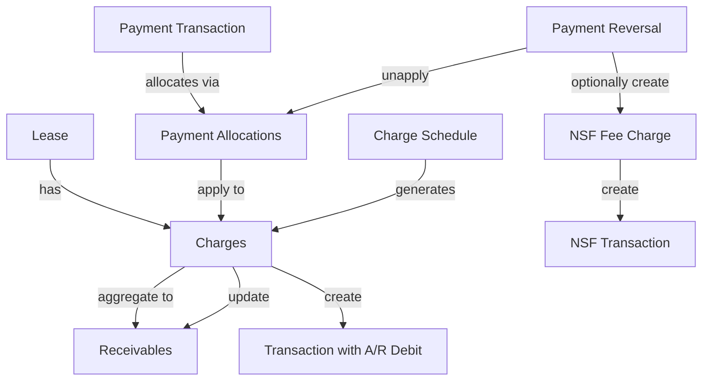

# Tenant Ledger and Payment Alignment Plan

## Overview

This plan aligns the repository's tenant ledger, rent charges, payments, and posting system with Buildium's model. The current system has transactions and journal entries but lacks explicit A/R data objects, deterministic payment allocation, and comprehensive reversal support.

## Current State Analysis

### What Exists

- **Transactions and transaction_lines**: Core double-entry ledger with posting rules
- **Lease transactions**: Charges and payments via Buildium API integration
- **Recurring charge engine**: Generates recurring charges (`src/lib/recurring-engine.ts`)
- **Proration logic**: First/last month proration in UI (`src/lib/proration.ts`)
- **Payment allocations**: Manual GL account allocations in payment forms
- **Reversal support**: Basic reversal via `src/lib/accounting/reversals.ts`
- **Posting rules**: Charge and payment posting rules in `src/lib/accounting/posting-rules.ts`
- **Monthly logs**: Monthly statement tracking with charges/payments stages

### What's Missing

1. **Explicit A/R data objects**: No `receivables` or `charges` tables tracking what's owed
2. **Payment-to-charge linkage**: Payments allocate to GL accounts, not specific receivables
3. **Deterministic allocation engine**: No automatic allocation order (oldest rent → fees → utilities)
4. **Receivable tracking**: Charges create A/R debit lines but no receivable records
5. **NSF/returned payment automation**: No support for bounced checks or NSF fees
6. **Charge schedules**: Recurring charges generate transactions but no schedule tracking
7. **Proration receivables**: Prorated amounts not tracked as separate receivables

## Implementation Plan

### Phase 1: Create A/R Data Model

**Files:**

- `supabase/migrations/YYYYMMDDHHMMSS_create_ar_data_model.sql`
- `src/types/ar.ts` (new)
- `src/lib/ar-service.ts` (new)

**Changes:**

1. **Create `charges` table**:
   ```sql
                           CREATE TABLE public.charges (
                             id uuid PRIMARY KEY DEFAULT gen_random_uuid(),
                             org_id uuid NOT NULL REFERENCES public.organizations(id) ON DELETE CASCADE,
                             lease_id bigint NOT NULL REFERENCES public.lease(id) ON DELETE CASCADE,
                             transaction_id uuid REFERENCES public.transactions(id) ON DELETE SET NULL,
                             
                             -- Charge details
                             charge_type text NOT NULL, -- 'rent', 'late_fee', 'utility', 'other'
                             amount numeric(14,2) NOT NULL,
                             due_date date NOT NULL,
                             description text,
                             
                             -- Proration tracking
                             is_prorated boolean DEFAULT false,
                             proration_days integer,
                             base_amount numeric(14,2), -- Original amount before proration
                             
                             -- Status
                             status text NOT NULL DEFAULT 'open', -- 'open', 'paid', 'cancelled'
                             paid_amount numeric(14,2) DEFAULT 0,
                             
                             -- Buildium sync
                             buildium_charge_id integer,
                             
                             -- Timestamps
                             created_at timestamptz NOT NULL DEFAULT now(),
                             updated_at timestamptz NOT NULL DEFAULT now()
                           );
   ```


2. **Create `receivables` table** (aggregates charges for a lease):
   ```sql
                           CREATE TABLE public.receivables (
                             id uuid PRIMARY KEY DEFAULT gen_random_uuid(),
                             org_id uuid NOT NULL REFERENCES public.organizations(id) ON DELETE CASCADE,
                             lease_id bigint NOT NULL REFERENCES public.lease(id) ON DELETE CASCADE,
                             
                             -- Receivable details
                             receivable_type text NOT NULL, -- 'rent', 'fee', 'utility', 'other'
                             total_amount numeric(14,2) NOT NULL,
                             due_date date NOT NULL,
                             description text,
                             
                             -- Status
                             status text NOT NULL DEFAULT 'open', -- 'open', 'partial', 'paid', 'cancelled'
                             paid_amount numeric(14,2) DEFAULT 0,
                             outstanding_amount numeric(14,2) NOT NULL,
                             
                             -- Timestamps
                             created_at timestamptz NOT NULL DEFAULT now(),
                             updated_at timestamptz NOT NULL DEFAULT now()
                           );
   ```


3. **Create `payment_allocations` table** (links payments to specific charges):
   ```sql
                           CREATE TABLE public.payment_allocations (
                             id uuid PRIMARY KEY DEFAULT gen_random_uuid(),
                             org_id uuid NOT NULL REFERENCES public.organizations(id) ON DELETE CASCADE,
                             payment_transaction_id uuid NOT NULL REFERENCES public.transactions(id) ON DELETE CASCADE,
                             charge_id uuid NOT NULL REFERENCES public.charges(id) ON DELETE CASCADE,
                             
                             -- Allocation details
                             allocated_amount numeric(14,2) NOT NULL,
                             allocation_order integer NOT NULL, -- For deterministic ordering
                             
                             -- Timestamps
                             created_at timestamptz NOT NULL DEFAULT now()
                           );
   ```


4. **Add indexes and RLS policies** following existing patterns

### Phase 2: Implement Charge Creation Service

**Files:**

- `src/lib/ar-service.ts` (new)
- `src/app/api/leases/[id]/charges/route.ts` (update)

**Changes:**

1. **Create `createChargeWithReceivable()` function**:

- Creates charge record with `amount_open = amount` initially
- Creates transaction with A/R debit line (via posting engine)
- Links charge to transaction via `transaction_id`
- Stamps transaction metadata: `charge_id` in transaction JSONB metadata field
- Supports idempotency via `external_id` parameter
- Returns charge record with status

2. **Update charge creation API** to use new service:

- Replace direct transaction creation with `createChargeWithReceivable()`
- Accept `source`, `external_id`, `created_by` parameters
- Return charge record with `amount_open` and `status` in response
- Include charge details in transaction metadata

3. **Handle proration**:

- Create separate charge records for prorated amounts
- Link prorated charges to base charge via `parent_charge_id`
- Set `is_prorated = true` and store `proration_days`
- Store `base_amount` for reference

### Phase 3: Implement Allocation Engine

**Files:**

- `src/lib/allocation-engine.ts` (new)
- `src/app/api/leases/[id]/payments/route.ts` (update)
- `src/app/api/monthly-logs/[logId]/payments/route.ts` (update)

**Changes:**

1. **Create `AllocationEngine` class** with transaction-safe allocation:
   ```typescript
                           class AllocationEngine {
                             async allocatePayment(
                               paymentAmount: number,
                               leaseId: number,
                               paymentTransactionId: string,
                               allocationOrder?: AllocationOrder,
                               manualAllocations?: ManualAllocation[],
                               externalId?: string // For idempotent retries
                             ): Promise<AllocationResult>
                             
                             async getOutstandingCharges(
                               leaseId: number,
                               order: AllocationOrder
                             ): Promise<Charge[]>
                           }
   ```


2. **Implement deterministic allocation with row locking**:

- Use `SELECT ... FOR UPDATE` on open charges ordered deterministically
- Run entire allocation in single database transaction
- Default order: oldest rent → fees → utilities → other (by due_date, then charge_type)
- Configurable via `allocation_order` table or org settings
- Support overrides per lease
- Validate `allocation_order` sequence is consecutive (0, 1, 2, ...)

3. **Update payment creation**:

- Auto-allocate payment to outstanding charges using allocation engine
- Create `payment_allocations` records with validated `allocation_order`
- Update charge `paid_amount`, `amount_open`, and `status` atomically
- Use CHECK constraint: `amount = paid_amount + amount_open`
- Support idempotent retries: check for existing allocations with same `external_id`

4. **Manual allocation support**:

- Allow manual allocation overrides via `manualAllocations` parameter
- Validate allocation totals match payment amount (within tolerance)
- Validate each allocation doesn't exceed charge `amount_open`
- Still apply deterministic ordering to manual allocations for consistency

5. **Uniqueness and validation**:

- Enforce `UNIQUE(payment_transaction_id, charge_id)` constraint
- Validate `allocation_order` is sequential (no gaps, starts at 0)
- Prevent double-allocation via transaction isolation

### Phase 4: Enhance Recurring Charges

**Files:**

- `src/lib/recurring-engine.ts` (update)
- `supabase/migrations/YYYYMMDDHHMMSS_add_charge_schedules.sql`

**Changes:**

1. **Create `charge_schedules` table** with org scoping and GL account linkage:
   ```sql
                           CREATE TABLE public.charge_schedules (
                             id uuid PRIMARY KEY DEFAULT gen_random_uuid(),
                             org_id uuid NOT NULL REFERENCES public.organizations(id) ON DELETE CASCADE,
                             lease_id bigint NOT NULL REFERENCES public.lease(id) ON DELETE CASCADE,
                             gl_account_id uuid NOT NULL REFERENCES public.gl_accounts(id) ON DELETE RESTRICT,
                             
                             -- Schedule details
                             charge_type charge_type_enum NOT NULL,
                             amount numeric(14,2) NOT NULL CHECK (amount >= 0),
                             frequency rent_cycle_enum NOT NULL, -- Reuse existing enum
                             start_date date NOT NULL,
                             end_date date, -- Optional end date
                             max_occurrences integer, -- Alternative end condition
                             description text,
                             
                             -- Timezone-safe date handling (store as date, compute in UTC)
                             timezone text DEFAULT 'UTC',
                             
                             -- Status
                             is_active boolean DEFAULT true,
                             
                             -- Timestamps
                             created_at timestamptz NOT NULL DEFAULT now(),
                             updated_at timestamptz NOT NULL DEFAULT now()
                           );
                           
                           -- Index for schedule lookup
                           CREATE INDEX idx_charge_schedules_lease_active 
                             ON public.charge_schedules(lease_id, is_active) 
                             WHERE is_active = true;
   ```


2. **Add `charge_schedule_id` to charges table**:
   ```sql
                           ALTER TABLE public.charges 
                             ADD COLUMN charge_schedule_id uuid REFERENCES public.charge_schedules(id) ON DELETE SET NULL;
                           
                           CREATE INDEX idx_charges_schedule_id ON public.charges(charge_schedule_id);
   ```


3. **Update recurring engine**:

- Generate charges via `createChargeWithReceivable()` with `source='recurring'`
- Link charge to schedule via `charge_schedule_id`
- Support proration for first/last periods (create separate charges with `parent_charge_id`)
- Use timezone-safe date calculations (UTC-based)
- Respect `end_date` and `max_occurrences` end conditions
- Track generated charges to prevent duplicates (idempotency via schedule + occurrence date)

### Phase 5: Add Payment Reversal and NSF Support

**Files:**

- `src/lib/accounting/reversals.ts` (extend)
- `src/app/api/leases/[id]/payments/[paymentId]/reverse/route.ts` (new)
- `supabase/migrations/YYYYMMDDHHMMSS_add_nsf_fee_support.sql`

**Changes:**

1. **Extend reversal service** with atomic reversal + NSF:

- Add `reversePaymentWithNSF()` function
- Run in single database transaction:
    - Reverse payment transaction (create reversal transaction)
    - Reverse payment allocations (unapply from charges, update `amount_open`)
    - Optionally create NSF fee charge via `createChargeWithReceivable()`
    - Update charge statuses atomically
- Stamp transaction metadata: `reversal_of_payment_id` in reversal transaction
- Support idempotent retries via `external_id`

2. **Create NSF fee charge**:

- Use `createChargeWithReceivable()` for NSF fee with `source='nsf'`
- Link to original payment via `external_id` or metadata
- Post to late fee income account (from org GL settings)
- Set `charge_type = 'late_fee'`

3. **Add returned payment automation**:

- Create `returned_payment_policies` table for org-level config:
     ```sql
                                         CREATE TABLE public.returned_payment_policies (
                                           org_id uuid PRIMARY KEY REFERENCES public.organizations(id) ON DELETE CASCADE,
                                           auto_create_nsf_fee boolean DEFAULT false,
                                           nsf_fee_amount numeric(14,2),
                                           nsf_fee_gl_account_id uuid REFERENCES public.gl_accounts(id),
                                           created_at timestamptz NOT NULL DEFAULT now(),
                                           updated_at timestamptz NOT NULL DEFAULT now()
                                         );
     ```


- Auto-create NSF fee on payment reversal if policy enabled
- Use policy amount/GL account or allow override per reversal

4. **Update reversal API**:

- Add `POST /api/leases/[id]/payments/[paymentId]/reverse` endpoint
- Support optional NSF fee amount and GL account (overrides policy)
- Return reversal transaction ID and NSF charge ID (if created)
- Include allocation unwinding details in response

### Phase 6: Update Posting Rules and Org GL Configuration

**Files:**

- `src/lib/accounting/posting-rules.ts` (update)
- `src/lib/gl-settings.ts` (update)
- `supabase/migrations/YYYYMMDDHHMMSS_add_org_gl_control_accounts.sql`

**Changes:**

1. **Parameterize control accounts per org**:

- Extend `org_gl_settings` or create `org_control_accounts` table:
     ```sql
                                         CREATE TABLE public.org_control_accounts (
                                           org_id uuid PRIMARY KEY REFERENCES public.organizations(id) ON DELETE CASCADE,
                                           ar_account_id uuid NOT NULL REFERENCES public.gl_accounts(id),
                                           undeposited_funds_account_id uuid REFERENCES public.gl_accounts(id),
                                           late_fee_income_account_id uuid REFERENCES public.gl_accounts(id),
                                           rent_income_account_id uuid NOT NULL REFERENCES public.gl_accounts(id),
                                           created_at timestamptz NOT NULL DEFAULT now(),
                                           updated_at timestamptz NOT NULL DEFAULT now()
                                         );
     ```


- Block postings if required mappings are missing (throw error)
- Validate account types match expected categories

2. **Enhance charge posting rule**:

- Ensure A/R debit line created using org's `ar_account_id`
- Link to charge record via transaction metadata JSONB field: `{charge_id: uuid}`
- Validate A/R account exists before posting

3. **Enhance payment posting rule**:

- Support undeposited funds vs. direct bank deposit:
    - If undeposited: Debit `undeposited_funds_account_id`, Credit A/R
    - If direct deposit: Debit bank GL account, Credit A/R
- Link to payment allocations via transaction metadata: `{payment_id: uuid, allocations: [...]}`
- Stamp `payment_id` in transaction metadata

4. **Add NSF fee posting rule**:

- Debit A/R (org's `ar_account_id`), Credit Late Fee Income (org's `late_fee_income_account_id`)
- Link to reversed payment via metadata: `{reversal_of_payment_id: uuid, nsf_fee: true}`
- Validate control accounts exist

5. **Transaction metadata stamping**:

- Add JSONB `metadata` column to `transactions` table if not exists:
     ```sql
                                         ALTER TABLE public.transactions 
                                           ADD COLUMN IF NOT EXISTS metadata jsonb DEFAULT '{}'::jsonb;
                                         
                                         CREATE INDEX idx_transactions_metadata_charge_id 
                                           ON public.transactions USING gin ((metadata->>'charge_id'));
                                         CREATE INDEX idx_transactions_metadata_payment_id 
                                           ON public.transactions USING gin ((metadata->>'payment_id'));
     ```


- Stamp: `charge_id`, `payment_id`, `reversal_of_payment_id` for reconciliation

### Phase 7: Update Monthly Logs Integration

**Files:**

- `src/app/api/monthly-logs/[logId]/payments/route.ts` (update)
- `src/lib/monthly-log-calculations.ts` (update)

**Changes:**

1. **Update calculations** to use charges (not receivables table):

- `getPreviousLeaseBalance()`: Sum `amount_open` from charges with `status IN ('open', 'partial')`
- `calculateTotalRentOwed()`: Sum `amount_open` from open charges
- `calculateRemainingRentBalance()`: Sum `amount_open` - payments applied
- Use AR view `v_ar_receivables` for aggregated reporting if needed

2. **Update payment creation** to use allocation engine:

- Use `AllocationEngine.allocatePayment()` for automatic allocation
- Support manual allocation overrides with validation (sum == payment amount)
- Return allocations and charge status in API response
- Include `amount_open` updates in response

3. **API response enhancements**:

- Return charge details with `amount_open` and `status`
- Return payment allocations array with charge details
- Include outstanding balance calculations

### Phase 8: Migration and Backfill

**Files:**

- `supabase/migrations/YYYYMMDDHHMMSS_backfill_charges_from_transactions.sql`
- `scripts/backfill-ar-data.ts` (new)

**Changes:**

1. **Stage the rollout**:

- **Stage 1**: Schema + RLS (Phase 1 migration)
- **Stage 2**: Backfill charges with dry-run validation
- **Stage 3**: Backfill allocations with conservative heuristics
- **Stage 4**: Verification queries comparing AR subledger vs AR GL

2. **Backfill charges from existing transactions**:

- Find all Charge transactions with A/R debit lines
- Create charge records with:
    - `amount` from transaction total
    - `amount_open = amount` initially (assume unpaid)
    - `status = 'open'` (will be updated when allocations backfilled)
    - `transaction_id` linkage
    - `source = 'backfill'`
- Use RLS-aware scripts or `SECURITY DEFINER` functions
- Dry-run mode: validate without inserting, report counts/amounts

3. **Backfill payment allocations**:

- For Payment transactions, attempt to allocate to charges
- Use conservative heuristics:
    - Match by date (payment date <= charge due_date)
    - Match by amount (exact or closest match)
    - Apply oldest-first allocation order
- Create `payment_allocations` records
- Update charge `paid_amount` and `amount_open`
- Update charge `status` based on `amount_open`

4. **Verification queries**:

- Compare AR subledger (sum of `charges.amount_open`) vs AR GL balance:
     ```sql
                                         -- AR Subledger (charges)
                                         SELECT org_id, SUM(amount_open) as ar_subledger_balance
                                         FROM public.charges
                                         WHERE status IN ('open', 'partial')
                                         GROUP BY org_id;
                                         
                                         -- AR GL Balance (transaction_lines)
                                         SELECT 
                                           tl.org_id,
                                           SUM(CASE WHEN tl.posting_type = 'Debit' THEN tl.amount ELSE -tl.amount END) as ar_gl_balance
                                         FROM public.transaction_lines tl
                                         JOIN public.gl_accounts ga ON ga.id = tl.gl_account_id
                                         WHERE ga.type = 'asset' 
                                           AND (ga.sub_type = 'AccountsReceivable' OR ga.name ILIKE '%accounts receivable%')
                                         GROUP BY tl.org_id;
                                         
                                         -- Reconciliation query
                                         SELECT 
                                           s.org_id,
                                           s.ar_subledger_balance,
                                           g.ar_gl_balance,
                                           (s.ar_subledger_balance - g.ar_gl_balance) as variance
                                         FROM (subledger query) s
                                         FULL OUTER JOIN (gl query) g ON s.org_id = g.org_id;
     ```


- Verify payment allocations sum to payment amounts
- Verify charge totals match transaction totals
- Report discrepancies for manual review

5. **Use RLS-aware scripts**:

- Scripts must respect RLS policies
- Use `SECURITY DEFINER` functions for admin operations
- Log backfill progress and errors
- Support resume/retry for large datasets

## Data Flow Diagram




## Key Design Decisions

1. **Charges as authoritative source**: Don't persist receivable aggregates initially; keep charges/payments/allocations as authoritative. Denormalize only `charge.amount_open` with CHECK constraints.
2. **AR view vs. projection**: Use view (`v_ar_receivables`) summing `amount_open`; add indexes on `org_id`, `status`, `due_date`. Only add projection table if AR aging/summary becomes a hotspot (with trigger-enforced consistency).
3. **Allocation engine with locking**: Run allocations in single transaction with `SELECT ... FOR UPDATE` on open charges ordered deterministically. Add uniqueness on `(payment_transaction_id, charge_id)`, validate `allocation_order` sequence, support idempotent retries.
4. **Parameterized control accounts**: Block postings if AR/undeposited/bank/late-fee mappings are missing. Stamp transaction metadata (`charge_id`, `payment_id`, `reversal_of_payment_id`) for reconciliation.
5. **NSF in single transaction**: Perform reversal + fee creation + allocation unwinding in one DB/ledger transaction.
6. **Proration as separate charges**: Each prorated period gets its own charge record with `parent_charge_id` for rollup.
7. **Recurring schedules with org scoping**: Include `org_id`, `gl_account_id`, timezone-safe dates, end conditions (`end_date`/`max_occurrences`). Link schedule→charge via `charge_schedule_id`.
8. **Backward compatibility**: Existing transactions remain valid; new system layers on top. Staged rollout with verification queries.

## Testing Considerations

1. **Unit tests**:

- Allocation engine: ordering logic, race conditions (concurrent allocations)
- Charge creation: proration edges, idempotency via `external_id`
- Reversal logic: with/without NSF, allocation unwinding
- Posting rules: control account validation, metadata stamping

2. **Integration tests**:

- Happy path: charge creation → payment → allocation → status updates
- Partial payments: multiple payments against single charge
- Reversals: payment reversal with NSF fee creation
- Manual allocations: override validation, sum == payment check
- Monthly logs: calculations using `amount_open`, allocation engine integration

3. **Migration/backfill tests**:

- Backfill script with sample data
- Verification queries: AR subledger vs AR GL reconciliation
- Dry-run validation: counts, amounts, discrepancies
- RLS-aware script execution

4. **Buildium sync tests**:

- Verify charge/payment sync maintains allocations
- Idempotency: duplicate syncs don't create duplicate charges
- External ID mapping: Buildium charge ID → local charge