# Database Table Relationships

> Generated on: 2025-01-15
>
> This document provides a comprehensive overview of table relationships in the Property Management System database.

## Overview

The database schema is designed around the core property management entities with clear relationships that support the
Buildium integration. Understanding these relationships is crucial for data synchronization, reporting, and application
logic.

## Core Entity Relationships

### 🏠 **Properties** (Central Entity)

The `properties` table is the central entity that connects to most other tables in the system.

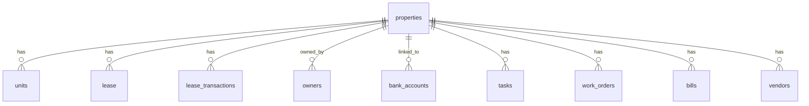

**Key Relationships:**

- **One-to-Many**: A property can have multiple units, leases, transactions, owners, etc.

- **Buildium Integration**: `buildium_property_id` links to Buildium's property records

- **Sync Tracking**: `last_synced_at` tracks when data was last synchronized

Fields (integration):
```text
properties.buildium_property_id  BIGINT UNIQUE
properties.buildium_created_at   TIMESTAMPTZ
properties.buildium_updated_at   TIMESTAMPTZ
```

### 🏢 **Units** (Property Sub-entities)

Units represent individual spaces within properties (apartments, offices, etc.).

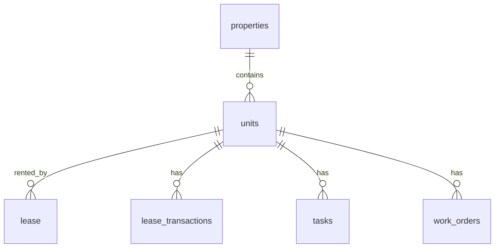

**Key Relationships:**

- **Many-to-One**: Units belong to a single property

- **One-to-Many**: A unit can have multiple leases over time

- **Buildium Integration**: `buildium_unit_id` links to Buildium's unit records

Fields (integration):
```text
units.buildium_unit_id      BIGINT UNIQUE
units.buildium_property_id  BIGINT
units.buildium_created_at   TIMESTAMPTZ
units.buildium_updated_at   TIMESTAMPTZ
```

### 👥 **Owners** (Property Ownership)

Owners represent individuals or entities that own properties.

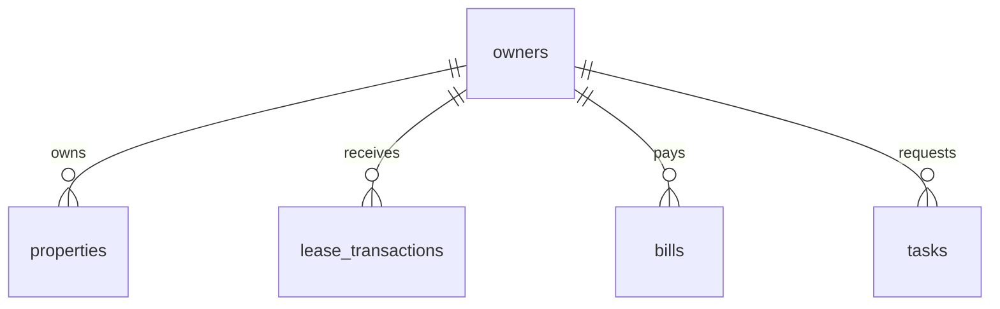

**Key Relationships:**

- **Many-to-Many**: Owners can own multiple properties, properties can have multiple owners

- **Ownership Percentage**: `ownership_percentage` field tracks partial ownership

- **Buildium Integration**: `buildium_owner_id` links to Buildium's owner records

### 📋 **Leases** (Rental Agreements)

Leases represent rental agreements between property owners and tenants.

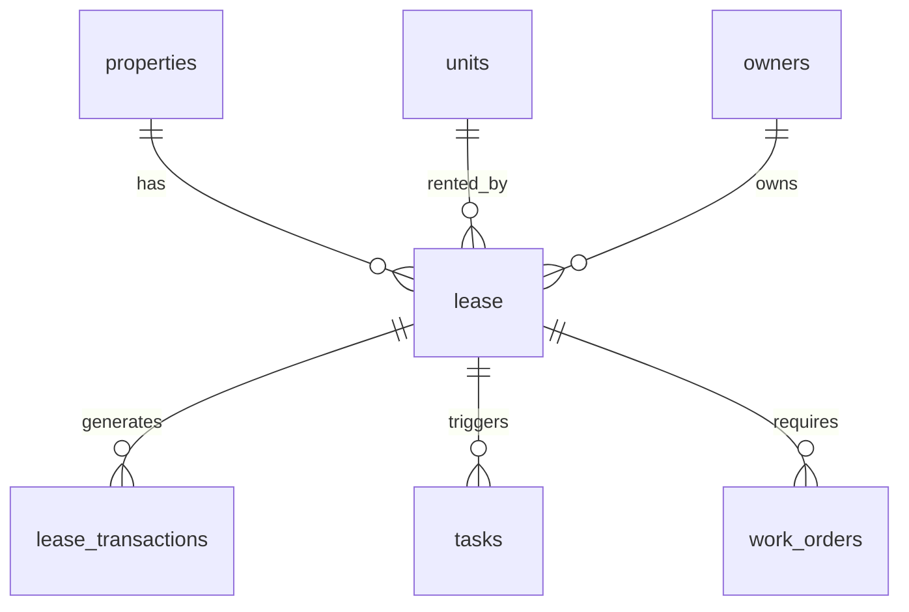

**Key Relationships:**

- **Many-to-One**: Leases belong to a single property and unit

- **One-to-Many**: A lease generates multiple transactions over time

- **Buildium Integration**: `buildium_lease_id` links to Buildium's lease records

## Financial Relationships

### 💰 **Lease Transactions** (Financial Records)

Lease transactions track all financial activity related to leases.

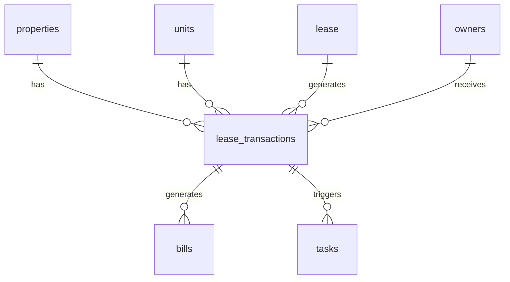

**Key Relationships:**

- **Many-to-One**: Transactions belong to a specific lease, property, and unit

- **Financial Tracking**: Tracks rent payments, charges, fees, etc.

- **Buildium Integration**: `buildium_transaction_id` links to Buildium's transaction records

### 🏦 **Bank Accounts** (Financial Infrastructure)

Bank accounts are linked to properties for financial management.

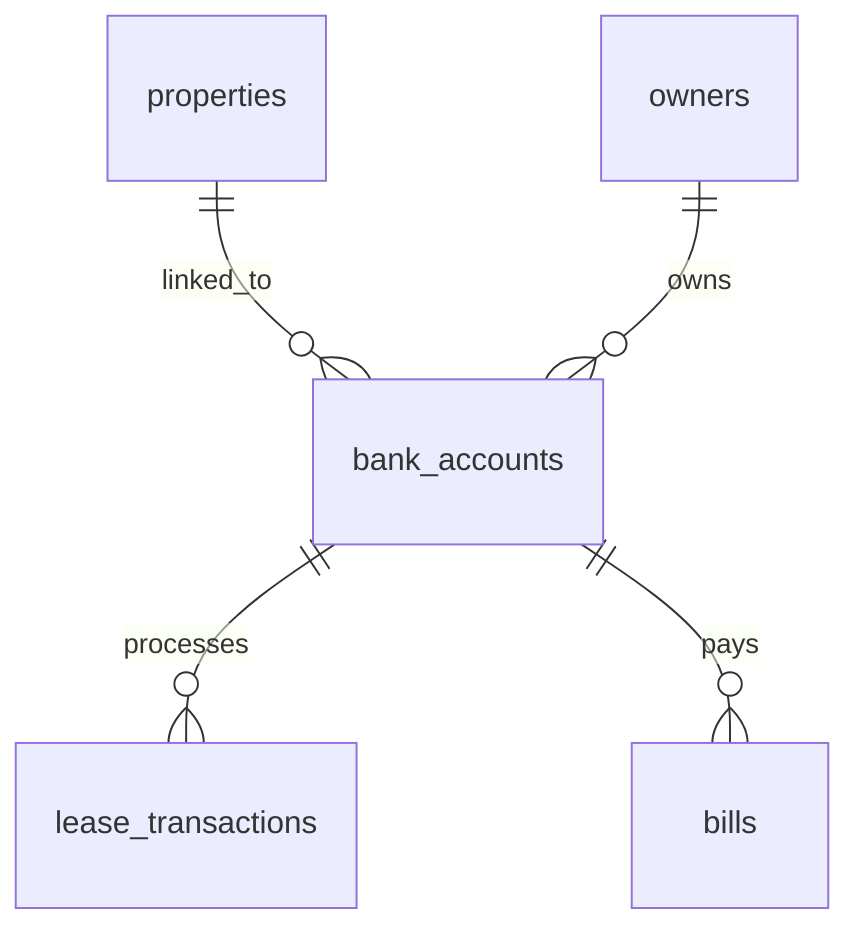

**Key Relationships:**

- **Many-to-One**: Bank accounts can be linked to multiple properties

- **Financial Processing**: Handles rent payments, owner distributions, etc.

- **Buildium Integration**: `buildium_bank_account_id` links to Buildium's bank account records

### 📚 **GL Accounts** (Chart of Accounts)

GL accounts are imported from Buildium and maintain a hierarchical structure.

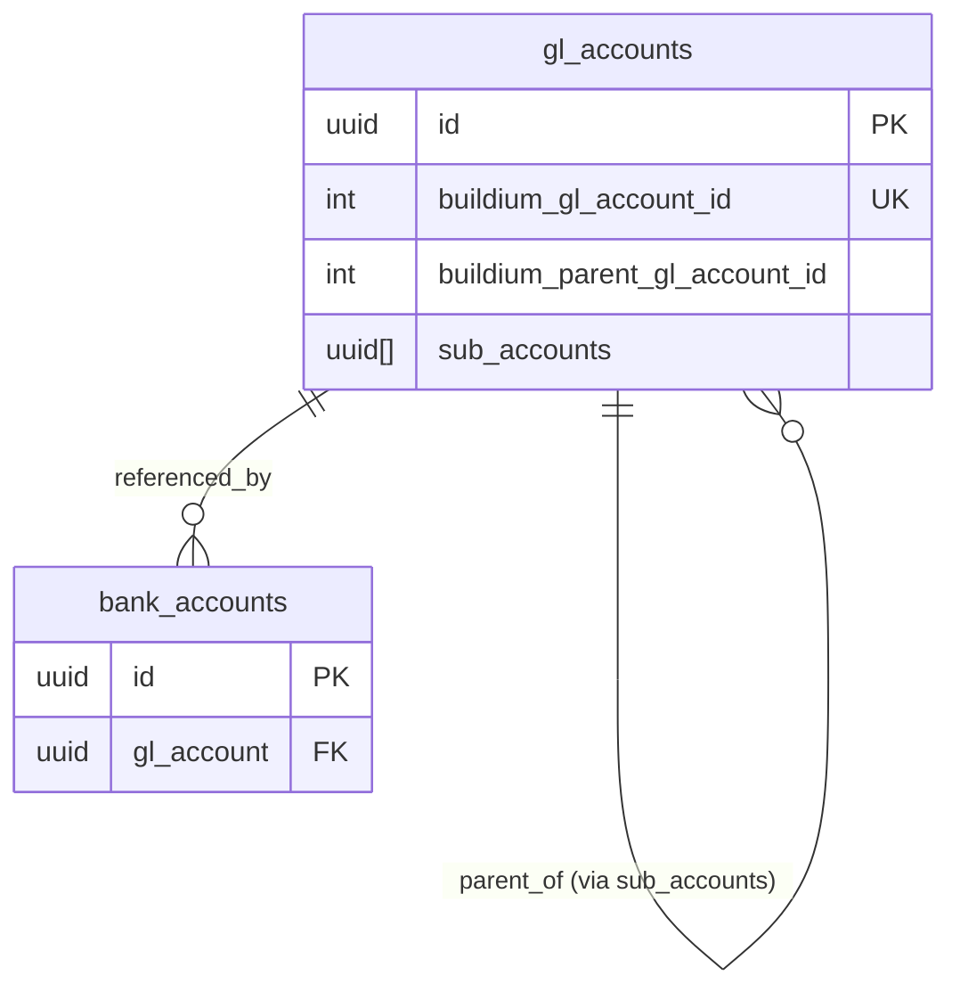

Key Notes:
- Parent/child relationships come from the child’s `buildium_parent_gl_account_id`.
- The parent record stores a denormalized list of child UUIDs in `sub_accounts` for quick traversal and UI trees.
- Indexes: `idx_gl_accounts_buildium_id` (btree), `idx_gl_accounts_sub_accounts` (GIN), `idx_gl_accounts_type`.


## Maintenance Relationships

### 🔧 **Tasks** (Maintenance Requests)

Tasks represent maintenance requests and work items.

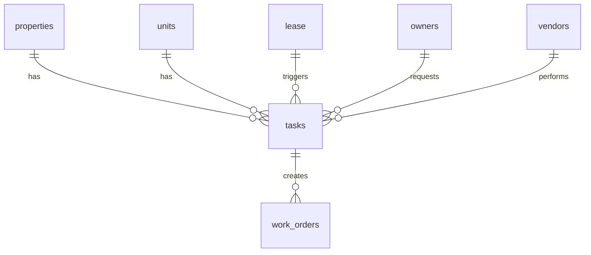

**Key Relationships:**

- **Many-to-One**: Tasks belong to specific properties, units, or leases

- **One-to-Many**: Tasks can create multiple work orders

- **Buildium Integration**: `buildium_task_id` links to Buildium's task records

### 🛠️ **Work Orders** (Maintenance Execution)

Work orders represent the execution of maintenance tasks.

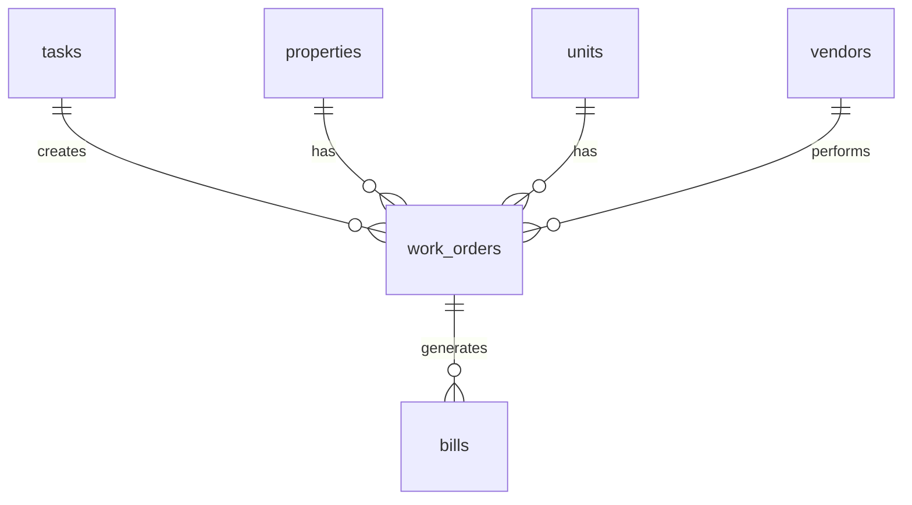

**Key Relationships:**

- **Many-to-One**: Work orders belong to specific tasks, properties, and units

- **Vendor Assignment**: Work orders are assigned to vendors for execution

- **Buildium Integration**: `buildium_work_order_id` links to Buildium's work order records

## Vendor Relationships

### 👷 **Vendors** (Service Providers)

Vendors provide services for properties and maintenance.

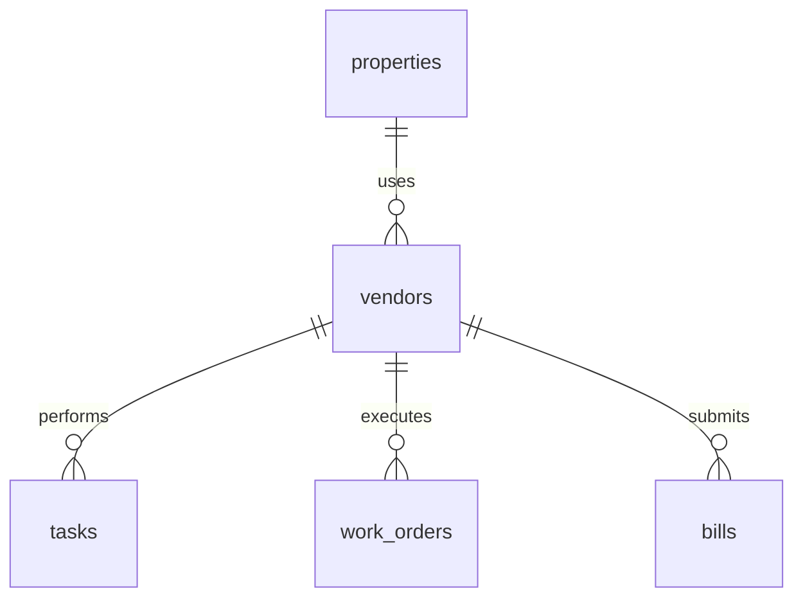

**Key Relationships:**

- **Many-to-Many**: Vendors can work for multiple properties

- **Service Tracking**: Vendors perform tasks and submit bills

- **Buildium Integration**: `buildium_vendor_id` links to Buildium's vendor records

### 📄 **Bills** (Financial Obligations)

Bills represent financial obligations to vendors and service providers.

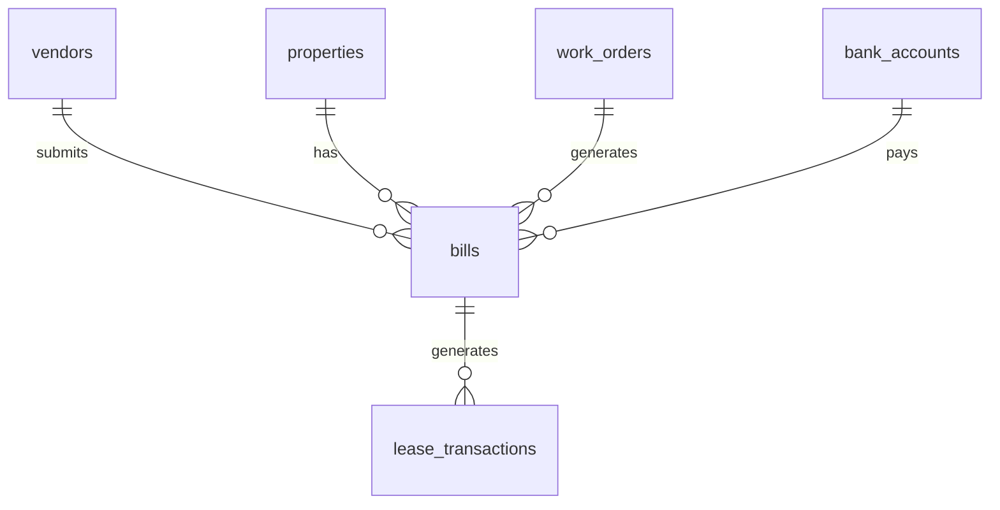

**Key Relationships:**

- **Many-to-One**: Bills belong to specific vendors and properties

- **Payment Processing**: Bills are paid through bank accounts

- **Buildium Integration**: `buildium_bill_id` links to Buildium's bill records

## Data Flow Patterns

### 🔄 **Sync Flow**

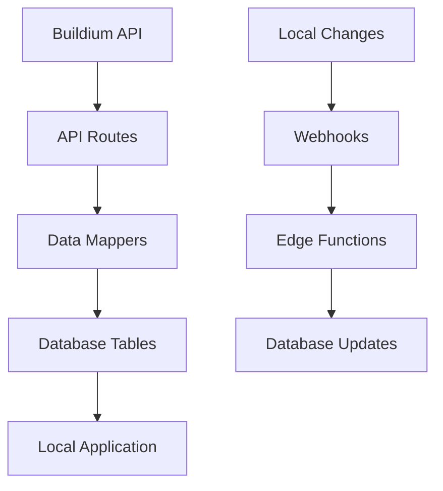

### 📊 **Reporting Flow**

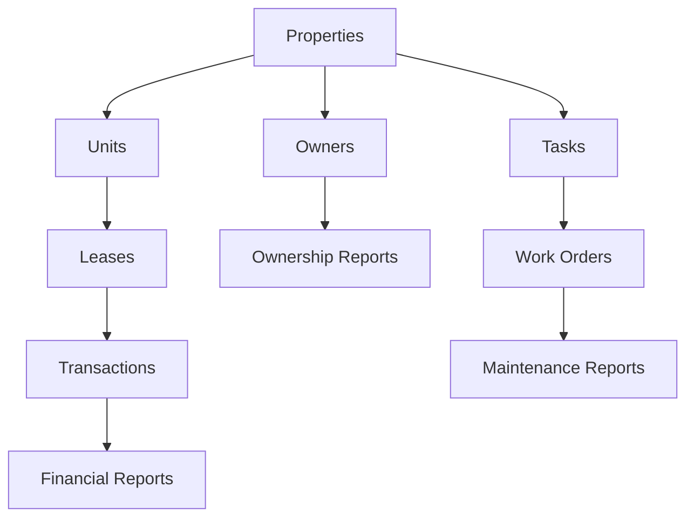

## Buildium Integration Patterns

### 🔗 **ID Mapping**

Every table with Buildium integration includes:

```sql

-- Buildium ID for linking
buildium_[entity]_id BIGINT UNIQUE

-- Sync tracking
last_synced_at TIMESTAMP WITH TIME ZONE
sync_status TEXT DEFAULT 'pending'

```

### 🔄 **Sync Status Values**

- `pending`: Record needs to be synced
- `syncing`: Currently being synced
- `synced`: Successfully synced
- `failed`: Sync failed, needs retry
- `deleted`: Record deleted in Buildium

### 📈 **Sync Strategies**

1. **Full Sync**: Download all records from Buildium

2. **Incremental Sync**: Only sync changed records since last sync

3. **Webhook Sync**: Real-time updates via webhooks

4. **Manual Sync**: On-demand sync for specific records

## Common Query Patterns

### 🔍 **Property Overview**

```sql

-- Get property with all related data
SELECT
    p.*,

    COUNT(DISTINCT u.id) as unit_count,
    COUNT(DISTINCT l.id) as lease_count,
    COUNT(DISTINCT o.id) as owner_count,
    SUM(lt.amount) as total_transactions
FROM properties p
LEFT JOIN units u ON p.id = u.property_id
LEFT JOIN lease l ON p.id = l.property_id
LEFT JOIN owners o ON p.id = o.property_id
LEFT JOIN lease_transactions lt ON l.id = lt.lease_id
WHERE p.id = $1
GROUP BY p.id;

```

### 💰 **Financial Summary**

```sql

-- Get financial summary for property
SELECT
    p.name as property_name,
    SUM(CASE WHEN lt.type = 'payment' THEN lt.amount ELSE 0 END) as total_payments,
    SUM(CASE WHEN lt.type = 'charge' THEN lt.amount ELSE 0 END) as total_charges,
    SUM(lt.amount) as net_amount
FROM properties p
JOIN lease l ON p.id = l.property_id
JOIN lease_transactions lt ON l.id = lt.lease_id
WHERE p.id = $1
GROUP BY p.id, p.name;

```

### 🏠 **Unit Status**

```sql

-- Get unit status with lease information
SELECT
    u.*,

    l.start_date as lease_start,
    l.end_date as lease_end,
    l.status as lease_status,
    t.name as tenant_name
FROM units u
LEFT JOIN lease l ON u.id = l.unit_id AND l.status = 'active'
LEFT JOIN tenants t ON l.tenant_id = t.id
WHERE u.property_id = $1;

```

## Best Practices

### 🔒 **Data Integrity**

1. **Foreign Key Constraints**: Always use foreign keys to maintain referential integrity

2. **Cascade Rules**: Use appropriate cascade rules for deletions

3. **Unique Constraints**: Ensure Buildium IDs are unique within their scope

4. **Check Constraints**: Validate data at the database level

### 🚀 **Performance**

1. **Indexing**: Index foreign keys and frequently queried fields

2. **Partitioning**: Consider partitioning large tables by date or property

3. **Query Optimization**: Use appropriate JOIN types and WHERE clauses

4. **Connection Pooling**: Use connection pooling for database connections

### 🔄 **Sync Management**

1. **Batch Processing**: Process records in batches to avoid timeouts

2. **Error Handling**: Implement robust error handling for sync failures

3. **Retry Logic**: Implement exponential backoff for failed syncs

4. **Monitoring**: Track sync performance and failures

## Troubleshooting

### 🔍 **Common Issues**

1. **Orphaned Records**: Records without proper foreign key relationships

2. **Duplicate Buildium IDs**: Multiple records with the same Buildium ID

3. **Sync Failures**: Records that fail to sync with Buildium

4. **Data Inconsistencies**: Mismatched data between local and Buildium

### 🛠️ **Debugging Queries**

```sql

-- Find orphaned records
SELECT 'units' as table_name, id, property_id
FROM units
WHERE property_id NOT IN (SELECT id FROM properties)
UNION ALL
SELECT 'lease' as table_name, id, property_id
FROM lease
WHERE property_id NOT IN (SELECT id FROM properties);

-- Find duplicate Buildium IDs
SELECT buildium_property_id, COUNT(*)

FROM properties
WHERE buildium_property_id IS NOT NULL
GROUP BY buildium_property_id
HAVING COUNT(*) > 1;

-- Find failed syncs
SELECT * FROM properties

WHERE sync_status = 'failed'
ORDER BY last_synced_at DESC;

```

## Conclusion

Understanding these table relationships is essential for:

- **Data Synchronization**: Ensuring proper data flow between Buildium and local database

- **Application Logic**: Building correct queries and business logic

- **Reporting**: Creating accurate financial and operational reports

- **Maintenance**: Troubleshooting data issues and performance problems

The relationship structure supports a comprehensive property management system with full Buildium integration while
maintaining data integrity and performance.

## Sync Operations (Error Tracking)

- Table: `public.sync_operations`
- Purpose: Track Buildium sync attempts, failures, retries, and payloads.
- Relationships: None currently. This table is intentionally decoupled (no FKs) to simplify retry workflows and avoid cascading failures.

Notes:
- Use this table to audit failures and drive retry logic in services and Edge Functions.
- Indexed by `status`, and `(entity, buildium_id)` for fast lookups.
